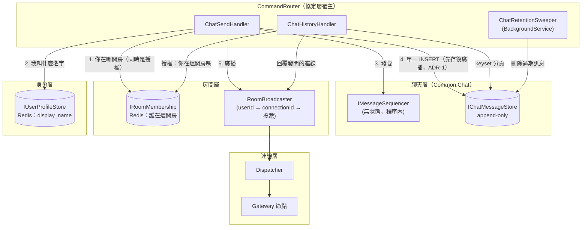
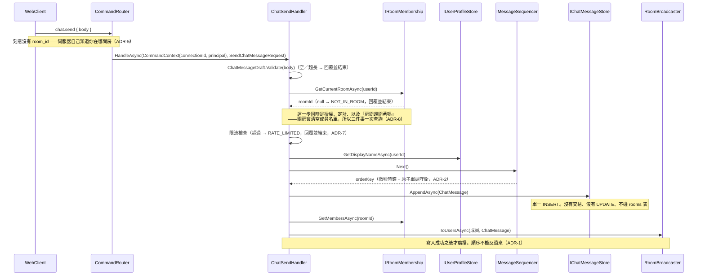
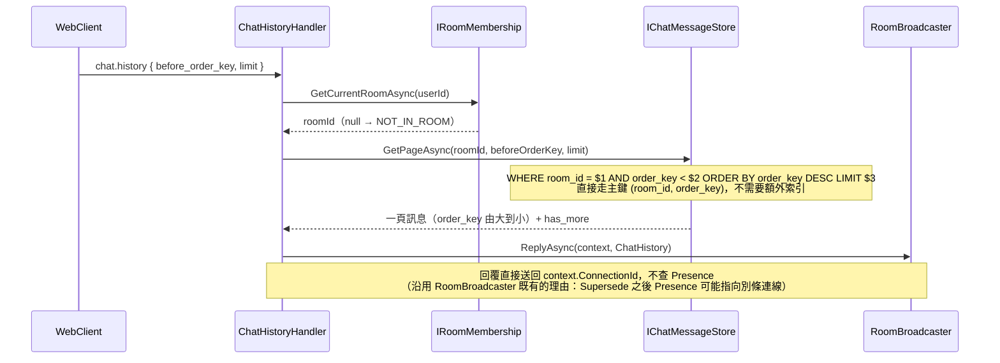
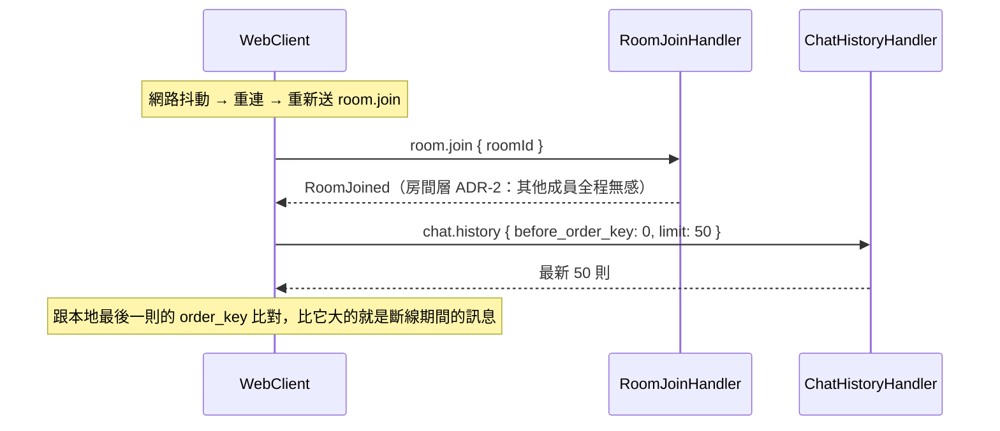

# 聊天層架構設計（Chat Layer）

狀態：**階段 A 已實作**（`Common/Chat/` + `Common/Protos/chat.proto`，行為完整）；**階段 B 只剩限流**——房間、封鎖名單、訊息都已落在 PostgreSQL 上，`IChatRateLimiter` 還是程序內的替身，見 §11
技術棧：延續 .NET 10 + NATS（Adaptare）+ protobuf；**新增 PostgreSQL 作為正式持久儲存**（見 ADR-4，階段 B）
範圍：**訊息本身——收發、持久化、歷史查詢**，不含「誰該收到」（房間層）與「怎麼投遞」（連線層）
依賴：命令的解析與分派由協定層負責（[protocol-layer.md](protocol-layer.md)）；成員名單與 fan-out 名單向房間層取得（[room-layer.md](room-layer.md)）；送出者的顯示名稱向身分層取得（[identity-layer.md](identity-layer.md)）

> 這是最後一個未設計的核心層，也是唯一一個**逼出正式持久儲存決定**的層。`room-layer.md` ADR-7 把房間與封鎖名單的儲存標為 provisional 並明說「跟聊天層一起決定」，`product-scope.md` §6 也寫「這是同一個儲存決定，不要為房間層單獨選一個」——本文件 ADR-4 就是那個決定。

> **本文件初稿的核心設計已被推翻。** 初稿讓 PostgreSQL 交易擁有「房間內訊息全序」這個領域不變量（`UPDATE rooms SET last_seq = last_seq + 1 RETURNING`），結果是整層變成以資料庫操作為中心：業務規則藏在 SQL 的 WHERE 子句、`IChatMessageStore` 表面上不綁儲存技術實際上綁死了「儲存必須有交易」、`rooms` 表成為每則訊息一次 UPDATE 的熱點。推翻的完整過程記在 ADR-2，因為**錯的方式比結論有價值**。

## 1. 範圍界定

這層要解決的問題：

1. **訊息收發**：把一則訊息廣播給房間內所有在線成員。
2. **訊息記錄**：訊息的持久化、房間內的排序、歷史分頁查詢。
3. **保留期限**：訊息存多久、過期怎麼清，以及**房間被刪掉時怎麼清**（ADR-6 與 ADR-10 是兩條不同的清理路徑）。
4. **本系統的正式持久儲存選型**，並把房間層 provisional 的部分一起接手。

明確排除：誰該收到（房間層的 `IRoomMembership`）、怎麼投遞（連線層的 `IOutboundGateway` → `Dispatcher`）、身分怎麼證明（身分層的 handshake 驗證）。

**與房間層的邊界**（延續 `room-layer.md` §1 定下的分工，本文件不改動它）：房間層回答「誰該收到」，聊天層回答「內容是什麼、要不要存」。聊天層拿到一則訊息時向房間層取得成員名單，再自己呼叫 `IPacketPublisher`。這條邊界的具體體現是 `RoomBroadcaster`——它已經把「userId 名單 → 解析成 connectionId → 投遞」封裝好了，聊天層直接重用（見 §6.8）。

## 2. 現有實作對照（`main` 分支）

`main` 的對應物是 `ChatServer`，核心是 `ChatServer/Models/Endpoints/ChatSendHandler.cs`。四個差異：

- **`main` 完全沒有持久化**。訊息是純 fan-out，送完就消失——`product-scope.md` §1 把「訊息歷史記錄」列為本次**新增**的功能，本層一半以上的複雜度來自這一點。
- **`main` 的 fan-out 自己做分組並直接 publish 到 `connect.send.{connectorId}`**，繞過了現在的 `Dispatcher`。這次一律走 `IPacketPublisher` → `IOutboundGateway` → `dispatch.deliver`（`protocol-layer.md` ADR-5：下行只有一條路徑）。
- **`main` 的 `ChatMessage` 內建 `Scope.Person`（私訊）與 `Scope.System`**。`product-scope.md` §3 已把私訊排除，所以本層的訊息型別沒有 `Scope` 欄位（見 §8）。
- **`main` 用 `PlayerInfoQuery` 依 `sessionId` 反查送出者**，再用 `GetRoomBySessionidQuery` 反查他在哪間房——每則訊息兩次反查。這次前者由 `context.Principal` 直接給（`protocol-layer.md` ADR-9），後者仍需要一次查詢，但它同時就是授權檢查（見 ADR-5）。

值得保留的一點：`main` 的 `sendContent.From = fromPlayerInfo.Name` 送的是**名字而不是 id**。本層 ADR-3 做同樣的事，但多做一步——把那個名字**存進訊息記錄**，而不只是放進當下那一則廣播。

## 3. 核心概念

| 概念 | 職責 |
|---|---|
| `ChatMessageDraft` | **未定序**的訊息：房間、送出者、顯示名稱、內容。內容的有效性由它自己定義（見 6.1） |
| `ChatMessage` | **已定序**的訊息：draft 加上 `OrderKey` 與 `SentAt`。從 draft 到它的轉換就是「發號」這件事 |
| `OrderKey` | 房間內用來排序與分頁的 `int64`。**單調但稀疏**——不保證連續，不能拿來計數或偵測缺口（見 ADR-2） |
| `IMessageSequencer`（新） | 發號的接縫。目前是無狀態的微秒時鐘實作；房間 actor 若落地，換掉的是註冊那一行（見 ADR-9） |
| `IChatMessageStore`（新） | **append-only**：一次 `INSERT`、一個 keyset 分頁查詢、一個批次刪除。沒有 read-modify-write，不要求交易 |
| `ChatRetention`（新） | 保留期限的政策值，`ChatRetentionSweeper` 用它 |
| `IChatRateLimiter`（新，**實作時才出現**） | 每人每秒幾則。設計稿把限流寫成 handler 裡直接打 Redis，實作時抽成介面——理由見 6.9 |
| `chat.send` / `chat.history` | 本層向 `CommandRouter` 註冊的兩個命令。**兩個都不帶 `room_id`**（見 ADR-5） |

## 4. 元件關係圖



**沒有任何箭頭從寫入路徑指向房間資料。** 這是初稿與現在最大的差別——初稿的寫入要 `UPDATE rooms`，所以 `rooms` 表在圖上是寫入路徑的一部分。現在 `messages` 的寫入完全不碰它。

## 5. 訊息序列

### 5.1 送出一則訊息



### 5.2 歷史分頁查詢



`before_order_key = 0` 代表「從最新的開始」。往上滑載入更舊的訊息時，client 把上一頁最小的 `order_key` 當成下一次的游標——這就是 keyset 分頁，不用 OFFSET，所以翻到第 100 頁跟第 1 頁一樣快，**而且完全不受排序鍵稀疏的影響**（見 ADR-2）。

### 5.3 重連後補齊



這條路徑是 `room-layer.md` ADR-2 那句「寬限期內送出的訊息**不補送**，使用者重連後靠聊天層的歷史記錄補齊」的兌現。那條 ADR 是在聊天層還不存在時寫的，等於預先開了一張支票——本節就是它。

**注意 client 這裡做的是「比對游標」而不是「偵測缺口」。** 前者只需要單調，後者需要連續，而 `order_key` 只保證前者。這是刻意的差別，見 ADR-2。

## 6. 具體介面設計

### 6.1 領域模型（`Common.Chat`）

初稿沒有這一節，那是它最根本的問題：整層只有 handler、store、資料表，`ChatMessageRecord` 是一列資料表穿了 C# record 的衣服。對照房間層有 `Room`、`RoomMember`、`RoomPassword`、`RoomGraceSweeper`——那些是概念。

```csharp
namespace Common.Chat;

public enum ChatMessageRejection
{
	None,
	BodyEmpty,
	BodyTooLong,
}

// 尚未定序的訊息。訊息的有效性是領域的性質，不是 schema 的 NOT NULL、
// 也不是 handler 裡隨手寫的兩個 if——把它放在這裡，規則只有一個地方可以改。
public sealed record ChatMessageDraft(
	string RoomId,
	string SenderUserId,
	string SenderDisplayName,
	string Body)
{
	public const int MaxBodyLength = 4096;   // 暫定值，見 §9

	public static ChatMessageRejection Validate(string body) => body switch
	{
		_ when string.IsNullOrWhiteSpace(body) => ChatMessageRejection.BodyEmpty,
		_ when body.Length > MaxBodyLength => ChatMessageRejection.BodyTooLong,
		_ => ChatMessageRejection.None
	};

	public ChatMessage WithOrder(long orderKey, DateTimeOffset sentAt) =>
		new(RoomId, orderKey, SenderUserId, SenderDisplayName, Body, sentAt);
}

// 已定序的訊息。從 draft 到這裡的那一步就是「發號」，而發號的擁有者
// 是可以換的（現在是程序內的時鐘，未來可能是房間 actor，見 ADR-9）——
// 用兩個型別把那一步標示出來，換擁有者時就知道要動哪裡。
public sealed record ChatMessage(
	string RoomId,
	long OrderKey,
	string SenderUserId,
	string SenderDisplayName,
	string Body,
	DateTimeOffset SentAt);

public sealed record ChatMessagePage(
	IReadOnlyList<ChatMessage> Messages,   // order_key 由大到小
	bool HasMore);
```

**刻意不發明更多名詞。** 「這個人現在能不能發言」是四個檢查的組合（內容合法、在房間裡、沒被限流），把它包成一個 `SpeakingRight` 之類的型別很誘人，但房間層的 handler 就是一連串有守衛的提前返回（`RoomJoinHandler` 有四個），本層跟著做才一致。初稿的問題不是「檢查沒有被包成型別」，是**其中一個檢查被藏進了 SQL 的 WHERE 子句**——那個問題由 ADR-8 解決，不需要新型別。

### 6.2 Proto（`Common/Protos/chat.proto`，新檔案）

```protobuf
syntax = "proto3";

option csharp_namespace = "Chat.Protos";
package chat;

// 聊天層自己的命令與下行訊息。協定層不認識這些型別，對應表由 AddChatPackets() 註冊。

// ---- 上行 ----

// 刻意沒有 room_id：使用者一次只能在一間房，「送到哪間房」是伺服器知道的事實，
// 不是 client 說了算（ADR-5）。
message SendChatMessageRequest {
	string body = 1;
}

message ChatHistoryRequest {
	// 0 = 從最新的開始；否則回傳 order_key 嚴格小於它的那一頁（keyset 分頁）。
	int64 before_order_key = 1;
	// 0 或超過上限時由伺服器夾到預設值，不回錯誤。
	int32 limit = 2;
}

// ---- 下行 ----

message ChatMessage {
	string room_id = 1;

	// 房間內單調遞增的排序鍵與分頁游標。
	//
	// **稀疏，不保證連續。** 不要拿它計數（則數 != max - min），也不要拿它偵測
	// 缺口（expected = last + 1 一定會誤判）。要判斷「有沒有新訊息」請比大小，
	// 不要做算術。命名刻意不叫 seq，就是為了不誘發那種寫法（ADR-2）。
	int64 order_key = 2;

	string sender_user_id = 3;
	// 送出當下的顯示名稱快照，不是即時查詢的結果（ADR-3）。
	string sender_display_name = 4;
	string body = 5;

	// 實際發生時間，跟 order_key 是兩件事：order_key 在突發時可能借用未來的
	// 微秒，sent_at 不會（ADR-2）。顯示時間一律用這個欄位。
	int64 sent_at_unix_ms = 6;
}

message ChatHistory {
	string room_id = 1;
	// order_key 由大到小（最新的在前）。
	repeated ChatMessage messages = 2;
	bool has_more = 3;
}

// 沿用 RoomOperationReply 的形狀。業務失敗一定要用明確的下行訊息回覆
// （protocol-layer.md ADR-8）。
message ChatOperationReply {
	enum Status {
		OK = 0;
		// 不在任何房間。房間被刪掉也走這一條——關房＝刪房（ADR-10）且會清空成員名單，
		// 所以兩件事在這裡是同一個結果（ADR-8）。
		NOT_IN_ROOM = 1;
		BODY_EMPTY = 2;
		BODY_TOO_LONG = 3;
		RATE_LIMITED = 4;
	}

	Status status = 1;
	string room_id = 2;
}
```

**`OK = 0` 在這裡是安全的**，但理由要寫清楚，因為 `protocol-layer.md` §9 有一條相反方向的教訓（`InboundAck.OK` 原本是 0，序列化成 0 bytes，經過 NATS 回來變 `null`，每個成功的命令都殺掉連線）。差別在於那條教訓只適用於 **request/reply 的 reply**——「0 bytes 的回覆」跟「沒有回覆」在那裡無法區分。`ChatOperationReply` 走的是一般下行投遞（`IPacketPublisher`），沒有「沒有回覆」這個對立面；而且成功路徑上 `room_id` 永遠非空，本來就不會序列化成 0 bytes。與 `RoomOperationReply` 形狀一致比自作聰明重要。

**沒有 `ROOM_CLOSED`**：初稿有，因為初稿的 `UPDATE ... WHERE NOT is_closed` 分得出那兩種情況。改成 append-only 之後不再多讀一次房間，而關房本來就會清空成員名單，所以「房間關了」對送訊息的人來說就是「你不在任何房間」。少一個狀態、少一次 Redis 讀取——**拿掉資料庫中心的設計讓這一層變小了，不是變大**。ADR-10 之後這個決定更強：**「已關閉的房間」這個狀態在系統裡根本不存在了**，所以連「本層剛好不需要區分」這個理由都不必用上；房間層自己的 `RoomOperationReply.ROOM_CLOSED` 也會一起消失。

### 6.3 `IChatMessageStore`（`Common.Chat`）

```csharp
namespace Common.Chat;

public interface IChatMessageStore
{
	// 單一 INSERT。訊息在進來之前就已經定序完成（OrderKey 由 IMessageSequencer 給），
	// 所以這裡沒有 read-modify-write，也不需要交易。
	//
	// 主鍵衝突（同一房間、同一 order_key）回 false 而不是丟例外——呼叫端重新發號
	// 再試一次即可，理由見 6.4。
	ValueTask<bool> TryAppendAsync(ChatMessage message, CancellationToken cancellationToken = default);

	// beforeOrderKey = 0 代表從最新的開始。
	ValueTask<ChatMessagePage> GetPageAsync(
		string roomId,
		long beforeOrderKey,
		int limit,
		CancellationToken cancellationToken = default);

	// 回傳實際刪除的筆數，讓 sweeper 知道要不要再跑一輪（見 ADR-6）。
	ValueTask<int> DeleteOlderThanAsync(
		DateTimeOffset cutoff,
		int batchSize,
		CancellationToken cancellationToken = default);
}
```

**這個介面現在真的不綁儲存技術**——三個方法分別是 append、range scan、range delete，任何 key-value 或文件儲存都給得起。初稿宣稱同一件事（ADR-4 寫「介面刻意不綁任何儲存技術」）但那是假的：它要求交易內的 read-modify-write，等於綁死了關聯式資料庫。**這是本次重寫最實質的改變**，也讓 ADR-4「換掉的成本是一次資料遷移」從願望變成事實。

### 6.4 `IMessageSequencer`（`Common.Chat`）

```csharp
namespace Common.Chat;

// 發號的接縫。今天是程序內的時鐘，明天可能是房間 actor（ADR-9）——
// 把它獨立成介面，換擁有者時動的是 DI 註冊那一行。
public interface IMessageSequencer
{
	long Next();
}

// 微秒時鐘 + 單調守衛。
internal sealed class MonotonicMicrosecondSequencer(TimeProvider timeProvider) : IMessageSequencer
{
	private long m_Last;

	public long Next()
	{
		var observed = timeProvider.GetUtcNow().ToUnixTimeMilliseconds() * 1000L;

		// 這個 CAS 迴圈是必要的，不是防禦性寫法。一個 CommandRouter process 裡有多個
		// handler 併發，非原子的 `m_Last = Math.Max(observed, m_Last + 1)` 會讓兩個
		// 執行緒讀到同一個 prior 而發出同一個號——那會把「主鍵衝突」從幾乎不可能
		// 變成經常發生。
		long prior, next;

		do
		{
			prior = Volatile.Read(ref m_Last);
			next = Math.Max(observed, prior + 1);
		}
		while (Interlocked.CompareExchange(ref m_Last, next, prior) != prior);

		return next;
	}
}
```

三個要說清楚的性質：

- **突發時會借用未來的微秒。** `Math.Max(observed, prior + 1)` 讓同一微秒內到達的訊息一路往後排。偏移只在**單一 process** 的到達率超過每微秒一則（＝100 萬則/秒）時才會累積，而每則訊息要走七次網路往返，實務上到不了；而且真實時鐘一追上就會重新採用時鐘值，**偏移不跨突發累積**。這也正是 `OrderKey` 與 `SentAt` **必須是兩個欄位**的理由——借用未來的是排序鍵，顯示時間不受影響。
- **NTP 往回大跳時，排序鍵與時間戳會短暫不一致。** 若時鐘被往回修正 5 秒，守衛會讓 `OrderKey` 純靠遞增撐過那 5 秒（仍然單調、仍然唯一），但同一批訊息的 `SentAt` 會往回跳，於是「列表順序」跟「顯示時間」在那個窗口內對不上。罕見、會自癒、只是觀感問題，記在這裡而不是假裝沒有。
- **跨 process 的碰撞靠重試，不靠協調。** 兩個複本要撞上同一個 `order_key` 需要同一間房、同一微秒、兩個 process 同時寫入。房間的訊息速率是人類尺度的，實務上不會發生；真的發生就是 `TryAppendAsync` 回 `false`，重新發號再試一次。因為寫入是單一 INSERT、沒有交易，重試就是重發一次 statement，沒有回滾要處理。

### 6.5 PostgreSQL 實作

儲存是 `IChatMessageStore` 與房間層兩個 store 的**實作細節**，不是本層的設計中心。這一節的地位相當於 `room-layer.md` 6.1 底下那張 Redis key 設計表。

```sql
CREATE TABLE rooms (
    room_id       text        PRIMARY KEY,
    name          text        NOT NULL,
    password_hash text        NULL,          -- NULL = 公開房
    owner_user_id text        NOT NULL,
    created_at    timestamptz NOT NULL
);
-- 沒有 last_seq。排序鍵由應用產生，rooms 完全不在訊息的寫入路徑上（ADR-2）。
-- 也沒有 is_closed。關房＝刪房，「已關閉的房間」這個狀態不存在（ADR-10）。

CREATE TABLE room_bans (
    room_id text NOT NULL REFERENCES rooms(room_id) ON DELETE CASCADE,
    user_id text NOT NULL,
    PRIMARY KEY (room_id, user_id)
);
-- banned_at 原本列在這裡，實作時拿掉了：IRoomBanList.BanAsync 沒有時間參數，加了會是一個
-- 沒有任何程式碼讀得到的欄位。等「這個封鎖是什麼時候下的」真的有需求再加（room-layer.md §9）。

CREATE TABLE messages (
    room_id             text        NOT NULL REFERENCES rooms(room_id) ON DELETE CASCADE,
    order_key           bigint      NOT NULL,
    sender_user_id      text        NOT NULL,
    sender_display_name text        NOT NULL,
    body                text        NOT NULL,
    sent_at             timestamptz NOT NULL,
    PRIMARY KEY (room_id, order_key)
);

-- 只給保留期限的清理用（ADR-6）。查詢路徑不需要它。
CREATE INDEX messages_sent_at_idx ON messages (sent_at);
```

- **兩個 FK 都是 `ON DELETE CASCADE`，那不是防禦性寫法而是 ADR-10 的實作**：刪掉一列 `rooms` 就把該房的封鎖名單與全部訊息一起帶走，房間層不需要認識聊天層、聊天層也不需要訂閱任何事件。
- **主鍵 `(room_id, order_key)` 直接服務唯一的讀取路徑**，不需要任何額外索引。**排序鍵稀疏對 B-tree 完全沒有影響**——`bigint` 不管值多大都是 8 bytes，索引不在乎密度，keyset 分頁在稀疏鍵上行為跟連續鍵完全一樣。稀疏唯一殺掉的是「對鍵做算術」，而那正是 ADR-2 明確放棄的東西。
- 主鍵同時是**跨 process 碰撞的守門**（6.4）：撞到時 `TryAppendAsync` 回 `false`。~~撞到就是 `23505`~~——**實作選了 `ON CONFLICT (room_id, order_key) DO NOTHING`，所以那個錯誤碼根本不會產生**，守門的表現形式是「影響 0 列」。對呼叫端完全一樣（回 `false`、重新發號再試），但例外在熱路徑上貴得多，也會把 SqlState 字串耦合進 store。跟 `PostgresRoomStore.TryCreateAsync` 同一個形狀。
- **`room_bans` 用複合主鍵而不是 surrogate id**。房間層的 `IRoomBanList` 三個方法分別對應 `SELECT` / `INSERT ... ON CONFLICT DO NOTHING` / `DELETE`，全部靠主鍵，跟 Redis Set 版本的原子性語意一樣，所以 `room-layer.md` 6.1 那句「`IRoomBanList` 因此不需要 Try 語意」遷移後仍然成立。

### 6.6 遷移與 schema 管理

**現在用 EF Core**（`ChatDbContext` + EF Migrations）。以下先保留原本的論證，因為它並沒有被證明是錯的——被換掉的是結論。

> ~~用 **Npgsql + Dapper 手寫 SQL + 冪等的啟動時 migration**，不用 EF Core：~~
>
> - ~~本層的查詢只有四種形狀（append、keyset 分頁、批次刪除、房間層那幾個 CRUD），全部是手寫得出來的 SQL。EF Core 的價值在複雜查詢的組合與變更追蹤，這裡兩者都用不到，卻要付 DbContext 生命週期、追蹤器、以及「產生的 SQL 跟你想的不一樣」的成本。~~
> - ~~既有的每個 store 都是「介面 + 手寫指令」的形狀（`RedisRoomStore`、`RedisSessionStore`…），維持一致。~~
> - ~~**代價**：schema 變更要自己管。啟動時跑一次 `CREATE TABLE IF NOT EXISTS` 對 demo 夠用，但**它不處理欄位變更**——真的要改欄位時得引入 migration 工具（DbUp／FluentMigrator）或手動處理。~~

**換掉的直接理由就是原文最後那一條代價**：`CREATE TABLE IF NOT EXISTS` 不處理欄位變更。現在 `Common/Storage/Migrations/` 底下每一次 schema 變更都是一個有序、可 review、可回退的檔案，`__EFMigrationsHistory` 記錄套用狀態。

**買到了什麼（實測）**：

- **Migrations**，也就是換掉的那條代價。
- **`DateTimeOffset` ↔ `timestamptz` 直接對映**。手寫 Dapper 時代為此存在的 `RoomRow` / `MessageRow` 兩個中間型別**整個刪掉了**——那是房間層 B2 花了一次「`room.list.reply` 沒回來」才找到的坑。
- **`ExecuteUpdateAsync` / `ExecuteDeleteAsync`** 讓「只動兩個欄位的 UPDATE」「回傳影響列數的 DELETE」用 LINQ 表達得出來，而且仍然是單一語句、不經過變更追蹤。
- **領域型別完全沒有被污染**：`Room` 與 `ChatMessage` 上沒有 attribute、沒有 navigation property、沒有為了 EF 加的無參數建構子。對映全在 `OnModelCreating`。

**沒買到、或反而變貴的（也是實測）**：

- **四個方法仍然是 raw SQL**，佔 11 個方法的三分之一：`TryCreateAsync` / `TryAppendAsync` / `BanAsync` 需要 `ON CONFLICT DO NOTHING`（EF Core 沒有原生 upsert，走 `Add` + `SaveChanges` 會把「撞主鍵」這個**正常**情況變成例外控制流），`DeleteOlderThanAsync` 需要 `DELETE ... LIMIT`（`ExecuteDeleteAsync` 不支援 `Take()`）。**這四處正是本層併發語意的全部所在**，所以 EF 沒有接手任何一條關鍵性質。
- **`IDbContextFactory` 是必要的，不是選配**：三個 store 與 `ChatRetentionSweeper` 都是 singleton，而 `DbContext` 是 scoped 且非執行緒安全。而且 `AddDbContextFactory` 不給 `optionsAction` 時會註冊一份**沒有 provider** 的 options 蓋掉 Aspire 那份——症狀是 CommandRouter 啟動失敗，訊息在 Aspire 的 log 裡、測試看不到。
- ~~**EF Core 進了 `Common`，於是每個 process 都拖著它**~~ **已修，方式是把儲存層抽成獨立專案。** 原本的狀況值得留著，因為它是這類函式庫「重」在哪裡的具體樣子：EF Core 住在 `Common` 裡的時候，每個 process 都拖著它（包括完全不碰資料庫的 Gateway 與 Dispatcher），而 Aspire 13.4.6 會 transitive 帶進較舊的 EF Core，於是**8 個專案同時出現 MSB3277，而 MSBuild 選的是舊的那個——編譯過得去，執行時才炸**。當時用根目錄的 `Directory.Build.props` 釘版本壓下來，那是治標。
  - **現在**：`Common.Storage` 專案持有 `ChatDbContext`、三個 Postgres 實作、migrations 與 `AddChatDb()`；介面與領域型別留在 `Common`，依賴方向是單向的（`Common` 不知道它存在）。Gateway / Dispatcher / WebBff 的輸出目錄**沒有任何 EF Core 組件**，`Directory.Build.props` 已刪除。
  - **只剩 `E2E.Tests` 需要釘版本**，而那個衝突是本質的：它同時扮演「啟動 AppHost」（Aspire hosting 帶舊 EF Core）與「直接使用 Postgres 實作」兩個角色。兩行 `PackageReference` 寫在那個 csproj 裡，理由也寫在那裡。
  - **`Integration.Tests` 仍然會拿到 EF Core 的組件**，因為它引用 `CommandRouter`（要 `InboundProcessor`）。但它不呼叫 `AddChatDb()`，所以那些組件一行都不會執行——0.6 秒的前提沒有受影響。
  - Dapper 從來沒暴露這個問題，因為它輕到不會跟任何東西撞版本。**這是這次換 ORM 真正的重量所在，而它不在查詢那一層。**
- **從手寫 DDL 換到 EF Migrations 對「已經有資料的資料庫」不是無縫的**：EF 不認得別人建的表，第一次跑會先建 `__EFMigrationsHistory`、再套用第一個 migration 時撞 42P07。開發機上的 `chat-db` 掛了 data volume，所以這件事一定會發生一次。要嘛把既有 schema 當 baseline 手動寫進 `__EFMigrationsHistory`（但既有表的主鍵／FK 名字是 Postgres 預設的 `rooms_pkey`，跟 EF 產生的 `PK_rooms` 不同，之後 drop constraint 會對不上），要嘛把 volume 刪掉重建。**這裡選重建**，因為那是本機測試殘留的資料。

### 6.7 命令註冊

```csharp
// Common/ChatLayerServiceCollectionExtensions.cs
public static IServiceCollection AddChatStore(this IServiceCollection services)
{
	services.TryAddSingleton(TimeProvider.System);
	services.TryAddSingleton(ChatRetention.Default);
	services.TryAddSingleton(ChatRateLimit.Default);

	services.AddSingleton<IMessageSequencer, MonotonicMicrosecondSequencer>();

	// 階段 A：跨複本不成立、字典不淘汰（6.9）。階段 B 換 RedisChatRateLimiter。
	services.AddSingleton<IChatRateLimiter, InMemoryChatRateLimiter>();

	// 階段 A：process 重啟訊息就消失。階段 B 換 PostgresChatMessageStore。
	return services.AddSingleton<IChatMessageStore, InMemoryChatMessageStore>();
}

public static IServiceCollection AddChatPackets(this IServiceCollection services)
{
	services.AddPacketHandler<SendChatMessageRequest, ChatSendHandler>("chat.send");
	services.AddPacketHandler<ChatHistoryRequest, ChatHistoryHandler>("chat.history");

	// MessagePacket 是 Chat.Protos.ChatMessage 的別名，理由見 6.10。
	services.AddOutboundPacket<MessagePacket>("chat.message");
	services.AddOutboundPacket<ChatHistory>("chat.history.reply");
	return services.AddOutboundPacket<ChatOperationReply>("chat.reply");
}

// 保留期限的清理（ADR-6）。跟 AddRoomMembershipMaintenance() 是同一種形狀。
public static IServiceCollection AddChatRetention(this IServiceCollection services) =>
	services.AddHostedService<ChatRetentionSweeper>();
```

`IMessageSequencer` 註冊為 **singleton**：單調守衛的狀態必須是整個 process 共用的，註冊成 scoped 會讓每則命令拿到一個新的守衛，那個 CAS 迴圈就白寫了。**這一條有併發測試釘住**，見 §9。

**階段 A 刻意讓這三個註冊在 `CommandRouter/Program.cs` 裡就位**，即使儲存是替身——換句話說 A→B 不會動到 `Program.cs`，只會動 `AddChatStore()` 裡那兩行。代價是**這個 process 現在看起來像可以上線但不是**（訊息不持久化、限流不跨複本），所以那兩處各有一行 `// 階段 A：` 標記，`Program.cs` 也有。

階段 B 才會在 AppHost 新增 `chat-db` 資源（`builder.AddPostgres("chat-db").WithDataVolume()`）與 `CommandRouter` 的 `WithReference`。**房間層的 `room-store` Redis 在遷移完成後只剩成員名單**，見 §9。

### 6.8 重用 `RoomBroadcaster`

聊天層的 fan-out 跟房間層完全一樣：拿 `userId` 名單 → `IPresenceDirectory.ResolveConnectionsAsync` → `IPacketPublisher`。`RoomBroadcaster` 已經是這個形狀。

決定：**保持原位、不改可見度、聊天層直接用**（同屬 `Common` 組件）。它的職責就是「把訊息送給一群房間成員」，那對聊天層與房間層是同一件事；為了「聊天層不該依賴 `Common.Rooms`」而複製一份，只會讓兩邊行為漂移——這正是 `room-layer.md` §9 拒絕「建房順便加入」時用過的同一個論證。聊天層本來就依賴房間層（要問成員名單），多用一個 broadcaster 沒有增加耦合方向。

### 6.9 `IChatRateLimiter`——設計稿沒有這個型別

ADR-7 只寫「限流用 Redis 計數（`INCR Chat:rate:{userId}:{unixSecond}` + `EXPIRE 2`）」，也就是預設 handler 直接打 Redis。實作時抽成介面，兩個理由：

- **跟本層其他每一個相依都是介面**（`IRoomMembership`、`IUserProfileStore`、`IChatMessageStore`、`IMessageSequencer`）。讓 handler 唯一一次直接持有 `IConnectionMultiplexer` 會破壞這個一致性，也會讓 handler 的單元測試需要一個 Redis mock。
- **它跟 `IMessageSequencer` 是同一類接縫**：ADR-9 的房間 actor 落地時，per-room 的 turn-based 併發會讓限流的實作方式改變。

```csharp
public sealed record ChatRateLimit(int MessagesPerSecond)   // 暫定值 10
{
	public static readonly ChatRateLimit Default = new(MessagesPerSecond: 10);
}

public interface IChatRateLimiter
{
	ValueTask<bool> TryAcquireAsync(string userId, CancellationToken cancellationToken = default);
}
```

階段 A 的 `InMemoryChatRateLimiter` **有兩個已知缺陷，都只有換 Redis 才能解**，寫在這裡以免日後被當成疏漏：

- **跨複本不成立**。`CommandRouter` 是多複本，記憶體計數器只擋得住打到同一個複本的請求，實際上限是「複本數 × 每秒 10 則」。這正是 ADR-7 一開始就說要用 Redis 的理由。
- **字典沒有淘汰**，鍵隨「曾經發過訊息的使用者」單調成長。Redis 版本靠 `EXPIRE 2` 自然解決。

實作上刻意用鎖而不是 `ConcurrentDictionary.AddOrUpdate`：後者的 update factory 可能被呼叫多次，計數會在競爭下遺失——而「同一個使用者同時猛送」正是這個限流器要擋的情況，在那個情況下少算等於沒擋。

### 6.10 領域型別與 wire 型別同名

`Common.Chat.ChatMessage`（領域）與 `Chat.Protos.ChatMessage`（proto）**同名**，這是實作時才浮現的摩擦——房間層沒有這個問題（`Room` 沒有對應的 proto 型別）。

**沒有改名，兩個都留著**：它們代表同一個概念的兩種形態，改掉任何一個都會讓「哪一個才是領域概念」變模糊。需要同時提到兩者的地方只有三處，各用一個 `using MessagePacket = Chat.Protos.ChatMessage;` 別名解決：`ChatPacket`（對應處本身）、`AddChatPackets()`（要寫 `AddOutboundPacket<MessagePacket>`）、以及測試。**handler 一次都不用寫**——它們靠泛型推論。

`ChatPacket` 這個靜態類別是領域 ↔ wire 的唯一對應處，等於把這個摩擦收斂在一個檔案裡。

## 7. 架構決策記錄（ADR）

### ADR-1：先存後廣播，不是先廣播後存

- **Context**：先廣播後存的延遲比較低——client 立刻看到訊息，寫入在背景完成。多數聊天系統的直覺選擇。
- **Decision**：**寫入成功之後才廣播**。`TryAppendAsync` 回 `false`（重試後仍失敗）或丟例外時，這則訊息不會被送給任何人。
- **Consequences**：
  - 這不是效能取捨，是被 `room-layer.md` ADR-2 決定的。那條 ADR 寫「寬限期內送出的訊息不補送，使用者重連後靠聊天層的歷史記錄補齊」——**歷史記錄因此是真相來源**。先廣播後存會產生「在線的人看到了、歷史裡沒有」的訊息，重連的人永遠看不到它，那條 ADR 當場變成空的。
  - **代價是實質的**：每則訊息在廣播前多一次 Postgres 往返，而 `protocol-layer.md` ADR-2 的 request/reply 讓那條連線在此期間阻塞（單一連線同時只有一則訊息 in-flight）。叢集內一次 INSERT 是毫秒級，聊天場景可以接受，但這是本層最主要的延遲來源。
  - **這條 ADR 在改成 append-only 之後成本降低了**：初稿是「交易 + UPDATE + INSERT」，現在是單一 INSERT，而且不跟同房的其他訊息搶 `rooms` 那一列的鎖。

### ADR-2：排序鍵由應用產生，單調但稀疏——不是 DB 交易、不是 Redis `INCR`、不是 snowflake

- **Context**：訊息需要一個穩定的排序鍵與分頁游標。**這一條前後被推翻兩次，過程比結論有價值。**
- **Decision**：`int64` 的 `order_key`，由程序內的 **微秒時鐘 + 原子單調守衛** 產生（6.4）。**保證單調與唯一，不保證連續。**

被否決的五個方案，依當初考慮的順序：

- **(a) 純 server 時間戳**：`CommandRouter` 多複本、時鐘不同步，且同微秒會撞主鍵。缺的是單調守衛——最終方案其實就是 (a) 加上那個守衛。
- **(b) Redis `INCR {rooms}:seq:{roomId}`**：**本文件第一版的選擇。** `seq` 的主要價值是讓 client 偵測「我漏訊息了嗎」，而那建立在「有缺口就代表真的漏了」。Redis 發號、Postgres 存訊息是兩個儲存——發號成功但 INSERT 失敗就留下**永久缺口**，client 會誤判並反覆補拉。**分配式序號必然有洞，所以它自己破壞了自己的主要價值。**
- **(c) 全域 `BIGSERIAL`**：給得起排序與游標，但房間內不連續（其他房間的訊息穿插），一樣偵測不到缺口，而且排序權仍在 DB 手上。
- **(d) 交易內遞增 `rooms.last_seq`**：**本文件第二版的選擇，也是這次被推翻的那個。** 它確實拿到了連續無洞（交易 rollback 時計數器一起 rollback），但代價是整層變成以資料庫操作為中心：
  - 領域不變量（房間內全序）被寄放在 Postgres 的 row lock 裡，**沒有 Postgres 就沒有這個保證**；
  - `IChatMessageStore` 表面上不綁儲存技術，實際上要求交易內的 read-modify-write；
  - `rooms` 表成為每則訊息一次 `UPDATE` 的寫入熱點，單一房間的吞吐上限＝一次交易時間的倒數；
  - 而最關鍵的一點是**它擋住了房間 actor**（ADR-9）：actor 落地時，那整套交易邏輯是要丟掉的。
  - 真正的錯不在選了 (d)，在於**發明了「連續」這個需求**：它唯一的消費者是缺口偵測（一個 nice-to-have），卻用整層的架構去換。
- **(e) Snowflake（41 bit 毫秒 + 10 bit 節點 + 12 bit 序號）**：評估過，不選。中間那 10 bits 需要**小而互斥**的節點編號，而 Gateway 現有的 nodeId 是 `Guid.NewGuid()`（`Gateway/Program.cs:35`），壓到 10 bits 會碰撞；要拿到真正互斥的編號就得引進 Redis 租約或 K8s ordinal——**那是協調，而本方案的整個賣點就是不需要協調**。另外一個實際差別：snowflake 的值是 1e17～1e18 量級，遠超過 JS 的 2^53，前端一定要當字串或 `BigInt` 處理；微秒時間戳現在約 1.786e15，**低於 2^53，TypeScript 可以直接當 number 用**（安全到約西元 2255 年）。下一層就是 Angular 的 webClient，這個差別會直接踩到。

- **Consequences**：
  - **儲存變回 dumb sink**：單一 INSERT，沒有交易、沒有 RMW、不碰 `rooms`。`IChatMessageStore` 的抽象因此是誠實的（6.3）。
  - **`rooms` 的寫入熱點消失**，同房訊息不再互相排隊。
  - **放棄缺口偵測。** 在線期間 NATS 丟一則下行訊息，client 不會知道（core NATS 沒有 retry，`protocol-layer.md` §8）。重連補齊不受影響，因為那只需要比較游標大小，不需要連續（5.3）。
  - **不同複本的時鐘偏移可能讓兩位使用者幾乎同時的訊息相對順序風向。** 這在任何無協調方案裡都存在，而且那個順序本來就是模糊的；**同一個人的訊息順序仍然被 `protocol-layer.md` ADR-2 從結構上釘住**（單一連線同時只有一則 in-flight）。
  - **命名是防護的一部分**：欄位叫 `order_key` 而不是 `seq`。一個叫 `seq` 的 `int64` 幾乎保證有人會在前端寫 `expected = last + 1`，而那一定會誤判。proto 的註解直接把禁止事項寫出來（6.2）。
  - **這是唯一不會擋住 ADR-9 的排序方案**：append-only + 應用發號正是 actor 想要的形狀，actor 落地時換掉的是 `IMessageSequencer` 的註冊，`IChatMessageStore` 一行都不用改。

### ADR-3：訊息內嵌送出者的顯示名稱快照

- **Context**：`ChatMessage` 可以只存 `sender_user_id`（Google `sub`，一串數字），讓 client 另外批次查 profile；也可以把送出當下的 `display_name` 一起存進訊息。
- **Decision**：**存快照**。寫入時讀一次 `Profile:{userId}` 的 `display_name` 存進訊息列。
- **Consequences**：
  - 歷史查詢不需要 join、不需要批次查 profile、不需要 client 端的 profile 快取與失效處理。一頁 50 則訊息就是一次查詢。
  - **改名之後舊訊息維持舊名字**。這是刻意的語意而不是缺陷——聊天記錄應該呈現「他當時叫什麼」，這也是 `main` 分支 `ChatSendHandler` 已經在做的事（`sendContent.From = fromPlayerInfo.Name`），只是 `main` 沒有存下來。
  - **代價：熱路徑上多一次 Redis `HGET`**。每則訊息一次，跟房間層每個 handler 的 Redis 往返同量級，不優化。想消掉它就得把 display name 塞進 `CommandContext`，但 `protocol-layer.md` ADR-9 明說 principal 是不透明字串、協定層「不知道它的值代表什麼」——為了省一次 Redis 讀取而打破那個不透明性不划算。
  - **只回答了 `identity-layer.md` ADR-11 的一半**。那條 ADR 說查詢介面「等房間層真的要顯示成員名單時再設計，屆時才知道需要的是單筆還是批次」。本層需要的是**單筆讀自己**（`GetDisplayNameAsync(userId)`）。**批次讀 N 個成員仍然沒有被回答**——那是 `RoomJoined.member_user_ids` 要顯示成名字時才會逼出來的，屬於 webClient 的需求，見 §9。

### ADR-4：PostgreSQL 作為正式持久儲存，房間與封鎖名單一起遷入

- **Context**：`room-layer.md` ADR-7 把 `IRoomStore` / `IRoomBanList` 的 Redis 實作標為 provisional 並指定「跟聊天層的訊息記錄一起決定」。候選是 PostgreSQL、MongoDB、ScyllaDB/Cassandra，或維持 Redis。
- **Decision**：**PostgreSQL**。`rooms`、`room_bans`、`messages` 三張表同一個資料庫。
- **Consequences**：
  - **ScyllaDB/Cassandra 的形狀對訊息最好但對房間最差**。`partition key = room_id, clustering key = order_key desc` 是聊天訊息的教科書形狀，但房間列表需要條件查詢（`ListOpenAsync`）與條件更新（`TryCloseAsync` 的「已經關閉則回 false」），那是 Cassandra 最弱的地方（LWT 很貴）。選它等於還是要第二個儲存——**直接違反「一次決定」的初衷**。而且 `product-scope.md` §4 沒有任何規模數字，為還沒發生的寫入量付營運複雜度不划算。
  - **MongoDB 的 schema 彈性在這裡不值錢**：訊息的欄位在 §6.2 就固定了，未來要加圖片／reaction 是新功能而不是 schema 演進；而房間那種「唯一性 + 條件更新」的保證在 Mongo 要自己小心。
  - **維持 Redis 等於這個決定沒做**——那正是 ADR-7 當初標 provisional 的原因（持久資料放快取型儲存、訊息無限成長且全在記憶體、分頁要自己用 Sorted Set 疊）。
  - **Postgres 的代價是誠實的**：單表寫入有上限，真要衝量得自己分片。接受這個代價的前提就是「沒有規模數字」。
  - **而現在「換掉」是真的做得到的**：ADR-2 改成 append-only 之後，`IChatMessageStore` 的三個方法（append / range scan / range delete）任何 key-value 或文件儲存都給得起。**初稿宣稱同一件事但那是假的**，它要求交易內的 RMW。這句話從願望變成事實，是本次重寫最實質的成果。
  - **Session / Presence / 成員名單留在 Redis**，不遷。它們本來就是 key-value + TTL 語意，`identity-layer.md` §9 那條「屆時要不要一起遷」的答案是**不要**：Session 有 sliding TTL、Presence 是 Supersede 的 compare-and-swap、成員名單有寬限期的 Sorted Set，這三個放進關聯式資料庫全部會變難看且變慢。

### ADR-5：`chat.send` / `chat.history` 都不帶 `room_id`，走 WebSocket 命令而不是 HTTP

兩個決定綁在一起，因為它們的理由是同一個。

- **Context（路徑）**：歷史分頁天生是 request/response 的形狀，放 `WebBff` 的 HTTP endpoint 很自然，還能用 HTTP caching、而且不會佔用 WebSocket。另一邊是註冊成 `chat.history` 命令，跟其他所有命令一致。
- **Context（`room_id`）**：所有房間層命令都帶 `room_id`。聊天命令照做是最一致的寫法。
- **Decision**：走 **WebSocket 命令**；請求 **不帶 `room_id`**，伺服器用 `GetCurrentRoomAsync(userId)` 自己決定。
- **Consequences**：
  - **一次查詢同時是授權、定址與「房間還開著嗎」**。「使用者一次只能在一間房」（`product-scope.md` §6 已確認的產品決定）讓「他在哪間房」成為伺服器知道的事實。client 給 `room_id` 的話，每個 handler 都要多一步「你真的在這間房嗎」，而那步驟一旦漏掉就是**可以讀取任意房間歷史訊息**的漏洞。不帶就不可能漏。
  - **走 HTTP 的話這個性質會消失一半**：`WebBff` 目前只連 Redis + NATS，要多連 Postgres；「你是不是這房間的成員」的授權要在 `WebBff` 再寫一次。**同一條授權規則寫在兩個地方**是這裡真正的成本。
  - **代價**：一次歷史查詢會佔住那條連線的順序通道（`protocol-layer.md` ADR-2），期間使用者送不出訊息。一頁 50 則的 keyset 查詢走主鍵，是毫秒級——但這是一個**有觸發條件的決定**：如果日後要做全文搜尋（完全不同的查詢成本），就該把它搬到 HTTP，屆時要連授權一起搬。
  - **副作用**：使用者不在任何房間時 `chat.history` 回 `NOT_IN_ROOM`——**沒有辦法查詢自己不在的房間的歷史**。這造成 §9 那個關房後歷史查不到的洞。

### ADR-6：保留期限用分批 `DELETE`，時間分區列為條件觸發

- **Context**：訊息保留 90 天後要清理。兩個做法：(a) `PARTITION BY RANGE (sent_at)` 月分區，清理是 `DROP TABLE`；(b) 分批 `DELETE`。
- **Decision**：**(b)**，由 `ChatRetentionSweeper` 每天跑一輪，每批 5000 列，刪到當輪沒有東西可刪為止。分區列為條件觸發的後續決定。
- **Consequences**：
  - **分區的代價是現在就要付的**，而 `DELETE` 的代價是量大了才會痛：分區表的主鍵**必須包含分區鍵**，所以 `(room_id, order_key)` 得變成 `(room_id, order_key, sent_at)`；而 §5.2 的查詢條件裡沒有 `sent_at`，planner 無法做分區裁剪，每次翻頁都要掃過所有分區。換句話說 (a) 會讓**唯一的讀取路徑變慢**，換來一個目前不存在的清理問題被解決。這跟 `room-layer.md` §8「房間列表的分頁先不做，等數量成為問題再說」是同一種判斷。
  - **Sweeper 必須是 idempotent**，理由跟 `RoomGraceSweeper` 完全一樣：`CommandRouter` 是多複本，每個複本都跑自己的 sweeper。`DELETE ... WHERE sent_at < $cutoff` 天生 idempotent，兩個複本同時跑最多是白做工。
  - **正確性不依賴 sweeper**：它掛掉的後果是磁碟成長，不是查詢結果錯誤。所以不需要對應的「讀取時過濾」機制——**過期但還沒被刪的訊息仍然查得到，這是可接受的**。
  - **sweeper 不負責房間被刪掉時的清理**，那條路徑是 `ON DELETE CASCADE`（ADR-10）。兩者的規模差一到兩個數量級，所以一個要分批、一個可以一次刪完；混在一起會讓 sweeper 需要知道「房間存不存在」，那是它不該認識的事。
  - **90 天是暫定值，未經任何驗證**，處理方式比照 `room-layer.md` 的 30 秒寬限期。
  - **觸發條件**：當單輪清理的時間長到影響正常查詢（鎖競爭、autovacuum 追不上造成的 bloat），就改用 (a)。需要實測數據。

### ADR-7：送訊息的限流與長度上限放 handler，**不**放 `IInboundFilter`

- **Context**：`protocol-layer.md` ADR-6 的 `IInboundFilter` 機制目前**沒有任何使用者**——它原本是為身分層的「未綁定前只接受 `identity.bind`」而建，那個狀態隨 handshake 驗證消失了。該 ADR 自己寫下了了斷條件：「它的下一個候選是 per-user 業務限流……如果限流最後也不放這裡，就該考慮把 `IInboundFilter` 整個拿掉。」**本層就是那個候選到期的時刻。**
- **Decision**：**限流要做**，但**放在 `ChatSendHandler` 裡，不用 filter**。
- **為什麼要做**（本文件初稿判斷「demo 不需要限流」，那個判斷是錯的）：`chat.send` 是**第一個會寫入無上限成長的持久儲存的命令**。房間層那 8 個命令全部是有界操作——建房、加入、踢人，狀態量不隨呼叫次數成長。灌訊息會直接吃磁碟。這跟連線層加 256 KB 訊息大小上限是同一類防護，而 `protocol-layer.md` ADR-8 已經明說「濫用不靠 terminate 防，靠限流與訊息大小上限」。**觸發它的不是吞吐量，是持久儲存。**
- **為什麼不用 filter**：`FilterDecision` 只有 `Allow` / `Drop` / `Terminate`，**沒有辦法回一則訊息給 client**。而 `protocol-layer.md` ADR-8 對上層的隱含要求正是「業務失敗必須用明確的下行訊息回覆，否則 client 會什麼都收不到、看起來像卡住」。被限流的 client 收到 `Drop` 就是沉默——正是那條要求要避免的狀況。
- **Consequences**：
  - 失去「在 payload 解析之前擋掉」的好處。但那個好處很小：payload 解析是一次小訊息的 protobuf parse，真正的成本是 Postgres 寫入，而那在限流檢查之後。
  - **`IInboundFilter` 因此仍然沒有使用者**，而它預告的最後一個候選已經用掉了。照 `protocol-layer.md` ADR-6 自己設的條件，**現在應該把它移除**——但那是協定層的變更，不由本文件決定，記在 §10。**（已執行：整組移除，`CommandRouter` 連帶失去終止連線的能力。）**
  - 限流用 Redis 計數（`CommandRouter` 多複本，記憶體計數器不跨節點）：`INCR Chat:rate:{userId}:{unixSecond}` + `EXPIRE 2`。每則訊息多一次 Redis 往返，加上 ADR-3 那次 `HGET`，熱路徑上總共兩次。
  - **長度上限在領域模型裡**（`ChatMessageDraft.MaxBodyLength`，6.1），不是靠連線層的 256 KB——那個上限防的是記憶體與 NATS `max_payload`，不是「一則聊天訊息該多長」。

### ADR-8：業務規則留在 handler，刻意接受毫秒級的 TOCTOU

- **Context**：初稿把「房間已關閉不能發言」寫進 `UPDATE rooms SET ... WHERE room_id = $1 AND NOT is_closed`，理由是消除 TOCTOU——先查再寫的話，查完之後房間被關掉，訊息還是進得去。
- **Decision**：**不消除它**。業務規則回到 handler，`chat.send` 只做 `GetCurrentRoomAsync`，接受「關房正在進行中」那個毫秒級窗口。
- **ADR-10 之後這條 ADR 的成本又降了一點**：`is_closed` 這個欄位不存在了，所以連「可以把規則寫進 WHERE 子句」這個誘惑都沒有了。殘留的競爭變成「刪房交易已經開始、成員還沒被清」那一瞬間，而那一則訊息會被 `ON DELETE CASCADE` 一起帶走——**後果從「躺在歷史裡」變成「根本不存在」**。
- **Consequences**：
  - **規則變回看得見的**。藏在 WHERE 子句裡的規則，讀 handler 的人不會知道它存在；而 handler 是所有人排查問題時會先打開的檔案。
  - **窗口比想像中更小**：`room.close` 會清空成員名單（`room-layer.md` §9），所以關房之後 `GetCurrentRoomAsync` 本來就回 `null`。殘留的競爭只有「關房流程跑到一半、成員還沒被清」那一瞬間。
  - **後果無害**：最多一則訊息寫進一間剛關閉的房間，躺在歷史裡，而房間已關沒有人在收。對照 `room-layer.md` 6.1 那份「刻意接受的競爭」清單（兩個 `TryCloseAsync` 併發會廣播兩次 `RoomClosed`），這一條的嚴重性更低。
  - **少一個狀態、少一次查詢**：`ChatOperationReply` 不需要 `ROOM_CLOSED`，handler 也不需要讀 `IRoomStore`。**拿掉資料庫中心的設計讓這一層變小了。**
  - **邊界要說清楚**：這條 ADR 說的是「業務規則」，不是「所有一致性都可以放棄」。`room-layer.md` 6.1 的判準仍然適用——那裡也只有 `TryCreateAsync` 一個操作需要真正原子，其餘全部列在「刻意接受的競爭」底下。本層目前沒有任何操作需要真正原子。

### ADR-9（條件觸發）：房間 actor 接手發號與成員狀態

- **Context**：ADR-2 放棄了連續序號，代價是 client 無法偵測漏訊息。要拿回連續性，正確的做法不是把不變量塞回資料庫（那是被推翻的 (d)），而是讓**房間成為一致性邊界**——同一房間的命令全部由同一個擁有者處理，順序自然落下來，不需要鎖也不需要交易。使用者已表明打算在需要時採用 **Dapr actor**。
- **Decision（暫緩）**：目前不做。`IMessageSequencer` 是預留的接縫。
- **它會買到什麼**：
  - 連續的 `order_key`（turn-based 讓計數器不共享，寫入失敗時回退記憶體計數器是安全的——這正是 Redis `INCR` 做不到的事）。
  - **`RoomGraceSweeper` 可以消失**。`room-layer.md` ADR-2 明寫那個 10 秒輪詢存在的原因是「目前技術棧沒有排程能力（core NATS 沒有延遲投遞、也沒有引入 JetStream）」，而 actor reminder 就是持久化排程。
  - 成員名單可以住在 actor 記憶體裡，每則訊息現在那兩次 Redis 往返（`GetMembersAsync` + `ResolveConnectionsAsync`）會消失。
- **Dapr 解決掉的成本**（自寫分區擁有者要付、Dapr 不用付的）：
  - **位置透明性讓「進入點必須知道房間」的要求消失**。`InboundBridge` 住在 Gateway 上、手上只有 `connectionId` 與 `principal`；自寫分片就得讓 Gateway 查房間（把 `room-layer.md` ADR-3 剛拆掉的耦合裝回去）或讓 client 傳 `roomId`（等於 client 選複本，`protocol-layer.md` ADR-3 拒絕過）。用 actor 的話任何複本都能收下訊息、做它今天就在做的那次查詢、然後 `ActorProxy` 呼叫，`command.inbound` 的 subject 與 queue group 完全不動。
  - **placement service 取代自寫的 lease + heartbeat + rebalance。**
  - 順序不受兩跳影響：`protocol-layer.md` ADR-2 已經從結構上保證單一連線同時只有一則 in-flight，該有序的部分已經有序。
- **Dapr 不解決的**（不要高估它）：
  - **單一啟動在網路分區下沒有保證**——placement 更新或分區期間可能短暫出現兩個 activation，要讓連續性滴水不漏仍然需要 fencing。
  - **sidecar 在熱路徑上**，每則訊息多兩跳。
  - **placement service 是新的有狀態基礎設施**，要自己 HA。成本是從**程式碼**裡消失，不是從**維運**裡消失。
  - **它會是 NATS/Adaptare 旁邊的第二套執行期**，而 `room-layer.md` §9 剛剛才得出「系統只有一套 messaging」的結論；`protocol-layer.md` ADR-5 拒絕過的正是「同一件事有兩套機制」。
- **觸發條件**：(1) 缺口偵測變成真的需求（而不是 nice-to-have）；或 (2) 每則訊息那幾次 Redis 往返成為量測到的瓶頸；或 (3) 系統因為別的理由決定採用 Dapr。
- **Consequences**：
  - **這是系統級決定，不是聊天層的決定**——它會動到房間層（成員名單、寬限期、fencing 全部想搬進 actor）與協定層。照層次紀律不該從本層偷渡進來，所以記成條件觸發，跟 `connection-layer.md` ADR-5、`protocol-layer.md` ADR-7 同一種格式。
  - 落地時本層要改的只有兩處：`IMessageSequencer` 的註冊、以及 `order_key` 語意從「稀疏」變成「連續」。**`IChatMessageStore` 一行都不用改**（append-only 正是 actor 要的形狀）。
  - **語意轉換不會自然銜接**：actor 之前寫入的訊息是稀疏鍵，之後是連續鍵，舊資料無法回溯。缺口偵測只能對「切換點之後」的訊息開啟，那個切換點屆時要明確處理。

### ADR-10：關閉房間＝**刪除**房間，歷史訊息隨之消失

- **Context**：本文件 §9 原本記著一個洞——`room-layer.md` 6.1 刻意用 `IsClosed` 而不真刪，寫下的理由是「歷史訊息如果變成孤兒就麻煩了」；但 `room.close` 會清空成員名單，而 ADR-5 的授權是「你**現在**在這間房嗎」。三者疊起來的結果是**資料還在、保留期內不會被刪、但沒有任何人查得到**。當時列了三個方向都沒定案。
- **Decision（產品決定，已確認）**：**關房就把訊息清掉**，而且既然訊息不留，房間也不需要留——`IsClosed` 這個狀態整個消失，`room.close` 變成真正的刪除，`messages` 與 `room_bans` 靠 `ON DELETE CASCADE` 一起走。
- **為什麼這是「刪房」而不是「關房 + 另外清訊息」**：使用者的決定只說訊息不留，技術上仍可以保留 `IsClosed` 再找人來刪訊息。但「找誰來刪」四個答案都比真刪貴：
  - **(a) `RoomCloseHandler` 直接呼叫聊天層的 store**：房間層就反過來依賴聊天層，而 `room-layer.md` §1 明確把「訊息本身與歷史記錄」排除在該層之外。依賴方向錯了。
  - **(b) 層間事件（聊天層訂閱「房間已關閉」）**：目前沒有這個機制。`RoomClosed` 是給 client 的**下行封包**，不是內部事件；為此引入一套層間事件是為了一個刪除動作蓋新基礎設施。
  - **(c) `ChatRetentionSweeper` 順便掃 `is_closed` 的房間**：依賴方向是對的（聊天層本來就依賴房間層），而且 sweeper 已經存在。**但它要求 `is_closed` 這個欄位活著，唯一的目的是告訴清理程序該刪什麼**——那正是「以資料庫為操作中心」的味道，ADR-2 才剛為此推翻過一次設計。
  - **(d) 真刪 + `ON DELETE CASCADE`**：兩層都不需要認識對方，刪除是原子的，一句 SQL。**選這個。**
- **而且產品上本來就沒有區分過**：`product-scope.md` §2 與 `room-layer.md` §1 都把這項能力寫成「關閉**／刪除**房間」。`IsClosed` 從來不是產品概念，它是為了避免孤兒訊息而生的實作手段——手段的前提被移除了，手段本身也該走。
- **Consequences**：
  - **房間層變小**：`Room.IsClosed` 欄位、`ListOpenAsync` 的過濾、`RoomOperationReply.ROOM_CLOSED`（併入 `ROOM_NOT_FOUND`）、`TryCloseAsync` 的「已經是關閉狀態則回 false」全部消失。`TryCloseAsync` → `TryDeleteAsync`，「房間不存在則回 false」自然保住 idempotency。
  - ~~**`room-layer.md` 6.1 兩條「刻意接受的競爭」變乾淨**：`TryUpdateSettingsAsync` 與關房併發，改成真刪之後 `UPDATE ... WHERE room_id = $1` 影響 0 列、回 `false`……~~ **這兩條實作之後只對了一條。** 「兩個關房併發只有一個刪得到，所以 `RoomClosed` 不會廣播兩次」成立。但 update／delete 那條**方向相反**：「UPDATE 影響 0 列」是 Postgres 的性質，而語意變更先落在 Redis 上，`HSET` 對不存在的 key 會建立它——真刪把那條競爭從「無害」變成「殭屍房」。已用一段 `EXISTS` 守門的 Lua 消除，完整記錄在 `room-layer.md` 6.1。**教訓是本 ADR 的推論只在目標儲存上成立，而中間狀態不是目標儲存。**
  - **不可逆，而且沒有救**。誤按「關閉房間」＝該房所有歷史訊息立刻消失，沒有 undo、沒有垃圾桶。**webClient 必須做二次確認**，這是本 ADR 對前端提出的唯一硬要求。
  - **§9 那個洞消失了**，而且是用最誠實的方式：不是給歷史查詢補一條「曾經是成員」的授權路徑，而是承認資料不該留。`chat.history` 對已刪除的房間回 `NOT_IN_ROOM` 仍然正確——因為使用者確實不在任何房間。
  - **與 ADR-6 有一個張力，要說清楚**：ADR-6 為了避免長交易與 WAL 暴增，把保留期清理做成分批 `DELETE`；而 CASCADE 是**一次刪完**。兩者不衝突的理由是規模不同——ADR-6 處理的是「全表掃 90 天前的訊息」，這裡是「單一房間的全部訊息」，後者小一到兩個數量級。**觸發條件**：若單一房間的訊息量成長到 CASCADE 造成可觀的鎖等待，就改成 (c)（標記 + sweeper 分批清），屆時 `is_closed` 會以「待清理」的語意回來——**那時它才真的是為清理而存在的欄位，不是為了掩護孤兒訊息**。
  - ~~**實作時機併入 PostgreSQL 遷移**（ADR-4），不單獨做。~~ **已改為單獨先做，而且做完了**（§11）。「同一個 refactor 做兩次」成立但範圍比字面小：只有 `RedisRoomStore.TryCloseAsync` 那一個方法白做（外加 Redis 沒有 CASCADE，真刪要自己把封鎖名單帶走的那幾行）。換來的是語意變更那一步不需要容器、紅掉時只有一個可能的原因——而它確實紅出了一個設計沒料到的問題（上一條）。**`IsClosed` 已經從系統裡消失。**

## 8. 明確排除於本階段

- **私訊 / 1-on-1**：`product-scope.md` §3 已排除。`main` 的 `ChatMessage.Scope` 因此不在本層的 proto 裡——**這是刻意不留擴充點**：留一個只有一個值的 enum 只會讓人以為那條路走得通。要做私訊時 fan-out 的名單來源完全不同，本來就不是加一個欄位的事。
- **系統訊息**（`main` 的 `Scope.System`）：房間層已經有 `RoomMemberJoined` / `RoomMemberLeft` / `RoomKicked` / `RoomClosed` 這些具名事件，client 自己決定要不要在訊息流裡呈現成一行系統訊息。塞進 `ChatMessage` 會讓它們同時存在兩種形式。
- **訊息的編輯與刪除**：`product-scope.md` 沒有提。
- **附件 / 圖片 / reaction / 已讀回條 / typing indicator**：都不在 `product-scope.md` §2 的核心功能範疇裡。
- **全文搜尋**：`product-scope.md` §6 列為「還沒討論」。它的查詢成本跟 keyset 分頁完全不同量級，會直接推翻 ADR-5 走 WebSocket 的判斷。
- **缺口偵測與訊息的投遞保證**：core NATS 沒有 retry（`protocol-layer.md` §8），在線期間丟一則下行訊息就是丟了，而 `order_key` 稀疏所以 client **偵測不到**（ADR-2）。要拿回來見 ADR-9。
- **房間人數上限**：`room-layer.md` §8 已排除，fan-out 的規模因此仍然沒有上界。

## 9. 待確認 / 後續事項

- ~~**關閉的房間，歷史訊息沒有人有權限查**~~ **已定案（ADR-10）**：關房＝刪房，訊息隨 `ON DELETE CASCADE` 一起刪。原本列的三個方向都沒被選——選的是第四個：**承認這些資料不該留**。這比「補一條曾經是成員的授權路徑」誠實，也讓 `IsClosed` 這個為了掩護孤兒訊息而存在的狀態整個消失。實作併入 PostgreSQL 遷移，理由見 ADR-10 最後一條。
- ~~**`IUserProfileStore` 只被回答了一半**（ADR-3）。本層需要單筆的 `GetDisplayNameAsync(userId)`~~ **單筆已實作**（單一 `HGET`，`identity-layer.md` ADR-11 已同步）。**批次讀 N 個成員的 profile 仍然沒有介面**，而 `RoomJoined.member_user_ids` 要在 UI 上顯示成名字就需要它——那要等 webClient。
- ~~**房間層的 Redis 遷移完成後，`room-store` 這個資源要怎麼處理**。保留它（符合 `connection-layer.md` ADR-2 的「每層擁有自己的基礎設施」）或併進 `connection-directory`。傾向後者，但跟 ADR-2 的原則衝突——**沒定案**。~~ **已定案，而且問錯了方向。**
  - **這條引用 ADR-2 引錯了。** 去翻原文，ADR-2 論證的是**誰擁有那張對照表**（連線層不該反過來依賴上層的 SessionServer），是依賴方向；它的 Consequences 甚至寫「這個依賴本來就會存在，只是換了誰擁有它」。「每層擁有自己的基礎設施」是本節的轉述，比原文強——**而那個被加強的版本才是這條懸案的來源**。房間層照樣擁有成員名單、照樣直接存取，跟那些 key 住在哪個 instance 是兩件事。
  - **真正的判準是 instance 級的設定**：`maxmemory-policy`（淘汰誰）、persistence、以及「一個慢指令卡住所有 client」的故障範圍。key 前綴解決撞名，解決不了那三個——所以只有那三者需要分歧時才該拆。這個專案只有一條分歧真的存在（身分層的 Session 要活過重啟），撐不起也不需要多顆。
  - **做法是把邏輯名稱與實體資源分離**：AppHost 只開一顆 Redis，`connection-directory` / `room-store` / `identity-store` 這些**連線字串名稱**都指向它（`WithReference(redis, "room-store")`）。各層本來就只認 service key（`AddRoomStore(redisServiceKey)`），所以層與層的程式碼一行都沒動。**「開幾顆」從架構決定降級成部署參數**，要拆回去就是換 AppHost 那幾行的第一個引數。
  - 代價三條寫在 `ChatSystem.AppHost/AppHost.cs`：persistence 被拉到最嚴格的那一個、key 前綴從巧合變成契約（那裡有清單）、每個邏輯名稱各自一組連線池。
  - **`room-store` 這個名稱因此留著**，即使 `rooms` / `room_bans` 搬走之後它只剩成員名單——名稱跟實體無關，改名只是在猜未來的切分方式。
- **遷移是一次破壞性變更**：`RedisRoomStore` / `RedisRoomBanList` 會被 Postgres 版本取代，`room-layer.md` 6.1 那張 Redis key 設計表會整段作廢。那節的論證仍有保存價值（它解釋了為什麼 `{rooms}` 用 hash tag 而連線層刻意不用），應該改寫成「已被取代」而不是刪掉。**注意：`{rooms}:seq:*` 這個 key 從來沒有存在過**——它只出現在本文件被推翻的第一版設計裡（ADR-2 的 (b)）。
- ~~**`IInboundFilter` 的去留**（ADR-7）：協定層的變更，需要獨立決定。~~ **已移除**，見 `protocol-layer.md` ADR-6 的「執行」段。
- **暫定值**（全部未經負載測試）：保留期 90 天、清理批次 5000 列 / 每天一輪、每人每秒 10 則、每則 4096 字元、歷史分頁預設 50 則、**歷史分頁上限 100 則**（最後這個是實作時補的：沒有上限的話 client 可以一次拉完整個房間的歷史，而 ADR-5 已經說明這條查詢會佔住那條連線的順序通道）。
- **測試分層**（階段 A 的實際狀況）：
  - `Integration.Tests`（`Adaptare.Direct`）蓋掉本層**絕大部分**行為，**11 條、跟房間層一起 0.6 秒跑完**。這是 append-only 帶來的好處：初稿的「seq 連續無洞」與「同房序列化」是 Postgres 交易的性質，in-memory 替身怎麼寫都會通過，等於在測自己寫的替身。現在沒有這個問題。
    - **而且階段 A 的聊天層在這條路徑上沒有任何替身**：`AddChatStore()` 註冊的本來就是 in-memory 的 store 與限流器，所以那是**完整的正式註冊**。這是巧合帶來的便利，階段 B 之後就會需要替身了。**B1 之後就是「之後」了**——訊息 store 現在跟房間層的兩個一樣要在 `CommandFlowHost` 裡覆寫掉。
  - **`MonotonicMicrosecondSequencer` 的 CAS 迴圈有併發測試**（`Next_NeverIssuesTheSameKeyTwice_UnderConcurrency`：16 執行緒 × 2000 次，斷言全部相異）。**已用手動變異驗證過它真的擋得住**：把 CAS 迴圈還原成 `m_Last = Math.Max(observed, m_Last + 1)`，只有這一條會紅，同檔案另外四條循序測試全部照過——那正是文件一開始就預期的失效模式。
  - **`ChatMessageStoreContract` 是介面的契約，不是替身的規格**：`PostgresChatMessageStore` 必須通過同一組斷言（keyset 游標嚴格小於、稀疏鍵行為相同、批次刪除回傳實際筆數）。**B1 已兌現**——那一份從具體類別改成抽象基底，in-memory 與 Postgres 各派生一個殼。工廠方法一併從 `NewStore()` 變成 `NewAsync()` 並多回一個 `IRoomStore`：`messages.room_id` 的 FK 讓「房間必須存在」成為這個介面沒被寫下來的前置條件，跟房間層 B2 被 `room_bans` 逼出來的那條一模一樣。
  - ~~仍然需要真 Postgres 的只剩兩件~~ **剩一件。**「主鍵衝突時 `TryAppendAsync` 真的回 `false`」已經在 B1 拿到（契約基底的那一條在 `PostgresChatMessageStoreContractTests` 上跑，並用「`DO NOTHING` 改成 `DO UPDATE`」的變異驗證過只有它會紅）。**還沒做的是 keyset 分頁在稀疏鍵上的實際查詢計畫**——那需要 `EXPLAIN`，斷言的形狀跟其他測試都不一樣（要看 planner 選了 index scan 還是 seq scan），所以留在剩餘清單的 (3)。
  - `E2E.Tests` 加了 3 條，只驗 Direct 蓋不到的三件事（production 接線、wire format 上的 `int64`、跨節點 fan-out）。**其中跨節點那條特別值得**：聊天層自己沒有 fan-out 程式碼，它重用 `RoomBroadcaster`（6.8），所以那條驗的是「重用真的接對了」。
  - ~~**階段 A 的 E2E 依賴 `CommandRouter` 只有一個複本**（AppHost 沒有對它 `WithReplicas`），因為訊息在該 process 的記憶體裡。一旦開複本，歷史查詢會開始隨機失敗——那不是測試的問題，是階段 B 還沒做。~~ **B1 之後這個限制解除了**：訊息在 Postgres，哪個複本處理歷史查詢都一樣。**但 AppHost 仍然沒有開複本**——開了才算驗過，而那要等限流也跨複本（(1)），否則等於用一個已知會壞的設定去跑 E2E。

## 10. 對既有文件的影響

### `room-layer.md`

- **ADR-7 的 provisional 狀態結束**：`IRoomStore` / `IRoomBanList` 遷入 PostgreSQL（本文件 ADR-4）。
- **`Room` record 不需要新欄位**。本文件第二版曾要求加一個 `LastSeq`，那隨 ADR-2 的推翻一起取消——**訊息的寫入路徑完全不碰房間資料**。
- **`Room` 要少一個欄位**：`IsClosed` 刪掉（本文件 ADR-10）。連帶 `IRoomStore.ListOpenAsync` → `ListAsync`、`TryCloseAsync` → `TryDeleteAsync`、`RoomOperationReply.ROOM_CLOSED` 併入 `ROOM_NOT_FOUND`、`Join_RepliesRoomClosed_ForAClosedRoom` 這類測試改寫。**跟遷移同一批做**，不單獨改 Redis 版本。
- **6.1 那句「用 `IsClosed` 而不是真的刪除」的理由作廢**：它寫的是「房間紀錄如果直接消失，歷史訊息就會變成孤兒（要不要一併刪除是聊天層的決定）」——聊天層的決定就是**一併刪除**（ADR-10），所以那個理由連同它保護的東西一起沒了。**B1 之後這條是真的**：在那之前訊息還在記憶體裡、沒有 FK 接手，刪房確實會留下孤兒訊息（無害，因為它們本來就重啟即消失）。現在 `messages.room_id` 的 `ON DELETE CASCADE` 建起來了，`PostgresRoomStore.TryDeleteAsync` 那一行 `DELETE` 真的會帶走整間房的訊息。
- **6.1「刻意接受的競爭」有兩條要改寫**：`TryUpdateSettingsAsync` 與關房併發、以及兩個關房併發廣播兩次 `RoomClosed`。真刪之後前者變成「影響 0 列、回 false」，後者**直接消失**。詳見 ADR-10 的 Consequences。
- **6.1 的 Redis key 設計表作廢**，但論證要保留（見 §9）。
- **§9 那條「關閉房間之後歷史訊息要保留多久、還能不能查」有答案了**：不保留、查不到，因為房間被刪掉時訊息一起刪（ADR-10）。該節寫「會回頭影響 `IsClosed` 而非真刪的設計是否足夠」——答案是**那個設計整個不需要了**。
- **ADR-2 的 `RoomGraceSweeper` 在本文件 ADR-9 落地時可以消失**（actor reminder 取代輪詢）。該 ADR 明寫輪詢存在的原因就是「沒有排程能力」。
- `RoomBroadcaster` 多一個使用者（本文件 6.8），行為不變。

### `protocol-layer.md`

- ~~**ADR-6 的了斷條件到期**：`IInboundFilter` 預告的最後一個候選（per-user 業務限流）確定不放這裡（本文件 ADR-7）。變更本文件不做，但條件已成立。~~ **已執行**：`IInboundFilter` 整組移除，連帶 `CommandRouter` 失去終止連線的能力。範圍記在 `protocol-layer.md` ADR-6 的「執行」段。
- **§9「per-subject／per-user 業務限流：等有業務規則再做」有業務規則了**，但落點是 handler 而不是該節寫的 filter。
- ADR-2 的「單一連線 1/RTT」第一次有了會實際觸碰它的命令（`chat.history`），觸發條件記在本文件 ADR-5。而它同時也是本文件 ADR-9 成立的前提——單一連線的順序已經被結構性地保證，所以房間 actor 那條路上的「兩跳」不會破壞順序。
- **ADR-7（依 `connectionId` 分片）與本文件 ADR-9（依 `roomId` 分區）互斥**：分區鍵只能選一個。兩條要一起評估。

### `identity-layer.md`

- **ADR-11 的查詢介面部分定案**：需要單筆的 `GetDisplayNameAsync(userId)`（本文件 ADR-3）。批次版本仍然待定。
- **§9 那條「Session／profile 要不要跟房間資料一起遷到正式儲存」有答案了：不遷**（本文件 ADR-4）。

### `connection-layer.md`

- 不需要修改。本層沒有對連線層提出任何新需求——這是四層以來第一次。
- 但 `Gateway/Program.cs:35` 那個 `Guid.NewGuid()` 的 nodeId 在本文件 ADR-2 的 (e) 被引用為「snowflake 不可行」的理由之一，那個事實值得知道。

### `product-scope.md`

- §5 表格：聊天層狀態從「待設計」→「設計中」→「階段 A 已實作」→ **「階段 B 只剩限流」**。
- §6「訊息記錄要保留多久」已回答：90 天（暫定值）。「要不要分頁查詢」已回答：keyset 分頁。「要不要搜尋」**仍然沒做**。
- §6「房間本身與封鎖名單需要持久儲存，這跟訊息記錄是同一個儲存決定」已執行：PostgreSQL。**注意該節先前引用的理由（「`seq` 的連續性要求同交易遞增」）隨 ADR-2 一起被推翻，要改回原本那個較弱但正確的理由：同一套 migration／備份策略。**
- §4「沒有具體規模數字」在本層被引用了三次（ADR-4 選 Postgres、ADR-6 不做分區、ADR-9 暫緩 actor）。

## 11. 實作進度：階段 A 已完成，階段 B 只剩限流

刻意切成兩段，理由是**把行為釘死在不需要容器的測試層，之後換 store 只是換一個介面實作，不會回頭改語意**。這只有在 ADR-2 改成 append-only 之後才做得到——初稿那版的核心性質是 Postgres 交易的性質，沒有真資料庫根本驗不了。

### 階段 A（已完成）

`Common/Protos/chat.proto`、`Common/Chat/`（領域模型、`IMessageSequencer` + `MonotonicMicrosecondSequencer`、`IChatMessageStore` + `InMemoryChatMessageStore`、`IChatRateLimiter` + `InMemoryChatRateLimiter`、`ChatRetention`、`ChatRetentionSweeper`、`Handlers/`）、`Common/ChatLayerServiceCollectionExtensions.cs`、`CommandRouter/Program.cs` 的三行註冊。`IUserProfileStore.GetDisplayNameAsync` 是這一段順帶補上的跨層變更。

（`InMemoryChatMessageStore` 在 B1 之後搬到 `Common.Tests/Chat/`——它從正式實作降級成測試替身，留在產品程式碼裡只會讓人選錯。）

**行為是完整的**：先存後廣播、keyset 分頁、排序鍵單調唯一且稀疏、名稱快照、限流、長度上限、保留期清理。測試 30 條單元 + 11 條整合 + 3 條端到端。

**但它不能上線**，兩個原因都在 §6.9 與 6.7 標記過：訊息不持久化（process 重啟就消失）、限流不跨複本。

### 階段 B（進行中）

**已完成**：

- 房間層兩個 store 的**契約測試**（`room-layer.md` §9）。房間層原本只有對著 mock `IDatabase` 的白箱測試，那些換掉實作就整份作廢——`ChatMessageStoreContract` 讓聊天層的訊息 store 有個接得住的目標，房間層的兩個 store 現在也有了。
- **ADR-10 的語意變更**（`room-layer.md` §9）。原本規劃跟換儲存同一批，改成先單獨做完——理由與代價見 ADR-10 最後一條。**儲存還是 Redis**，所以下面 (2) 只剩換實作這件事。

- **AppHost 的 `chat-db`**（`postgres` 資源 + 同名資料庫）與 `CommandRouter` 的 `WithReference`。
- **房間層已遷**（原清單的 (2)）：`PostgresRoomStore` / `PostgresRoomBanList`、`Common/Storage/ChatDbMigrator`，`RedisRoomStore` / `RedisRoomBanList` 與 14 條白箱測試已刪除。**B0 那 20 條契約斷言現在對著真 Postgres 跑一次**（契約測試改成抽象基底，in-memory 與 Postgres 各派生一個殼）。實作才浮現的三件事與一個變異驗證的陷阱記在 `room-layer.md` §9，其中兩件值得在這裡點名：
  - **Dapper 不能直接對映 `Room`**（`timestamptz` → `DateTime` vs `DateTimeOffset`），症狀出現在 `room.list.reply` 沒回來而不是單元測試裡。
  - **`IRoomBanList` 有一條沒寫下來的前置條件：房間必須存在**，被 `room_bans` 的 FK 逼出來。那條 FK 就是 ADR-10 的 CASCADE 機制，所以這不是可以繞的。

- **訊息已遷（B1）**：`PostgresChatMessageStore`、`ChatDbMigrator` 的 `messages` DDL、`AddChatStore()` 換掉那一行。**`messages` 的 FK 在這裡建起來，ADR-10 的 `ON DELETE CASCADE` 因此閉合**——刪房真的會帶走訊息，而那條性質有測試（`Delete_TakesTheMessagesWithIt_ThroughTheForeignKey`，拿掉 CASCADE 只有它會紅）。**`CommandRouter` 從此可以開複本。**
  - **預告的三個坑全部踩到，而且都是預告的那個樣子**：`SentAt` 的 `DateTimeOffset` 要 row 型別（`MessageRow`）、FK 要求房間存在所以契約測試要先建房、測試 schema 是 `DROP` 重建所以 DDL 變異驗得出來。
  - **兩個實作才浮現的決定**：
    1. **`beforeOrderKey = 0` 的「從最新的開始」在 C# 這一側翻譯成 `long.MaxValue` 上界**，而不是寫成 SQL 的 `(@before = 0 OR order_key < @before)`。後者是個 OR，planner 會放棄主鍵的 index scan——**那正好會讓 (3) 那條待驗的性質變成假的**，而且是靜默的。
    2. **保留期清理用 `WHERE ctid IN (SELECT ctid ... LIMIT n)`**：Postgres 的 `DELETE` 沒有 `LIMIT`。`ctid` 是物理位址但在這裡安全——子查詢與 DELETE 在同一個語句、同一個 snapshot，而這張表 append-only、沒有任何 `UPDATE` 會讓列搬家。多個複本的 sweeper 重疊時是互相等鎖然後刪 0 列，仍然正確，所以不加 `SKIP LOCKED`。
  - **契約測試多了一條「欄位對映」**（`GetPage_PreservesTheMessage_FieldForField`）。原本那 9 條**全部只斷言 `OrderKey`**，所以「欄位錯位」在這一組裡完全隱形——把兩個 sender 欄位的 alias 對調，9 條照過。加了之後只有它會紅。房間層 B2 踩的是同一類坑，而那次的症狀是 `room.list.reply` 沒回來，離真正的原因非常遠。
  - **`InMemoryChatMessageStore` 搬到 `Common.Tests/Chat/`**，`Integration.Tests` 從此要自己覆寫掉正式註冊——**階段 A 那個「聊天層在 Direct 路徑上完全沒有替身」的巧合到此結束**（§9 早就預告過會結束）。
  - **E2E 的 fixture 補上一個就緒檢查，那是這一步唯一的意外**：`AppHostFixture` 只等 Gateway 與 WebBff 的 HTTP endpoint，而 **CommandRouter 是 worker、沒有 endpoint 可打**，它在開始訂閱 `command.inbound` 之前要先 `await` 一次 migration。那段期間 client 連得上、命令發得出去、什麼都不會回來。**這個洞一直都在，B1 只是把它推過了臨界點**——migration 多建一張表與一個索引，第一條房間測試就開始隨機紅在「等不到 `room.reply`」上。修法是走一次真正的往返（送 `room.list`、等 `room.list.reply`，每輪重連因為 ack 沒回來 Gateway 會關掉連線），跟 `WaitUntilReachableAsync` 同一個哲學：直接問傳輸層，不猜內部狀態。**跟 `Broadcast_ReachesAMemberOnADifferentGatewayNode` 那次是同一類問題——就緒假設，不是產品。**
  - **已用手動變異驗證過**：三個變異（`DO NOTHING` 改成 `DO UPDATE`、拿掉 `messages` 的 `ON DELETE CASCADE`、把兩個 sender 欄位的 alias 對調）各自只打紅預期的那一條，其餘 45 條照過。
  - 測試數：Common.Tests 165、Integration.Tests 31、E2E 46（含 32 條 Postgres 契約）。

- **儲存層換成 EF Core**（6.6 那個決定被推翻，論證與代價都記在那裡）。三個 store 從 Npgsql + Dapper 手寫 SQL 改寫成 `ChatDbContext` + LINQ，`ChatDbMigrator` 改成跑 EF Migrations。
  - **契約測試一行都沒改**，Common.Tests 165 與 Integration.Tests 31 直接全綠。這是這次換底層唯一的安全網，而它撐住了——`IChatMessageStore` / `IRoomStore` / `IRoomBanList` 三個介面沒有任何一處洩漏儲存技術，所以「換掉的成本是一次資料遷移」（ADR-4）這句話第二次被證明是真的。
  - **E2E 的就緒檢查在這裡付了它自己的錢**：CommandRouter 因為 DI 設定錯誤啟動失敗時，訊息是「CommandRouter 在 60 秒內沒有開始處理命令」加上 chat-db 的實際狀態，而不是某一條測試隨機紅在「等不到 `room.reply`」。B1 剛加它的時候只是為了修 flaky。
  - **診斷本身也繞了一圈值得記**：先加的版本是在失敗**之後**才去訂閱 Aspire 的 resource log，而那時 CommandRouter 早就死了、log stream 也關了，於是印出「讀 log 逾時」——**比沒有診斷更糟，因為它看起來像診斷有跑**。改成從 AppHost 一啟動就在背景收。（即便如此 `ResourceLoggerService` 在 testing 模式下仍然拿不到 project 的輸出，所以真正解決問題的是「查 `__EFMigrationsHistory` 有沒有東西」那一句 SQL。）
  - **一度被自己的診斷誤導**：查到 `__EFMigrationsHistory` 存在就放棄了「撞既有的表」這個假設，實際上 EF 是**先建 history 表、再套用第一個 migration**，所以「表在、history 是空的」正是套用失敗的樣子。加上「已套用哪些 migration」之後答案才明確。
  - **儲存層獨立成 `Common.Storage` 專案**（上面 6.6 那條代價的正解，跟 EF Core 同一批做完）。連帶把兩個名不副實的 DI 擴充方法改掉：`AddChatStore()` 抽走 `IChatMessageStore` 之後不含任何 store，改名 `AddChatCore()`（設定、發號、限流）；`AddRoomStore()` 抽走 Postgres 之後只剩成員名單，改名 `AddRoomMembership()`。**房間層橫跨兩個儲存這件事因此在 `CommandRouter/Program.cs` 上是兩行、直接看得見的**，先前它藏在一個擴充方法裡面。
  - **同三個變異重跑過，落點一條都沒變**（`DO NOTHING` 改成 `DO UPDATE`、拿掉 `messages` 的 CASCADE、把兩個 sender 欄位對調），各自只打紅預期的那一條、其餘 45 條照過。**其中兩個變異的施力點換了地方**：CASCADE 現在要改 migration 檔案（改 `OnModelCreating` 不會動到已產生的 DDL——這件事本身值得知道），欄位對映則改 `HasColumnName`。第三個仍然在 raw SQL 裡，因為那一段沒被 EF 接手。
  - 測試數不變：Common.Tests 165、Integration.Tests 31、E2E 46。

剩下的：

1. **`RedisChatRateLimiter`**（`INCR` + `EXPIRE 2`）。聊天層拿自己的邏輯名稱（`chat-ratelimit`），AppHost 把它指到同一顆實體 Redis，**不需要新容器**。要做的只有 `AddChatCore()` 換一行實作、`CommandRouter/Program.cs` 加一個 `AddKeyedRedisClient`、AppHost 加一個 `WithReference`。記得對一遍 AppHost 那份 key 前綴清單。不碰 schema，順序上完全獨立。
2. **keyset 分頁在稀疏鍵上的實際查詢計畫**（§9 測試分層的最後一條；同一節列的另一件已經在 B1 拿到）。要用 `EXPLAIN` 斷言 planner 走的是主鍵的 index scan 而不是 seq scan——**這條的價值在 B1 之後變高了**：`GetPageAsync` 的游標翻譯（上面的決定 1）正是為了不讓 planner 掉進 seq scan，而那個決定目前沒有任何測試守著，改回 `OR` 寫法所有測試都會照過。基礎設施已經就位，`ChatDbProbe` 就是為這種測試開的。

**目前的中間態**：~~刪房會留下孤兒訊息~~ 已消失（CASCADE 在 B1 閉合），~~訊息不持久化~~ 也消失。**「不能上線」現在只剩一條：限流不跨複本**，也就是上面的 (1)。
