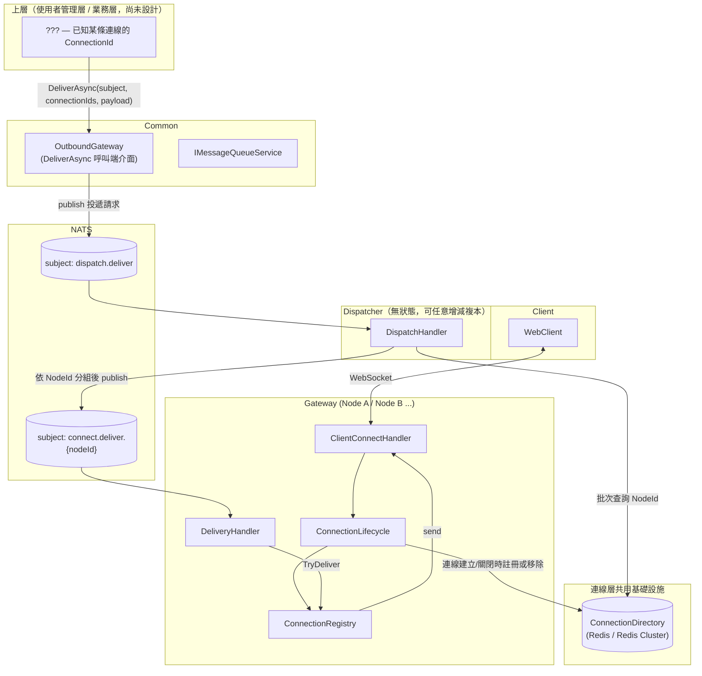
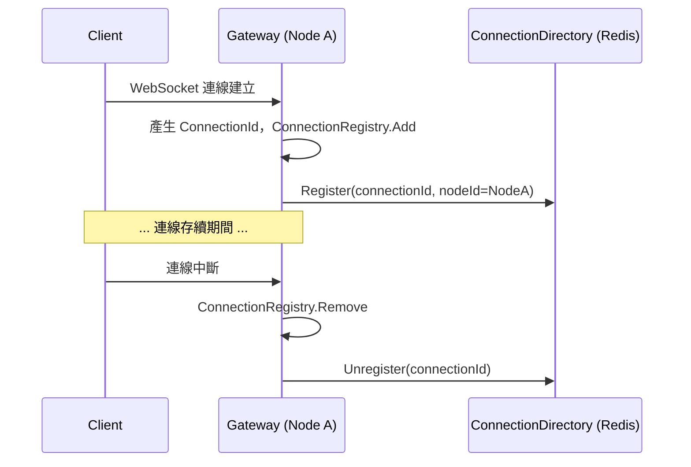
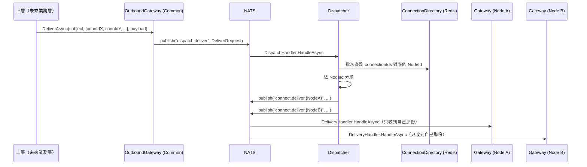

# 連線層架構設計（Connection Layer）

狀態：討論中 draft，尚未實作
技術棧：延續現有 .NET + NATS + 自製 WebSocket handler
範圍：**只做連線層本身**（Gateway + Dispatcher + 連線的路由/投遞），不含使用者身分、Session、房間、聊天等業務語意

> 修正記錄：前一版把 Dispatcher 的路由查詢綁到了假設中的 SessionServer/PlayerInfo，這其實是把「使用者管理層」的概念提前混進「連線層」。本版重新界定範圍：連線層只認得 `ConnectionId`，不認得使用者身分；使用者管理層（Session、身分、房間、聊天）是連線層之上、**尚未開始設計**的下一階段。

## 1. 範圍界定

- 連線層要解決的問題只有一個：**一條 WebSocket 連線，怎麼被持有、怎麼被跨節點定址、怎麼被投遞訊息**。
- 連線層唯一的識別碼是 `ConnectionId`——代表一條 transport 連線本身，**不代表任何使用者身分**。一條連線是否經過驗證、背後是哪個帳號、屬於哪個房間，都是連線層看不到、也不需要看到的事。
- 「上層」（使用者管理層/業務層）目前還沒有設計，本文件裡凡是需要提到它的地方，都當作一個尚未定義的黑盒子：它會拿到某條連線的 `ConnectionId`，然後呼叫連線層提供的投遞能力；它怎麼知道該用哪個 `ConnectionId`（例如 userId → ConnectionId 的對照），不屬於這裡要解決的問題。

## 2. 現有實作對照

盤點 `main` 分支現有 `ChatConnector` 程式碼，跟「純連線層」這個範圍對照，問題分兩類：

**屬於連線層本身、這次要解決的**：

1. **定址慣例外洩**：`connect.send.{connectorId}` 這個 NATS subject 命名規則，被業務層直接字串內插使用，連線層沒有把這個能力包裝成 API 對外提供。
2. **Fan-out 邏輯沒有集中**：依節點分組、批次投遞的邏輯應該是連線層的能力，不該讓每個呼叫端各自重寫一次。
3. **`WebSocketRepository` 是貧血物件**：`class WebSocketRepository : ConcurrentDictionary<string, WebSocket> {}`，沒有承載任何「連線」行為；封包框裝邏輯在多處各寫一次。
4. **連線生命週期用手動串接的 Command 表達**：`OnConnectedAsync` / `OnDisconnectedAsync` 手動依序呼叫多個獨立的 `ICommandService<T>`，沒有一個聚合物件描述整體流程。

**其實是使用者管理層的問題、本階段不處理、記錄下來留給下一階段**：

5. 現有 `SessionId` 直接沿用 ASP.NET 的 `TraceIdentifier`，且連線建立時直接綁定 `httpContext.User.Identity`、直接呼叫 `RegisterSessionCommand` 註冊到 SessionServer——這把「接受一條連線」和「這個使用者上線了」揉在一起，正是本次要拆開的耦合。
6. 同一身分重複登入時要不要關閉舊連線（Supersede），需要比較「身分」是否相同，這是身分/使用者的概念，連線層本身無法回答，留給使用者管理層。

## 3. 核心概念（連線層）

| 概念 | 對應/取代現有元件 | 職責 |
|---|---|---|
| `Connection` | 散落在各 handler 的 `socket.SendAsync` | 封裝單一 socket 的生命週期與送封包行為，框裝邏輯只寫一次。識別碼是 `ConnectionId`（連線建立時由 Gateway 產生，例如 GUID，不依賴 ASP.NET `TraceIdentifier`，也不依賴任何身分資訊） |
| `ConnectionRegistry` | `WebSocketRepository` | 單一 Gateway 節點內的本地連線表：`ConnectionId → Connection`，明確方法（Add/Remove/TryDeliver），不繼承 Dictionary |
| `ConnectionDirectory`（新） | 無（現有實作沒有這個概念，直接用 SessionServer 代替，這正是耦合來源） | 跨節點的 `ConnectionId → NodeId` 對照表。**由連線層自己擁有**，只回答「這條連線在哪個節點」，不知道也不需要知道使用者是誰 |
| `Gateway` | `ChatConnector` | 持有 `ConnectionRegistry`，負責 accept / 驗證前置（如果有）/ 框裝 / 本地投遞；連線建立與關閉時维护 `ConnectionDirectory` |
| `Dispatcher`（新） | 無 | 無狀態部署單元，接收「投遞請求」（`subject` + 一批 `ConnectionId` + `payload`），查 `ConnectionDirectory` 依 `NodeId` 分組後投遞給對應 Gateway 節點 |
| `OutboundGateway` | 業務層裡手寫的 `connect.send.{connectorId}` | 上層呼叫連線層的**唯一入口**：`DeliverAsync(subject, connectionIds, payload)`。參數只接受 `ConnectionId`，不接受 userId/sessionId——那個轉換是上層自己的事 |
| `ConnectionLifecycle` | handler 裡手動串接的多個 Command | 聚合 OnConnect / OnDisconnect 該發生的步驟順序與失敗處理（目前只有：註冊/移除 `ConnectionRegistry`、註冊/移除 `ConnectionDirectory`） |

## 4. 元件關係圖



## 5. 訊息序列

### 5.1 連線建立 / 關閉（維護 ConnectionDirectory）



### 5.2 上層投遞一則訊息到多條連線



## 6. 具體介面設計

沿用 `Common` 現有的介面慣例（`ICommandService<T>` / `IGetService<TQuery,TResult>` / `IMessageHandler` + `AddHandler<THandler>(subject, group)` 的 queue-group 訂閱機制）。

### 6.1 Proto（重新命名，不沿用 `session_id` 這種帶身分意味的命名）

因為這是整個系統的重建，這裡直接把 wire 格式的命名改成誠實反映「這是連線層，只認得 ConnectionId」，不繼續沿用舊 proto 的 `session_id` 命名（那正是造成耦合的命名遺留）：

```protobuf
// connection.proto（新檔案，取代 common.proto 裡跟連線相關的部分）
syntax = "proto3";
option csharp_namespace = "Chat.Protos";
package chat;

// 上層 -> OutboundGateway -> Dispatcher：未分組的投遞請求
message DeliverRequest {
	string subject = 1;
	repeated string connection_ids = 2;
	bytes payload = 3;
}

// Dispatcher -> Gateway：已依 NodeId 分組後的投遞封包
message DeliverPacket {
	string subject = 1;
	repeated string connection_ids = 2;
	bytes payload = 3;
}
```

`DeliverRequest` 和 `DeliverPacket` 目前 wire 格式完全一樣（`subject` + `connection_ids` + `payload`），语意差異只在於 `connection_ids` 是全量清單還是已篩選過的子集。先分成兩個訊息型別而不是重用同一個，是為了讓 proto 本身讀起來就標示「這是request還是已分組的packet」，避免未來兩邊需求分岔時還要拆訊息型別；如果覺得目前重複沒必要，也可以先共用一個型別，等分岔時再拆。

### 6.2 `ConnectionDirectory`（連線層自己擁有，`Common` 提供介面）

```csharp
namespace Common;

public interface IConnectionDirectory
{
	ValueTask RegisterAsync(string connectionId, string nodeId);
	ValueTask UnregisterAsync(string connectionId);
	ValueTask<IReadOnlyDictionary<string, string>> ResolveNodesAsync(IReadOnlyCollection<string> connectionIds);
}
```

實作直接包 Redis（或 Redis Cluster），key schema例如 `Conn:{connectionId} -> nodeId`，短 TTL + Gateway 定期續命（沿用現有 30 秒 TTL + 心跳續命的思路，只是這次續的是「連線還活著」，不是「使用者 session 還活著」）：

```csharp
internal class RedisConnectionDirectory(IDatabase database) : IConnectionDirectory
{
	public ValueTask RegisterAsync(string connectionId, string nodeId) =>
		new(database.StringSetAsync($"Conn:{connectionId}", nodeId, TimeSpan.FromSeconds(30)));

	public ValueTask UnregisterAsync(string connectionId) =>
		new(database.KeyDeleteAsync($"Conn:{connectionId}"));

	public async ValueTask<IReadOnlyDictionary<string, string>> ResolveNodesAsync(IReadOnlyCollection<string> connectionIds)
	{
		// 真實 Redis Cluster：不同 connectionId 的 key 分散在不同 slot，
		// 無法用單一 MGET 跨 slot 查詢；改成平行送出多個 GET、一次 await 全部完成。
		var ids = connectionIds.ToArray();
		var values = await Task.WhenAll(
			ids.Select(id => database.StringGetAsync($"Conn:{id}"))
		).ConfigureAwait(false);

		var result = new Dictionary<string, string>();
		for (var i = 0; i < ids.Length; i++)
			if (!values[i].IsNullOrEmpty)
				result[ids[i]] = values[i]!;

		return result; // 查不到的 connectionId（已斷線）直接省略，不報錯
	}
}
```

因為 `ConnectionDirectory` 是連線層**自己的**基礎設施（不是借用某個業務服務的資料），Gateway（寫入端）跟 Dispatcher（讀取端）可以共用同一份 Redis 連線設定，**不需要再多一次 NATS request/reply 去問誰**——這是跟前一版設計（繞去問 SessionServer）比起來明確變簡單的地方。

### 6.3 `IOutboundGateway`（`Common`，上層呼叫的唯一入口）

```csharp
namespace Common;

public interface IOutboundGateway
{
	ValueTask DeliverAsync(string subject, IReadOnlyCollection<string> connectionIds, ByteString payload);
}

internal class OutboundGateway(IMessageQueueService messageQueueService) : IOutboundGateway
{
	private const string DispatchSubject = "dispatch.deliver";

	public ValueTask DeliverAsync(string subject, IReadOnlyCollection<string> connectionIds, ByteString payload)
	{
		var request = new DeliverRequest { Subject = subject, Payload = payload };
		request.ConnectionIds.AddRange(connectionIds);

		return messageQueueService.PublishAsync(DispatchSubject, request.ToByteArray());
	}
}
```

### 6.4 `Dispatcher`（新專案）

```csharp
namespace Dispatcher.Models.Handlers;

public class DispatchHandler(
	IConnectionDirectory connectionDirectory,
	IMessageQueueService messageQueueService,
	ILogger<DispatchHandler> logger) : IMessageHandler
{
	public async ValueTask HandleAsync(Msg msg, CancellationToken cancellationToken)
	{
		var request = DeliverRequest.Parser.ParseFrom(msg.Data);

		var nodesByConnection = await connectionDirectory
			.ResolveNodesAsync(request.ConnectionIds)
			.ConfigureAwait(false);
		// 查不到的 connectionId（已斷線）直接被省略，這裡不用特別處理

		foreach (var group in nodesByConnection.GroupBy(kv => kv.Value, kv => kv.Key))
		{
			var packet = new DeliverPacket { Subject = request.Subject, Payload = request.Payload };
			packet.ConnectionIds.AddRange(group);

			await messageQueueService
				.PublishAsync($"connect.deliver.{group.Key}", packet.ToByteArray())
				.ConfigureAwait(false);
		}

		logger.LogInformation(
			"Dispatched {Subject} to {NodeCount} node(s) for {TargetCount} connection(s).",
			request.Subject,
			nodesByConnection.Values.Distinct().Count(),
			request.ConnectionIds.Count);
	}
}
```

`Dispatcher/Program.cs` 訂閱時掛 queue group，讓多個複本互相分攤負載：

```csharp
config.AddHandler<DispatchHandler>("dispatch.deliver", "dispatch.deliver");
```

### 6.5 Gateway 端：`ConnectionLifecycle` 維護 `ConnectionDirectory`

```csharp
namespace Gateway.Models;

public class ConnectionLifecycle(
	string nodeId,
	ConnectionRegistry registry,
	IConnectionDirectory connectionDirectory)
{
	public async ValueTask<Connection> OnConnectedAsync(WebSocket socket)
	{
		var connectionId = Guid.NewGuid().ToString("N");
		var connection = new Connection(connectionId, socket);

		registry.Add(connection);
		await connectionDirectory.RegisterAsync(connectionId, nodeId).ConfigureAwait(false);

		return connection;
	}

	public async ValueTask OnDisconnectedAsync(string connectionId)
	{
		registry.Remove(connectionId);
		await connectionDirectory.UnregisterAsync(connectionId).ConfigureAwait(false);
	}
}
```

這裡刻意**不含任何身分驗證、不呼叫任何「註冊使用者」的動作**——跟現有 `ClientConnectHandler` 最大的差異就是這裡。身分驗證要不要在 Gateway 這一層做（例如握手時檢查 token），是下一階段要決定的事；連線層目前假設「能接受 WebSocket handshake 的就是一條合法連線」。

## 7. 架構決策記錄（ADR）

### ADR-1：連線層只認得 `ConnectionId`，不引入身分/Session 概念

- **Context**：現有實作把「接受連線」跟「使用者登入」揉在一起（連線建立時直接查驗身分、註冊到 SessionServer）。
- **Decision**：連線層的資料模型只有 `Connection` / `ConnectionId`，不出現 `Session`、`User`、`PlayerInfo` 等任何身分相關概念。使用者管理層要用什麼 key（userId? sessionId?）來記住「這個使用者對應哪個 ConnectionId」，是下一階段的設計，連線層不預設、也不依賴它。
- **Consequences**：連線層可以獨立設計、獨立測試、獨立部署，不必等使用者管理層的設計定案。代價是「同一身分重複連線」這種問題本階段無法回答（見下方排除事項）。

### ADR-2：`ConnectionDirectory` 由連線層自己擁有

- **Context**：前一版設計讓 Dispatcher 去查一個假設中的 SessionServer 來解析路由——但 SessionServer 屬於還沒設計的使用者管理層，連線層反過來依賴它是本末倒置。
- **Decision**：`ConnectionId → NodeId` 的對照表（`ConnectionDirectory`）是連線層自己的基礎設施，用連線層自己的 Redis（Cluster）存放，Gateway 直接寫、Dispatcher 直接讀，都在 `Common` 共用同一個介面/連線設定。
- **Consequences**：比透過另一個服務轉一手少一次網路來回，設計也更單純；代價是連線層現在多了一個自己要維運的 Redis 依賴（但這個依賴本來就會存在，只是換了誰擁有它）。

### ADR-3：`OutboundGateway` 是上層呼叫連線層的唯一入口，只接受 `ConnectionId`

- **Context**：定址慣例（NATS subject 命名）不該外洩給呼叫端。
- **Decision**：`IOutboundGateway.DeliverAsync(subject, connectionIds, payload)` 是唯一對外 API，參數型別就是 `ConnectionId`，不接受任何業務身分（userId/sessionId/room）。呼叫端要用什麼方式把「使用者/房間」轉換成一批 `ConnectionId`，是呼叫端（未來業務層）自己的責任。
- **Consequences**：介面維持乾淨，連線層完全不用因為業務語意變化（例如以後房間規則改變）而跟著改。

### ADR-4：Dispatcher 為無狀態部署單元，獨立於 Gateway 擴展

- **Context**：大量連線場景需要「連線數」（Gateway）跟「路由查詢 + fan-out 投遞」（Dispatcher）各自獨立擴展。
- **Decision**：Dispatcher 是獨立部署單元，本身無狀態、可任意增減複本；查詢倚賴 `ConnectionDirectory`（Redis Cluster）撐吞吐；大量連線的 fan-out 透過「依 NodeId 批次分組」處理，投遞成本正比於 Gateway 節點數，不是連線數。
- **Consequences**：多一個網路 hop（上層 → Dispatcher）；換來 Gateway/Dispatcher 兩層可以依各自負載獨立擴展。

### ADR-5（條件觸發）：有狀態 + Sharded Dispatcher

- **Context**：若未來量測顯示 Redis Cluster 查詢延遲/吞吐仍是瓶頸。
- **Decision（暫緩）**：屆時才考慮讓 Dispatcher 依某種 key 做一致性雜湊分片，記憶體快取部分路由狀態。
- **觸發條件**：需要先有實測數據證明 ADR-4 的無狀態方案不足，才啟動這個 ADR。

## 8. 明確排除於本階段（留給使用者管理層決定）

- 連線要不要驗證身分、什麼時候驗證（handshake 時？連線後第一則訊息？）。
- 使用者/Session 概念本身：一個使用者是否只能有一條連線、重複登入要不要 Supersede 舊連線——這些都需要「身分」才能回答，連線層看不到身分。
- Room、Chat 等業務語意，以及「誰該收到這則訊息」的決策——連線層只負責「把訊息送到給定的 ConnectionId」，不負責決定名單。
- 斷線後 `ConnectionId` 要不要保留一段時間等待重連——目前只有連線本身的 TTL（存活容錯用），跟「業務上要不要讓使用者恢復原本的房間身分」是兩件事，後者留給使用者管理層。

## 9. 待確認 / 後續事項

- 超大批次投遞（`DeliverRequest.connection_ids` 上萬筆）的 payload 大小上限：需要對照 NATS 的 payload 上限（預設 1MB）決定要不要加分批送出的保護。
- `ResolveNodesAsync` 用 `Task.WhenAll` 平行送出 N 個 Redis GET，沒有做併發上限；量大時可能需要限流或改用 pipeline API。
- Gateway 是否需要在 handshake 階段做任何驗證（即使不涉及「使用者身分」，例如限流、來源檢查），待決定連線層的安全邊界時再補。
