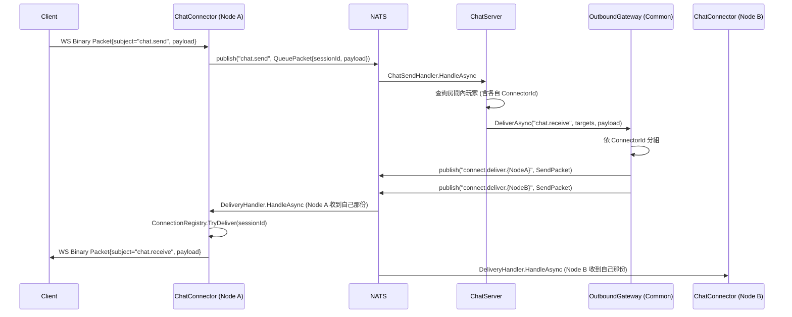
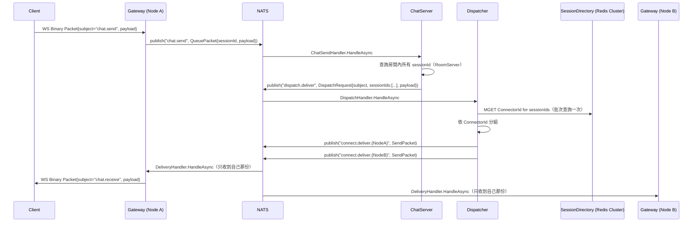

# 連線層架構設計（Connection Layer）

狀態：討論中 draft，尚未實作
技術棧：延續現有 .NET + NATS + 自製 WebSocket handler
範圍：Gateway（現有 ChatConnector）+ 新增的 Dispatcher 層，不涉及房間/聊天業務規則本身

> 更新：新增 Gateway → Dispatcher 兩層架構，用來讓「連線數」與「路由/fan-out 吞吐」各自獨立擴展，對應大量 user 場景。細節見第 7 節。

## 1. 背景：現有實作的模型問題

盤點 `main` 分支現有程式碼後，觀察到以下模型不夠俐落之處：

1. **Session 與 Connection 沒有分開**：`SessionId` 直接沿用 ASP.NET 的 `TraceIdentifier`，等同「連線=身分」，重新連線＝全新身分，沒有讓業務層決定重連語意的空間。
2. **定址慣例外洩到業務層**：`connect.send.{connectorId}` 這個 NATS subject 命名規則，被 `ChatServer.ChatSendHandler` 直接字串內插使用；連線層本身沒有把這個能力包裝成 API 對外提供。
3. **Fan-out 邏輯混在業務 handler 裡**：依 `ConnectorId` 分組、組 `SendPacket`、逐一 publish 的邏輯寫在 `ChatSendHandler`，未來每個新功能都要重寫一次。
4. **`WebSocketRepository` 是貧血物件**：`class WebSocketRepository : ConcurrentDictionary<string, WebSocket> {}`，沒有承載任何「連線」行為；封包框裝（Binary / EndOfMessage）在 `ClientConnectHandler` 和 `ConnectSendHandler` 各寫一次。
5. **連線生命週期用手動串接的 Command 表達**：`OnConnectedAsync` / `OnDisconnectedAsync` 手動依序呼叫 4~5 個獨立的 `ICommandService<T>`，沒有一個聚合物件描述整體流程與失敗處理。
6. **同一身分重複登入未處理**：目前程式碼沒有檢查「這個身分是否已經有一條活躍連線」，新連線進來時不會主動關閉舊連線，可能產生殭屍 socket。

值得保留的優點：`ConnectorId` 已經隨玩家資料（`PlayerInfo.ConnectorId`）流到 RoomServer / ChatServer，避免每次送訊息都要回頭查 SessionServer——這個「把定位資訊 denormalize 到業務資料上」的思路是對的，新模型延續它。

## 2. 核心概念

| 概念 | 對應/取代現有元件 | 職責 |
|---|---|---|
| `Connection` | 散落在各 handler 的 `socket.SendAsync` | 封裝單一 socket 的生命週期與送封包行為，框裝邏輯只寫一次 |
| `ConnectionRegistry` | `WebSocketRepository` | 單一 ChatConnector instance 內的本地連線表，明確方法（Add/Remove/TryDeliver），不繼承 Dictionary |
| `Session`（身分/在場狀態） | `SessionServer` 現有概念正名 | 代表已驗證身分的在場狀態，生命週期獨立於單次 Connection |
| `SessionDirectory` | `SessionServer` + Redis | 全域 `sessionId → (connectorId, identity)` 對照表，跨 service 可查詢 |
| `OutboundGateway` | 業務層裡手寫的 `connect.send.{connectorId}` | 業務服務呼叫的介面 `DeliverAsync(subject, targets, payload)`；內部實作改為送出 `DispatchRequest` 給 Dispatcher（見第 7 節），呼叫端契約不變 |
| `ConnectionLifecycle` | handler 裡手動串接的多個 Command | 聚合 OnConnect / OnDisconnect 該發生的步驟順序與失敗處理 |
| `Dispatcher`（第 7 節新增） | 無 | 獨立部署單元，接收 `DispatchRequest`，批次查 `SessionDirectory`、依 `ConnectorId` 分組後投遞給對應 Gateway node |

### 2.1 Session 與 Connection 的關係

- **結構上分離，但目前業務規則是 1:1**：一個 `Session` 在任何時刻最多對應一個 `Connection`（已確認不支援多裝置同時在線）。
- 分離的意義不是現在就要做「斷線保留房間」，而是讓這個決定成為**未來可以插上去的 policy**，不用重新設計 Connection/Registry/Transport。連線層現在只需要保證：
  - `Connection` 的生命週期 = 底層 socket 的生命週期，斷了就是斷了，連線層不做恢復邏輯。
  - `Session` 的生命週期由 `SessionDirectory`（現有 Redis TTL 機制）決定，是否在 Connection 斷開後短暫保留、要不要恢復房間身分，交給業務層（RoomServer/ChatServer）在未來另立 ADR 決定。

### 2.2 單一連線 + Supersede 策略

因為確認不支援多裝置，新模型需要明確定義「同一身分第二次連進來」時的行為（現有程式碼未處理）：

- `ConnectionLifecycle.OnConnected` 驗證身分後，先向 `SessionDirectory` 查詢該身分是否已有活躍 `Session`。
- 若有，視為 **Supersede**：對舊連線所在的 ChatConnector instance 送出「強制關閉」訊號（透過 `OutboundGateway` 送到舊 `connectorId`），舊連線關閉後才註冊新連線；避免同一身分同時存在兩條活躍連線與殭屍 socket。
- 這個決策獨立於「Session/Connection 是否分離」——即使日後開放多裝置，Supersede 邏輯也只是換成「允許 N 條」而不需重推翻整體模型。

## 3. 元件關係圖（含 Gateway / Dispatcher 分層，見第 7 節）

```mermaid
graph TB
    subgraph Client
        WC[WebClient]
    end

    subgraph "Gateway：ChatConnector (Node A / Node B ...)"
        CH[ClientConnectHandler]
        CR[ConnectionRegistry]
        CL[ConnectionLifecycle]
        DH[DeliveryHandler]
    end

    subgraph Common
        OG["OutboundGateway\n(DeliverAsync 呼叫端介面)"]
        MQ[IMessageQueueService]
    end

    subgraph "Dispatcher（無狀態，可任意增減複本）"
        DP[DispatchHandler]
    end

    subgraph "NATS"
        SUB1[("subject: chat.send / room.* ...")]
        SUB3[("subject: dispatch.deliver")]
        SUB2[("subject: connect.deliver.{nodeId}")]
    end

    subgraph Backend Services
        SS[SessionServer\n+ Redis Cluster\n(SessionDirectory)]
        RS[RoomServer]
        CS[ChatServer]
    end

    WC <-- WebSocket --> CH
    CH --> CL
    CL --> CR
    CL -- register/unregister --> SS
    CH -- inbound packet --> MQ --> SUB1
    SUB1 --> CS
    SUB1 --> RS
    CS -- "DeliverAsync(subject, sessionIds, payload)" --> OG
    RS -- "DeliverAsync(subject, sessionIds, payload)" --> OG
    OG -- publish DispatchRequest --> SUB3
    SUB3 --> DP
    DP -- 批次查詢 ConnectorId --> SS
    DP -- 依 ConnectorId 分組後 publish --> SUB2
    SUB2 --> DH
    DH -- TryDeliver --> CR
    CR -- send --> CH
```

## 4. 訊息序列：聊天訊息送達



## 5. 架構決策記錄（ADR）

### ADR-1：Session 與 Connection 分離建模

- **Context**：現有 `SessionId` = `TraceIdentifier`，等同連線=身分，重連即新身分。
- **Decision**：結構上把 `Session`（身分/在場）與 `Connection`（單次 socket 生命週期）拆成兩個概念，即使目前業務規則是嚴格 1:1。
- **Consequences**：
  - 好處：未來若要支援「斷線重連保留房間」，只需在 `SessionDirectory` 加 policy，不需重新設計 Connection/Registry。
  - 代價：多一層抽象，`ConnectionLifecycle` 需要同時操作 `Connection`（本地）與 `Session`（跨服務）兩個生命週期，複雜度略增。
  - 本次**不**決定重連是否保留房間身分——留給業務層（RoomServer）未來另立 ADR。

### ADR-2：單一連線 + Supersede 策略

- **Context**：確認不支援多裝置同時在線；現有程式碼未處理同一身分重複登入的情境。
- **Decision**：`SessionDirectory` 保證同一身分最多一個活躍 `Connection`；新連線登入時若偵測到舊連線存在，透過 `OutboundGateway` 通知舊連線所在 node 強制關閉，再完成新連線註冊。
- **Consequences**：需要在 `ConnectionLifecycle.OnConnected` 加入「查詢並清除舊連線」的步驟，跨 node 的強制關閉走既有的 deliver 通道即可，不需新機制。

### ADR-3：OutboundGateway 集中在 Common

- **Context**：現行 `ChatServer` 直接字串組 `connect.send.{connectorId}`，NATS 定址慣例耦合在業務層，多處重複。
- **Decision**：在 `Common` 提供 `IOutboundGateway.DeliverAsync(subject, IEnumerable<RoutingTarget>, payload)`，內部負責依 `ConnectorId` 分組、組裝 `SendPacket`、決定實際 publish 的 subject 命名規則（如 `connect.deliver.{nodeId}`）。所有 backend service 只依賴這個介面。
- **Consequences**：
  - 需要一個共用型別 `RoutingTarget { SessionId, ConnectorId }`，現有 `PlayerInfo` 已具備對應欄位，可直接轉換。
  - Subject 命名規則、序列化格式集中在一處，未來要換訊息匯流排（例如 NATS → Redis Streams）只需改 `OutboundGateway` 實作。

## 6. 待確認 / 後續事項

- 重連是否保留房間身分：留給 RoomServer/ChatServer 側未來另立 ADR，本次連線層設計不預先鎖定。
- `ConnectionRegistry` 與 `Connection` 的具體介面（方法簽章）尚未定案，留待進入實作階段時再細化。
- `OutboundGateway` 的 subject 命名規則（沿用 `connect.send.*` 或改為 `connect.deliver.*`）待與現有其他服務命名慣例對齊後決定。

## 7. 擴展方向：Gateway → Dispatcher 兩層架構

### 7.1 動機

「大量 user」同時牽涉兩個獨立的瓶頸，需要能各自獨立擴展：

1. **連線數瓶頸**：單一 Gateway process 的 socket/fd/記憶體上限。
2. **路由與 fan-out 吞吐瓶頸**：訊息送達前要查 `SessionDirectory` 找 `ConnectorId`，且大房間廣播時 fan-out 量隨人數增加。

單純把 fan-out 邏輯包成 `Common` 裡的 library（ADR-3）並不足夠——那段邏輯仍在 `ChatServer` process 內執行，沒辦法獨立於業務邏輯本身擴展。因此把它拆成獨立部署單元：**Dispatcher**。

### 7.2 兩個瓶頸，兩種對策（討論結論）

| 瓶頸 | 對策 | 為什麼不需要更複雜的方案 |
|---|---|---|
| SessionDirectory 查詢吞吐 | Redis Cluster 分片 | 純 KV 查詢的吞吐/資料量可以靠 Redis 原生分片線性擴展，不需要 Dispatcher 自己做一致性雜湊 |
| 大房間 fan-out 放大 | Dispatcher 依 `ConnectorId` **批次分組**後投遞 | 投遞成本正比於 Gateway 節點數（M），而非使用者數（N）；跟查詢速度無關，是投遞策略問題 |
| 每則訊息的網路來回延遲 | 目前不處理，先觀察 | 有狀態 + sharded 的 Dispatcher 能把這個延遲換成記憶體存取，但複雜度高（shard rebalance、cache 失效），先不預付這個成本 |

### 7.3 三層各自的擴展依據

| 層 | 元件 | 擴展依據 | 狀態 |
|---|---|---|---|
| Gateway | 現有 ChatConnector | 併發連線數（fd / 記憶體） | 無狀態，僅本地 `ConnectionRegistry` |
| Dispatcher | 新增服務 | 路由查詢 + fan-out 投遞吞吐 | 無狀態，任意增減複本 |
| SessionDirectory | SessionServer + **Redis Cluster** | 查詢 QPS + 資料量 | 有狀態，靠 Redis 原生分片擴展 |
| 業務服務 | ChatServer / RoomServer | 業務邏輯運算量 | 依現有設計，不變 |

### 7.4 職責重新分配

- **Gateway**：只做 `Connection` / `ConnectionRegistry` / `ConnectionLifecycle`（第 2 節定義）。不知道房間、不知道 fan-out，只知道「我這台有哪些 sessionId 對應哪個 socket」。
- **業務服務（ChatServer/RoomServer）**：決定「誰是這則訊息的目標」（例如房間內所有 sessionId），透過 `OutboundGateway`（`Common` 裡的介面，維持 ADR-3 的呼叫端契約不變）送出一個 `DispatchRequest{subject, sessionIds, payload}`。**不再自己查 ConnectorId、不再自己分組**。
- **Dispatcher**（新）：收到 `DispatchRequest` 後，對 `sessionIds` 批次查詢 `SessionDirectory`（Redis Cluster，用 `MGET`/pipeline），依查到的 `ConnectorId` 分組，組成 `SendPacket` 後批次 publish 到各 Gateway 專屬的 `connect.deliver.{nodeId}`。

副作用（值得注意但本次不強制執行）：一旦 Dispatcher 統一負責查 `ConnectorId`，`RoomServer.PlayerInfo` 上目前 denormalize 的 `ConnectorId` 欄位就不再是必需的——單一真實來源回到 `SessionDirectory`。這是後續可以做的簡化，本次先不動現有資料結構。

### 7.5 訊息序列（更新版）



### 7.6 架構決策記錄（新增 ADR）

#### ADR-4：Dispatcher 獨立為無狀態部署單元（延伸 ADR-3）

- **Context**：ADR-3 把 fan-out/定址邏輯包成 `Common` 的 library，但執行位置仍在呼叫端（`ChatServer`）process 內，無法獨立於業務邏輯擴展；大量 user 場景需要「連線數」「路由查詢/fan-out」「業務邏輯」三個維度各自能水平擴展。
- **Decision**：把實際查詢與分組邏輯搬到獨立服務 **Dispatcher**。`OutboundGateway`（`Common` 裡對業務服務的介面）維持不變，內部改為送出 `DispatchRequest` 給 Dispatcher，而不是在本地做查詢與分組。Dispatcher 本身無狀態、可任意增減複本，查詢倚賴 Redis Cluster 撐吞吐。
- **Consequences**：多一個網路 hop（業務服務 → Dispatcher）；換來三層可以依各自負載獨立擴展。大房間廣播的成本正比於 Gateway 節點數，不是使用者數。

#### ADR-5（條件觸發）：有狀態 + Sharded Dispatcher

- **Context**：若未來量測顯示 Redis Cluster 的查詢延遲或吞吐仍是瓶頸（例如訊息延遲預算被單次查詢的網路來回吃掉）。
- **Decision（暫緩）**：屆時才考慮讓 Dispatcher 依 room/user 做一致性雜湊分片，每個 shard 在記憶體中快取一部分路由狀態，Redis 只作為 source of truth 或 rebalance 時的備援，不在熱路徑上。
- **觸發條件**：需要先有實測數據（延遲/QPS）證明 ADR-4 的無狀態方案不足，才啟動這個 ADR；不提前預付一致性雜湊、shard rebalance 的複雜度成本。
