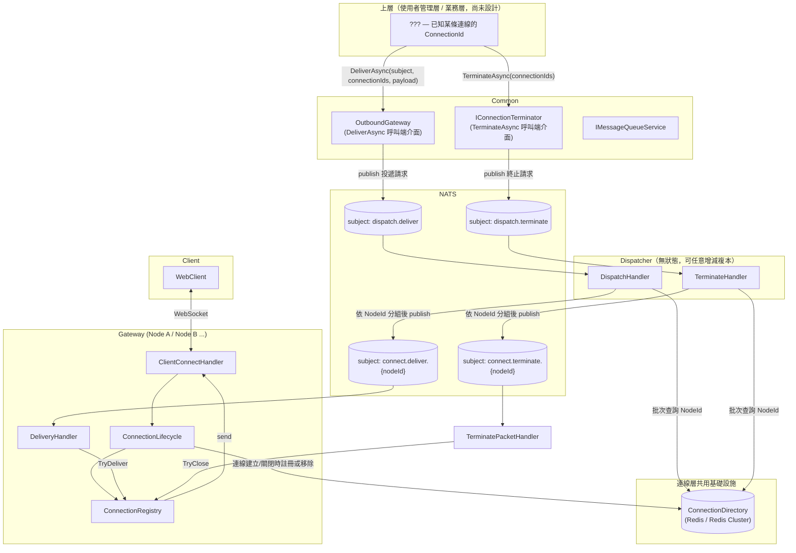
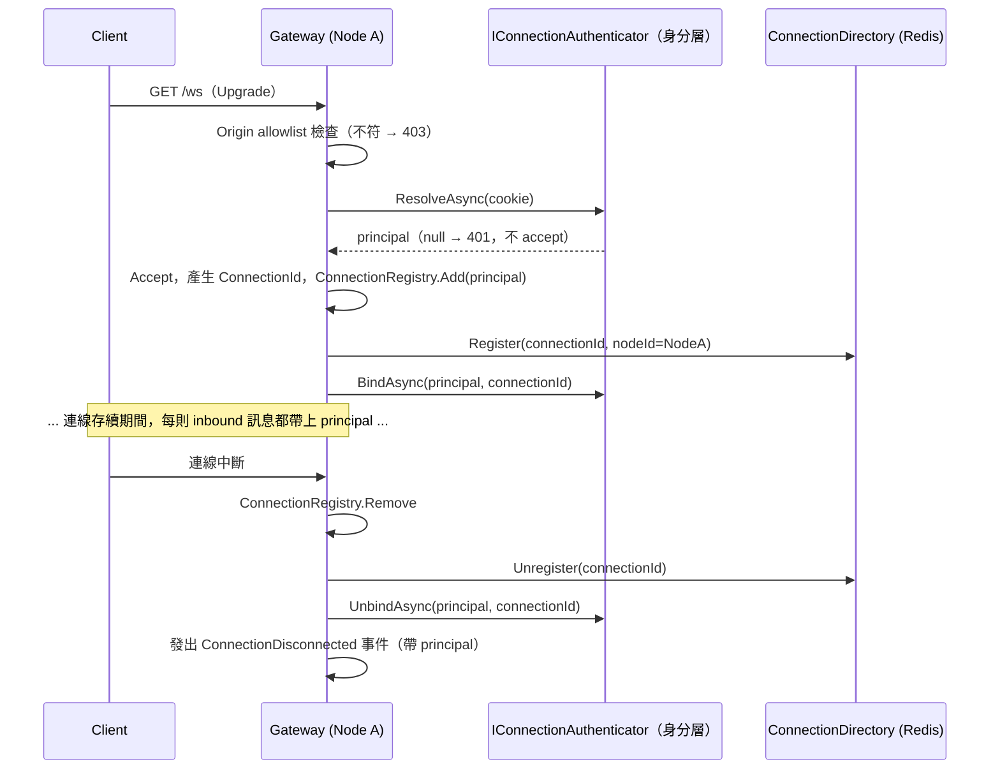
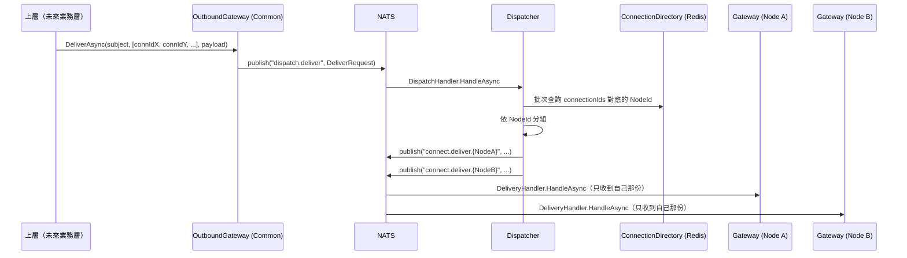
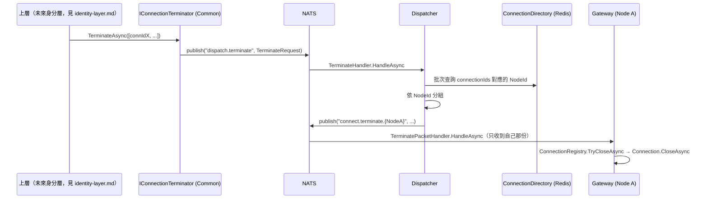

# 連線層架構設計（Connection Layer）

狀態：核心設計與實作已完成（Gateway / Dispatcher / `Common.Connections` / `Common.Delivery`，含單元測試），ADR-9 的 handshake 驗證與 principal 轉交也已實作
技術棧：延續現有 .NET + NATS + 自製 WebSocket handler
範圍：**只做連線層本身**（Gateway + Dispatcher + 連線的路由/投遞），不含使用者身分、Session、房間、聊天等業務語意

> 修正記錄：前一版把 Dispatcher 的路由查詢綁到了假設中的 SessionServer/PlayerInfo，這其實是把「使用者管理層」的概念提前混進「連線層」。本版重新界定範圍：連線層只認得 `ConnectionId`，不認得使用者身分；使用者管理層（Session、身分、房間、聊天）是連線層之上、**尚未開始設計**的下一階段。
>
> 修正記錄（身分層定案後）：身分驗證改為在 WebSocket handshake 進行（`identity-layer.md` ADR-8），連線層因此必須開兩個 hook 並多帶一個 **principal**（不透明字串）。第 1 節原本「`ConnectionId` 不代表任何使用者身分」那句話已依此修正，完整取捨見本文件 ADR-9。

## 1. 範圍界定

- 連線層要解決的問題只有一個：**一條 WebSocket 連線，怎麼被持有、怎麼被跨節點定址、怎麼被投遞訊息**。
- 連線層的識別碼是 `ConnectionId`——代表一條 transport 連線本身。連線層**不解讀**任何身分語意：一條連線背後是哪個帳號、屬於哪個房間，都是連線層看不到、也不需要看到的事。
- 唯一的例外是 **principal**：handshake 時由身分層的 hook 交給連線層的一個不透明字串，連線層把它記在 `Connection` 上、隨每則 inbound 訊息轉交給上層，但不解讀、不比較、不用它做任何決策（處境跟 `Packet.subject` 一樣——看得到、不理解）。沒有這個字串，上層就必須為「這則命令是誰送的」每則查一次 Redis。取捨見 ADR-9。
- 「上層」（身分層/業務層）怎麼決定要投遞給哪些連線（例如 userId → ConnectionId 的對照）不屬於這裡要解決的問題；連線層只負責「把訊息送到給定的 ConnectionId」。

## 2. 現有實作對照

盤點 `main` 分支現有 `ChatConnector` 程式碼，跟「純連線層」這個範圍對照，問題分兩類：

**屬於連線層本身、這次要解決的**：

1. **定址慣例外洩**：`connect.send.{connectorId}` 這個 NATS subject 命名規則，被業務層直接字串內插使用，連線層沒有把這個能力包裝成 API 對外提供。
2. **Fan-out 邏輯沒有集中**：依節點分組、批次投遞的邏輯應該是連線層的能力，不該讓每個呼叫端各自重寫一次。
3. **`WebSocketRepository` 是貧血物件**：`class WebSocketRepository : ConcurrentDictionary<string, WebSocket> {}`，沒有承載任何「連線」行為；封包框裝邏輯在多處各寫一次。
4. **連線生命週期用手動串接的 Command 表達**：`OnConnectedAsync` / `OnDisconnectedAsync` 手動依序呼叫多個獨立的 `ICommandService<T>`，沒有一個聚合物件描述整體流程。

**其實是使用者管理層的問題、本階段不處理、記錄下來留給下一階段**：

5. 現有 `SessionId` 直接沿用 ASP.NET 的 `TraceIdentifier`，且連線建立時直接綁定 `httpContext.User.Identity`、直接呼叫 `RegisterSessionCommand` 註冊到 SessionServer——這把「接受一條連線」和「這個使用者上線了」揉在一起，正是本次要拆開的耦合。
   **身分層定案後的修正**：驗證時機最終**回到 handshake**（`identity-layer.md` ADR-8），所以這條不是「時機錯了」，而是「耦合形狀錯了」。本次拆掉的是：Gateway 不再認識 `SessionServer`、不再呼叫任何業務命令、拿到的身分是一個不解讀的字串；`SessionId` 也不再跟 `ConnectionId` 混用（是兩個獨立的識別碼）。詳見 ADR-9 與 `identity-layer.md` 第 2 節。
6. 同一身分重複登入時要不要關閉舊連線（Supersede），需要比較「身分」是否相同，這是身分/使用者的概念，連線層本身無法回答，留給使用者管理層。**現況**：規則仍然完全屬於身分層（`identity-layer.md` ADR-4），但執行時機落在連線建立路徑上——連線層呼叫 `IConnectionAuthenticator.BindAsync` 之後由身分層自己決定要不要踢人，連線層不知道有沒有發生過踢人。

## 3. 核心概念（連線層）

| 概念 | 對應/取代現有元件 | 職責 |
|---|---|---|
| `Connection` | 散落在各 handler 的 `socket.SendAsync` | 封裝單一 socket 的生命週期與送封包行為，框裝邏輯只寫一次。識別碼是 `ConnectionId`（連線建立時由 Gateway 產生，例如 GUID，不依賴 ASP.NET `TraceIdentifier`）。另外持有 handshake 取得的 `Principal` 字串，只為了隨 inbound 訊息轉交（見 ADR-9） |
| `ConnectionRegistry` | `WebSocketRepository` | 單一 Gateway 節點內的本地連線表：`ConnectionId → Connection`，明確方法（Add/Remove/TryDeliver），不繼承 Dictionary |
| `ConnectionDirectory`（新） | 無（現有實作沒有這個概念，直接用 SessionServer 代替，這正是耦合來源） | 跨節點的 `ConnectionId → NodeId` 對照表。**由連線層自己擁有**，只回答「這條連線在哪個節點」，不知道也不需要知道使用者是誰 |
| `Gateway` | `ChatConnector` | 持有 `ConnectionRegistry`，負責 `Origin` 檢查 / handshake 驗證 hook / accept / 框裝 / 本地投遞；連線建立與關閉時维护 `ConnectionDirectory` |
| `Dispatcher`（新） | 無 | 無狀態部署單元，接收「投遞請求」（`subject` + 一批 `ConnectionId` + `payload`），查 `ConnectionDirectory` 依 `NodeId` 分組後投遞給對應 Gateway 節點 |
| `OutboundGateway` | 業務層裡手寫的 `connect.send.{connectorId}` | 上層呼叫連線層的**唯一入口**：`DeliverAsync(subject, connectionIds, payload)`。參數只接受 `ConnectionId`，不接受 userId/sessionId——那個轉換是上層自己的事 |
| `ConnectionLifecycle` | handler 裡手動串接的多個 Command | 聚合 OnConnect / OnDisconnect 該發生的步驟順序與失敗處理：註冊/移除 `ConnectionRegistry`、註冊/移除 `ConnectionDirectory`、呼叫身分層 hook 的 `BindAsync`/`UnbindAsync`、發出斷線事件 |
| `IConnectionTerminator`（新） | 無（現有實作沒有這個能力，只有收到對方 Close frame 時被動關閉） | 上層（身分層）主動終止指定 `ConnectionId` 的能力，設計脈絡見 ADR-7 |
| `IConnectionAuthenticator`（**身分層擁有**，連線層只呼叫） | `httpContext.User.Identity` + `RegisterSessionCommand` | handshake 驗證與 principal 綁定/解綁的唯一 hook。介面定義在 `Common.Identity`（見 `identity-layer.md` 6.3），連線層不知道它做了什麼 |

## 4. 元件關係圖



## 5. 訊息序列

### 5.1 連線建立 / 關閉（維護 ConnectionDirectory）



`Origin` 檢查與 `ResolveAsync` 必須在 `AcceptWebSocketAsync` **之前**——一旦 accept 就沒辦法回 HTTP 狀態碼了。`BindAsync` 只能在 accept 之後（`ConnectionId` 是那時才產生的），所以「已 accept、尚未綁定」有一個幾毫秒的窗口，影響見 `identity-layer.md` 6.3。

### 5.2 上層投遞一則訊息到多條連線



### 5.3 上層主動終止一批連線



## 6. 具體介面設計

沿用 `Common` 現有的介面慣例（`ICommandService<T>` / `IGetService<TQuery,TResult>` / `IMessageHandler` + `AddHandler<THandler>(subject, group)` 的 queue-group 訂閱機制）。

### 6.1 Proto（重新命名，不沿用 `session_id` 這種帶身分意味的命名）

因為這是整個系統的重建，這裡直接把 wire 格式的命名改成誠實反映「這是連線層，只認得 ConnectionId」，不繼續沿用舊 proto 的 `session_id` 命名（那正是造成耦合的命名遺留）：

```protobuf
// connection.proto（新檔案，取代 common.proto 裡跟連線相關的部分）
syntax = "proto3";
option csharp_namespace = "Chat.Protos";
package chat;

// 上層 -> OutboundGateway -> Dispatcher：未分組的投遞請求
message DeliverRequest {
	string subject = 1;
	repeated string connection_ids = 2;
	bytes payload = 3;
}

// Dispatcher -> Gateway：已依 NodeId 分組後的投遞封包
message DeliverPacket {
	string subject = 1;
	repeated string connection_ids = 2;
	bytes payload = 3;
}

// 上層 -> IConnectionTerminator -> Dispatcher：未分組的終止請求（見 ADR-7）
message TerminateRequest {
	repeated string connection_ids = 1;
}

// Dispatcher -> Gateway：已依 NodeId 分組後的終止封包
message TerminatePacket {
	repeated string connection_ids = 1;
}
```

`DeliverRequest` 和 `DeliverPacket` 目前 wire 格式完全一樣（`subject` + `connection_ids` + `payload`），语意差異只在於 `connection_ids` 是全量清單還是已篩選過的子集。先分成兩個訊息型別而不是重用同一個，是為了讓 proto 本身讀起來就標示「這是request還是已分組的packet」，避免未來兩邊需求分岔時還要拆訊息型別；如果覺得目前重複沒必要，也可以先共用一個型別，等分岔時再拆。

### 6.2 `ConnectionDirectory`（連線層自己擁有，`Common` 提供介面）

```csharp
namespace Common;

public interface IConnectionDirectory
{
	ValueTask RegisterAsync(string connectionId, string nodeId);
	ValueTask UnregisterAsync(string connectionId);
	ValueTask<IReadOnlyDictionary<string, string>> ResolveNodesAsync(IReadOnlyCollection<string> connectionIds);
}
```

實作直接包 Redis（或 Redis Cluster），key schema例如 `Conn:{connectionId} -> nodeId`，短 TTL + Gateway 定期續命（沿用現有 30 秒 TTL + 心跳續命的思路，只是這次續的是「連線還活著」，不是「使用者 session 還活著」）：

```csharp
internal class RedisConnectionDirectory(IDatabase database) : IConnectionDirectory
{
	public ValueTask RegisterAsync(string connectionId, string nodeId) =>
		new(database.StringSetAsync($"Conn:{connectionId}", nodeId, TimeSpan.FromSeconds(30)));

	public ValueTask UnregisterAsync(string connectionId) =>
		new(database.KeyDeleteAsync($"Conn:{connectionId}"));

	public async ValueTask<IReadOnlyDictionary<string, string>> ResolveNodesAsync(IReadOnlyCollection<string> connectionIds)
	{
		// 真實 Redis Cluster：不同 connectionId 的 key 分散在不同 slot，
		// 無法用單一 MGET 跨 slot 查詢；改成平行送出多個 GET、一次 await 全部完成。
		var ids = connectionIds.ToArray();
		var values = await Task.WhenAll(
			ids.Select(id => database.StringGetAsync($"Conn:{id}"))
		).ConfigureAwait(false);

		var result = new Dictionary<string, string>();
		for (var i = 0; i < ids.Length; i++)
			if (!values[i].IsNullOrEmpty)
				result[ids[i]] = values[i]!;

		return result; // 查不到的 connectionId（已斷線）直接省略，不報錯
	}
}
```

因為 `ConnectionDirectory` 是連線層**自己的**基礎設施（不是借用某個業務服務的資料），Gateway（寫入端）跟 Dispatcher（讀取端）可以共用同一份 Redis 連線設定，**不需要再多一次 NATS request/reply 去問誰**——這是跟前一版設計（繞去問 SessionServer）比起來明確變簡單的地方。

### 6.3 `IOutboundGateway`（`Common`，上層呼叫的唯一入口）

```csharp
namespace Common;

public interface IOutboundGateway
{
	ValueTask DeliverAsync(string subject, IReadOnlyCollection<string> connectionIds, ByteString payload);
}

internal class OutboundGateway(IMessageQueueService messageQueueService) : IOutboundGateway
{
	private const string DispatchSubject = "dispatch.deliver";

	public ValueTask DeliverAsync(string subject, IReadOnlyCollection<string> connectionIds, ByteString payload)
	{
		var request = new DeliverRequest { Subject = subject, Payload = payload };
		request.ConnectionIds.AddRange(connectionIds);

		return messageQueueService.PublishAsync(DispatchSubject, request.ToByteArray());
	}
}
```

### 6.4 `Dispatcher`（新專案）

```csharp
namespace Dispatcher.Models.Handlers;

public class DispatchHandler(
	IConnectionDirectory connectionDirectory,
	IMessageQueueService messageQueueService,
	ILogger<DispatchHandler> logger) : IMessageHandler
{
	public async ValueTask HandleAsync(Msg msg, CancellationToken cancellationToken)
	{
		var request = DeliverRequest.Parser.ParseFrom(msg.Data);

		var nodesByConnection = await connectionDirectory
			.ResolveNodesAsync(request.ConnectionIds)
			.ConfigureAwait(false);
		// 查不到的 connectionId（已斷線）直接被省略，這裡不用特別處理

		foreach (var group in nodesByConnection.GroupBy(kv => kv.Value, kv => kv.Key))
		{
			var packet = new DeliverPacket { Subject = request.Subject, Payload = request.Payload };
			packet.ConnectionIds.AddRange(group);

			await messageQueueService
				.PublishAsync($"connect.deliver.{group.Key}", packet.ToByteArray())
				.ConfigureAwait(false);
		}

		logger.LogInformation(
			"Dispatched {Subject} to {NodeCount} node(s) for {TargetCount} connection(s).",
			request.Subject,
			nodesByConnection.Values.Distinct().Count(),
			request.ConnectionIds.Count);
	}
}
```

`Dispatcher/Program.cs` 訂閱時掛 queue group，讓多個複本互相分攤負載：

```csharp
config.AddHandler<DispatchHandler>("dispatch.deliver", "dispatch.deliver");
```

### 6.5 Gateway 端：`ConnectionLifecycle` 維護 `ConnectionDirectory`

```csharp
namespace Gateway.Models;

public class ConnectionLifecycle(
	string nodeId,
	ConnectionRegistry registry,
	IConnectionDirectory connectionDirectory)
{
	public async ValueTask<Connection> OnConnectedAsync(WebSocket socket)
	{
		var connectionId = Guid.NewGuid().ToString("N");
		var connection = new Connection(connectionId, socket);

		registry.Add(connection);
		await connectionDirectory.RegisterAsync(connectionId, nodeId).ConfigureAwait(false);

		return connection;
	}

	public async ValueTask OnDisconnectedAsync(string connectionId)
	{
		registry.Remove(connectionId);
		await connectionDirectory.UnregisterAsync(connectionId).ConfigureAwait(false);
	}
}
```

上面是身分層定案前的形狀。實際實作在 `OnConnectedAsync` 末尾多一次 `authenticator.BindAsync(principal, connectionId)`、在 `OnDisconnectedAsync` 的清理之後多一次 `UnbindAsync`（發事件之前），`Connection` 也多帶一個 `Principal`。跟現有 `ClientConnectHandler` 的差異不在「有沒有碰身分」，而在**碰的方式**：這裡呼叫的是一個身分層自己提供的介面、參數是不解讀的字串，而 `ClientConnectHandler` 是直接認識 `SessionServer` 與房間並呼叫它們的 Command。詳見第 6.8 節與 ADR-9。

### 6.6 `IConnectionTerminator`（`Common`，新）——設計脈絡見 ADR-7

身分層設計 Supersede（同一身分同時只能有一條連線生效）時，發現連線層原本沒有任何「主動終止指定連線」的能力——`ConnectionRegistry` 只公開 `Add`/`Remove`/`TryDeliverAsync`，`Connection.CloseAsync` 只有在收到對方送出的 Close frame 時被 `GatewayWebSocketEndpoint` 自己呼叫。這裡補上這個能力，設計上完全複用 `IOutboundGateway`/`Dispatcher`/`DeliverPacketHandler` 已經建立的 fan-out 模式，只是把「投遞資料」換成「終止連線」：

```csharp
namespace Common;

public interface IConnectionTerminator
{
	ValueTask TerminateAsync(IReadOnlyCollection<string> connectionIds);
}

internal class ConnectionTerminator(IMessageQueueService messageQueueService) : IConnectionTerminator
{
	private const string DispatchSubject = "dispatch.terminate";

	public ValueTask TerminateAsync(IReadOnlyCollection<string> connectionIds)
	{
		var request = new TerminateRequest();
		request.ConnectionIds.AddRange(connectionIds);

		return messageQueueService.PublishAsync(DispatchSubject, request.ToByteArray());
	}
}
```

`Dispatcher` 端新增對稱的 `TerminateHandler`（訂閱 `dispatch.terminate`，查 `ConnectionDirectory.ResolveNodesAsync` 依 NodeId 分組後 publish 到 `connect.terminate.{nodeId}`，邏輯結構跟 `DispatchHandler` 完全一樣，只是把 `DeliverPacket` 換成 `TerminatePacket`）。

`Gateway` 端新增 `TerminatePacketHandler`（訂閱 `connect.terminate.{nodeId}`），呼叫 `ConnectionRegistry` 新增的方法：

```csharp
public async ValueTask<bool> TryCloseAsync(string connectionId, CancellationToken cancellationToken = default)
{
	if (!m_Connections.TryGetValue(connectionId, out var connection))
		return false;

	try
	{
		await connection
			.CloseOutputAsync(WebSocketCloseStatus.PolicyViolation, CloseDescription, cancellationToken)
			.ConfigureAwait(false);
	}
	catch (Exception ex) when (ex is WebSocketException or ObjectDisposedException)
	{
		return false; // 跟「連線正在自然斷開」競爭，結果等同於查不到
	}

	return true;
}
```

查不到的 `connectionId`（連線已經自然斷開）直接回傳 `false`，不報錯——沿用 `ResolveNodesAsync` 查不到就省略的既有慣例，呼叫端（身分層）不需要特別處理「舊連線其實已經斷了」這種情況。

實作時修正了本節原本設計的兩個問題（見第 9 節）：

1. **必須用 `CloseOutputAsync`，不能用 `CloseAsync`**。`WebSocket.CloseAsync` 會在送出 close frame 後**等待對方回應的 close frame**，而 receive loop 同時也在 `ReceiveAsync`——兩邊會搶同一個 receive，結果是例外或卡住。`CloseOutputAsync` 只送出自己的 close frame，socket 狀態轉為 `CloseSent`，receive loop 下一輪的狀態檢查就會結束迴圈，`finally` 照既有流程跑 `OnDisconnectedAsync`。因此 `Connection` 也對稱新增了一個取 `m_SendLock` 的 `CloseOutputAsync`。
2. **close description 不能寫 `"Superseded by a newer connection."`**。Supersede 是身分層的語意，連線層不知道上層為什麼要關這條連線，寫死這句話等於把上層概念漏進連線層（違反 ADR-1）。實作改用中性字串 `"Connection terminated by server."`；要讓 client 分辨原因是上層的責任。

另外 `TryCloseAsync` **刻意不呼叫 `Remove`**：socket 關閉後 receive loop 會自然結束，由 `GatewayWebSocketEndpoint` 的 `finally` 走既有的 `OnDisconnectedAsync`，才會連 `ConnectionDirectory` 一起清乾淨。

### 6.7 `IConnectionEventPublisher`（`Common`，新）——設計脈絡見 ADR-8

連線層唯一「主動往上告知」的通道。其他對外能力（`IOutboundGateway`、`IConnectionTerminator`）都是上層呼叫下來，這個是反方向的：

```csharp
namespace Common.Connections;

public interface IConnectionEventPublisher
{
	// principal 是 handshake 取得的不透明字串（見 ADR-9），連線層只轉手。
	// 有了它，訂閱端（房間層）不需要任何 connectionId → 身分的反查。
	ValueTask PublishDisconnectedAsync(
		string connectionId,
		string nodeId,
		string principal,
		CancellationToken cancellationToken = default);
}
```

這個 publisher 跟系統裡其他每一條通道一樣走 Adaptare 的 `IMessageSender`。它曾經短暫改用原生 `INatsConnection`，理由寫的是「Adaptare 的 publish 不會落在字面 subject」——**那個診斷是錯的，已推翻**（實測 subject、payload、目標 server 全部一致），完整過程見 `room-layer.md` 第 9 節。

**這條事件通道有一個必須守住的性質：發布它的 cancellation token 不能是那條正在死掉的連線自己的 token。** 這不是 messaging 元件的問題，而是這個事件的本質——它**只在連線已經斷掉之後才發**，所以任何「連線還活著」才有效的 token 拿到這裡都必然已經取消。`GatewayWebSocketEndpoint` 的 `finally` 因此用自己的有界 `CancellationTokenSource`（5 秒）而不是請求注入的 `CancellationToken`（那就是 `HttpContext.RequestAborted`）。原本傳請求 token 的版本讓這個事件**從來沒有被送出去過**，而且沒有 log。

subject 是 `events.connection.disconnected`，**刻意不放在 `connect.*` 家族**：那個前綴目前的意思是「投遞給某個 Gateway 節點」（`connect.deliver.{nodeId}`、`connect.terminate.{nodeId}`），而這是反方向的事件廣播、沒有特定目標角色。用 `events.*` 開一個明確的事件命名空間，也避免 `connect.` 跟 `connection.` 只差三個字母的辨識風險。

`ConnectionLifecycle.OnDisconnectedAsync` 在清理完成**之後**才發事件：

```csharp
public async ValueTask OnDisconnectedAsync(string connectionId, CancellationToken cancellationToken = default)
{
	registry.Remove(connectionId);
	await connectionDirectory.UnregisterAsync(connectionId, cancellationToken).ConfigureAwait(false);

	try
	{
		await connectionEventPublisher.PublishDisconnectedAsync(connectionId, nodeId.Value, cancellationToken).ConfigureAwait(false);
	}
	catch (OperationCanceledException)
	{
		logger.LogDebug(...);   // 關站時每條連線都會走到這裡，不能用 Error 洗 log
	}
	catch (Exception ex)
	{
		logger.LogError(ex, ...);   // 發不出去不能影響清理本身
	}
}
```

順序有意義：訂閱端收到事件時，這條連線必須已經不在 `ConnectionDirectory` 上，否則會出現「收到斷線通知卻還查得到節點」這種自相矛盾的中間狀態。這個順序有測試釘住。

因為 `IConnectionTerminator` 的關閉路徑最終也會讓 receive loop 結束、走到同一個 `finally`，所以主動終止的連線同樣會發出事件，不需要另外處理。

### 6.8 handshake 驗證與 principal 轉交（見 ADR-9）

連線層為身分層開的兩個 hook，加上一個自己負責的檢查。三者都在 `GatewayWebSocketEndpoint`／`ConnectionLifecycle` 裡，沒有新元件：

**① `Origin` 檢查（連線層自己做）**——allowlist 從設定注入，不符就 403 且不 accept。這是連線層的安全邊界（第 9 節原本列為待決的「handshake 階段要不要做來源檢查」），不是身分邏輯：它跟 cookie 認證天生的 CSWSH 風險綁在一起，理由見 `identity-layer.md` ADR-9。

**② `ResolveAsync`（身分層 hook，accept 之前）**

```csharp
var principal = await authenticator
	.ResolveAsync(context.Request.Cookies[SessionCookieName], cancellationToken)
	.ConfigureAwait(false);

if (principal is null)
{
	context.Response.StatusCode = StatusCodes.Status401Unauthorized;
	return;
}

using var socket = await context.WebSockets.AcceptWebSocketAsync();
var connection = await lifecycle.OnConnectedAsync(socket, principal, cancellationToken);
```

連線層知道的只有「cookie 名稱」跟「回 null 就拒絕」；它不知道那個字串怎麼被驗證、principal 的值代表什麼。

**③ principal 隨每則 inbound 訊息轉交**——`IInboundMessageHandler` 多一個參數：

```csharp
ValueTask HandleAsync(
	string connectionId,
	string principal,
	string subject,
	ByteString payload,
	CancellationToken cancellationToken = default);
```

receive loop 從 `connection.Principal` 取值（不是每則重查 Redis），唯一實作 `InboundBridge` 把它塞進 `InboundPacket.principal`（見 `protocol-layer.md` 6.1）。

**協定層與身分層的介面同步變更**（一次性、全部是新增參數）：`InboundPacket` 加 `principal`、`ConnectionDisconnected` 加 `principal`、協定層的 handler/filter 改收 `CommandContext`（見 `protocol-layer.md` ADR-9）。

## 7. 架構決策記錄（ADR）

### ADR-1：連線層只認得 `ConnectionId`，不引入身分/Session 概念

- **Context**：現有實作把「接受連線」跟「使用者登入」揉在一起（連線建立時直接查驗身分、註冊到 SessionServer）。
- **Decision**：連線層的資料模型只有 `Connection` / `ConnectionId`，不出現 `Session`、`User`、`PlayerInfo` 等任何身分相關概念。使用者管理層要用什麼 key（userId? sessionId?）來記住「這個使用者對應哪個 ConnectionId」，是下一階段的設計，連線層不預設、也不依賴它。
- **Consequences**：連線層可以獨立設計、獨立測試、獨立部署，不必等使用者管理層的設計定案。代價是「同一身分重複連線」這種問題本階段無法回答（見下方排除事項）。
- **部分修正（ADR-9）**：身分層定案後，連線層多了一個 `Principal` 字串與兩個 hook。本 ADR 的核心主張仍然有效——連線層的資料模型不出現 `Session`/`User`/`PlayerInfo` 這些**型別**，`ConnectionDirectory` 仍然只有 `ConnectionId → NodeId`，連線層也不知道 principal 的值從哪來。改變的是「連線層完全不經手身分資料」這個更強的說法，它撐不住 httpOnly cookie 的現實（見 `identity-layer.md` ADR-8）。

### ADR-2：`ConnectionDirectory` 由連線層自己擁有

- **Context**：前一版設計讓 Dispatcher 去查一個假設中的 SessionServer 來解析路由——但 SessionServer 屬於還沒設計的使用者管理層，連線層反過來依賴它是本末倒置。
- **Decision**：`ConnectionId → NodeId` 的對照表（`ConnectionDirectory`）是連線層自己的基礎設施，用連線層自己的 Redis（Cluster）存放，Gateway 直接寫、Dispatcher 直接讀，都在 `Common` 共用同一個介面/連線設定。
- **Consequences**：比透過另一個服務轉一手少一次網路來回，設計也更單純；代價是連線層現在多了一個自己要維運的 Redis 依賴（但這個依賴本來就會存在，只是換了誰擁有它）。
- **範圍澄清（後補）**：本 ADR 講的是**誰擁有那張對照表**，不是「每層要有自己的 Redis 實例」。`chat-layer.md` §9 曾把它轉述成後者、並因此生出一條「`room-store` 要不要保留」的懸案——那條懸案的前提是錯的。實體上開幾顆 Redis 是部署參數（AppHost 現在只開一顆，多個連線字串名稱指向它），拆與不拆都不影響本 ADR：連線層照樣擁有 `ConnectionDirectory`、Gateway 照樣直接寫、Dispatcher 照樣直接讀。要拆的判準是 instance 級的設定（`maxmemory-policy`、persistence、慢指令的故障範圍），跟資料歸屬無關。

### ADR-3：`OutboundGateway` 是上層呼叫連線層的唯一入口，只接受 `ConnectionId`

- **Context**：定址慣例（NATS subject 命名）不該外洩給呼叫端。
- **Decision**：`IOutboundGateway.DeliverAsync(subject, connectionIds, payload)` 是唯一對外 API，參數型別就是 `ConnectionId`，不接受任何業務身分（userId/sessionId/room）。呼叫端要用什麼方式把「使用者/房間」轉換成一批 `ConnectionId`，是呼叫端（未來業務層）自己的責任。
- **Consequences**：介面維持乾淨，連線層完全不用因為業務語意變化（例如以後房間規則改變）而跟著改。

### ADR-4：Dispatcher 為無狀態部署單元，獨立於 Gateway 擴展

- **Context**：大量連線場景需要「連線數」（Gateway）跟「路由查詢 + fan-out 投遞」（Dispatcher）各自獨立擴展。
- **Decision**：Dispatcher 是獨立部署單元，本身無狀態、可任意增減複本；查詢倚賴 `ConnectionDirectory`（Redis Cluster）撐吞吐；大量連線的 fan-out 透過「依 NodeId 批次分組」處理，投遞成本正比於 Gateway 節點數，不是連線數。
- **Consequences**：多一個網路 hop（上層 → Dispatcher）；換來 Gateway/Dispatcher 兩層可以依各自負載獨立擴展。

### ADR-5（條件觸發）：有狀態 + Sharded Dispatcher

- **Context**：若未來量測顯示 Redis Cluster 查詢延遲/吞吐仍是瓶頸。
- **Decision（暫緩）**：屆時才考慮讓 Dispatcher 依某種 key 做一致性雜湊分片，記憶體快取部分路由狀態。
- **觸發條件**：需要先有實測數據證明 ADR-4 的無狀態方案不足，才啟動這個 ADR。

### ADR-6：採用 .NET Aspire 建立專案骨架與本地開發編排

- **Context**：Gateway/Dispatcher/Redis/NATS 這種多服務 + 資源的組合，需要一致的方式做本地啟動編排、服務發現、觀測性（trace/log/metrics），手動兜 `docker-compose` 或各專案自己的 `launchSettings.json` 維護成本高。
- **Decision**：用 `ChatSystem.AppHost` 定義資源拓樸——`connection-directory`（Redis）、`message-bus`（NATS）、`gateway`（可 `WithReplicas` 開多份模擬多節點）、`dispatcher`；每個服務專案透過 `ChatSystem.ServiceDefaults` 取得統一的 OpenTelemetry/health check/resilience 設定，透過 `Aspire.StackExchange.Redis`/`Aspire.NATS.Net` 的 `AddRedisClient`/`AddNatsClient` 拿到由 AppHost 注入的連線字串，不用自己管設定檔。
- **Consequences**：
  - 本地開發時可以直接 `dotnet run` AppHost 啟動整套拓樸（含 Redis/NATS 容器）並在 Aspire Dashboard 看到 trace/log。
  - `Aspire.NATS.Net` 底層是新版 `NATS.Net`（`NATS.Client.Core`）非同步用戶端，跟舊 `main` 分支用的 `NATS.Client`（classic 同步用戶端）不是同一套 API；`Common` 裡 `IMessageQueueService`/`IMessageHandler` 這類抽象要對著新用戶端重新設計，不能直接照搬舊程式碼。
  - 部署到正式環境時，Aspire 的資源定義可以轉成 manifest 餵給對應的部署工具，但這次先只處理本地開發編排，正式環境的部署方式待後續另立 ADR。

### ADR-7：新增 `IConnectionTerminator`，讓上層能主動終止指定連線

- **Context**：設計身分層的 Supersede 規則（同一身分同時只能有一條連線生效，詳見 `identity-layer.md` ADR-4）時，發現連線層完全沒有「主動終止連線」的能力——`connection-layer.md` 第 8 節原本的排除清單也沒提到這件事，代表這不是刻意排除，是設計當時沒預想到的盲點（那時候身分層還沒開始設計，自然想不到這個需求）。
- **Decision**：新增獨立介面 `IConnectionTerminator`（不併入 `IOutboundGateway`），複用 `Dispatcher`/`ConnectionDirectory` 已經建立的 fan-out 模式，設計見第 6.6 節。選擇獨立介面而非併入 `IOutboundGateway`，是因為「投遞資料」跟「終止生命週期」語意不同，符合這個 codebase 既有的單一職責小介面風格（`IConnectionDirectory`、`IOutboundGateway` 都是各自獨立、職責單一的小介面）。
- **Consequences**：連線層原始碼（`ConnectionRegistry`、`ConnectionLifecycle`）不需要修改設計思路，只是新增 `TryCloseAsync` 方法跟一組對稱的 Dispatcher/Gateway handler，風險很小；代價是又多了一組 NATS subject（`dispatch.terminate`/`connect.terminate.{nodeId}`）要維護。**設計已定案，尚未實作**（見第 9 節）。

### ADR-8：新增斷線事件，語意是 best-effort，訂閱端不得只依賴它

- **Context**：房間層要做「斷線後寬限期到期就退房」（`room-layer.md` ADR-3），但 `OnDisconnectedAsync` 原本只清自己的 registry 與 `ConnectionDirectory`，上層完全不知道連線消失了。身分層的 `Presence` 與協定層的 principal 生命週期當時也都在用 TTL 當這個事件的替代品（協定層那張表後來整個不存在了，見 `protocol-layer.md` ADR-9）。舊 `main` 分支的做法是在 `ClientConnectHandler.OnDisconnectedAsync` 裡直接呼叫 `LeaveRoomCommand`——連線層直接認識房間，正是這次要拆掉的耦合。
- **Decision**：新增 `IConnectionEventPublisher`，連線關閉時 publish 到 `events.connection.disconnected`，設計見第 6.7 節。連線層不知道誰在聽、也不等待任何回應。
- **Consequences**：
  - **事件是 best-effort，不是保證**。process 被 SIGKILL、機器斷電、publish 本身失敗時，事件都不會送出。所以訂閱端必須設計成「沒收到事件也會正確」——房間層 ADR-2 刻意把正確性放在「讀取名單時過濾過期成員」上、只讓事件加速「離開」廣播，就是照這個前提設計的。任何「只在收到事件時才清理」的上層設計都是錯的。
  - publish 失敗被吞掉並記 log，不影響 registry/directory 的清理。關站時的 `OperationCanceledException` 降級為 Debug，否則一個節點關站會依連線數產生等量的 Error log。
  - 關站會產生「連線數量級」的事件突發。目前不批次處理——rolling deploy 時 client 幾秒內就會重連到其他節點，寬限期本來就吸收得掉。真的成為問題再考慮批次或抑制。
  - 事件**不帶時間戳**，訂閱端收到時自己蓋。少一個「用誰的時鐘」的問題；代價是訂閱端積壓時算出的斷線時間會偏晚。以 30 秒寬限期的量級來說不影響，真的需要再加欄位。
  - 事件帶 `connectionId`、`nodeId` 與 **`principal`**（ADR-9 之後新增），不帶房間或任何業務狀態。principal 是連線層轉手的不透明字串，帶上它讓訂閱端（房間層）不必為了知道「是誰斷線了」而維護一張 `connectionId → userId` 的反向索引——那張表在身分層前一版設計裡存在過，正是被這個欄位取代掉的（`identity-layer.md` ADR-8）。

### ADR-9：handshake 驗證與 principal 轉交——連線層讓出的形狀

- **Context**：身分層原本設計成「連線後第一則訊息 `identity.bind` 綁定身分」，連線層完全不需要改。但 SessionToken 存在 `httpOnly` cookie 裡、前端 JS 讀不到，那個設計無法成立（完整分析見 `identity-layer.md` ADR-8）。改成 handshake 驗證的話，連線層必須讓出三樣東西：一個 hook 呼叫點、`Connection` 上的一個字串、以及 `IInboundMessageHandler`／`InboundPacket`／`ConnectionDisconnected` 三處的一個新參數/欄位。
- **Decision**：讓出。連線層新增 `Origin` 檢查（自己的安全邊界）、在 handshake 與生命週期兩處呼叫身分層的 `IConnectionAuthenticator`、把 principal 記在 `Connection` 上並隨每則 inbound 訊息與斷線事件轉交。連線層不解讀 principal、不驗證它、不比較它。
- **Consequences**：
  - **界線改成「可以轉手，不可以解讀」**，跟既有的 `Packet.subject` 完全同一條線——連線層看得到 subject、用它記 log、但不理解它的業務語意。principal 適用同一條規則。真正要守住的是「連線層不解 `payload`、不認識房間、不呼叫業務命令」，這三條都沒有被碰到。
  - **換來的是上層每則命令省一次 Redis 查詢**，以及「已連線但還沒有身分」這個中間狀態根本不存在（因此協定層不需要守門 filter、不需要處理 bind 逾時與 bind 競爭）。這個交換是本 ADR 的全部理由：讓出的是一個字串的轉手，換掉的是一整個中間狀態機。
  - **代價一**：每個 Gateway 節點都要連 identity-store 的 Redis（handshake 時查一次 Session）。Gateway 的依賴從「Redis(connection-directory) + NATS」變成三個。
  - **代價二**：Supersede 的踢人動作跑在連線建立路徑上，形狀上跟舊 `main` 的 `RegisterSessionCommand` 相似（見第 2 節第 5 點的說明）。若哪天要把 Gateway 換成不受控的 edge（雲端 WebSocket 服務、k8s ingress 直接終結 WS），這個 hook 會是最難搬的東西——屆時得回到 bind 命令那類方案。
  - **代價三**：`IInboundMessageHandler` 的簽章改變。實作上風險很低（唯一實作是協定層的 `InboundBridge`），但這是連線層第一次為了上層需求改對外介面。
  - 連線層**沒有**取得的東西：不知道 principal 怎麼被驗證、不知道 Supersede 有沒有發生、不知道 principal 的值代表 Google `sub` 還是別的什麼。`IConnectionAuthenticator` 的介面與實作都屬於身分層（`Common.Identity`）。

## 8. 明確排除於本階段（留給使用者管理層決定）

- ~~連線要不要驗證身分、什麼時候驗證（handshake 時？連線後第一則訊息？）。~~ **已回答**：handshake，見 ADR-9 與 `identity-layer.md` ADR-8。
- 使用者/Session 概念本身：一個使用者是否只能有一條連線、重複登入要不要 Supersede 舊連線——這些規則仍然完全屬於身分層（`identity-layer.md` ADR-4），連線層只提供 hook 與 `IConnectionTerminator`，不知道規則內容。
- Room、Chat 等業務語意，以及「誰該收到這則訊息」的決策——連線層只負責「把訊息送到給定的 ConnectionId」，不負責決定名單。
- 斷線後 `ConnectionId` 要不要保留一段時間等待重連——目前只有連線本身的 TTL（存活容錯用），跟「業務上要不要讓使用者恢復原本的房間身分」是兩件事，後者留給使用者管理層。

## 9. 待確認 / 後續事項

- **已完成**：超大批次投遞（`DeliverRequest.connection_ids` 上萬筆）的 payload 大小上限保護。新增 `Common/Delivery/DeliveryBatching.cs`，依 payload 大小動態算出每則訊息最多帶幾個 `connectionId`（保守值：訊息上限 900KB、每個 connectionId 估 40 bytes，皆未經負載測試驗證，之後有實測數據再調整），`OutboundGateway.DeliverAsync` 與 `DispatchHandler`（同一個 NodeId 分組後）都改成依此分批送出多則訊息，不再假設單一 `DeliverRequest`/`DeliverPacket` 一定裝得下。
- **已完成**：`ResolveNodesAsync` 併發上限。原本 `Task.WhenAll` 平行送出 N 個 Redis GET 沒有上限，改用 `Parallel.ForEachAsync` 搭配 `MaxDegreeOfParallelism = 64` 限制同時進行的數量（同樣是憑經驗抓的保守暫定值，未經負載測試）。
- ~~Gateway 是否需要在 handshake 階段做任何驗證（即使不涉及「使用者身分」，例如限流、來源檢查）。~~ **已決定（ADR-9），尚未實作**：`Origin` allowlist 檢查（不符 403）＋ 呼叫身分層 hook 驗證 cookie（null 回 401）。handshake 階段的**連線數/連線速率**限流仍然沒做，那是另一件事——目前沒有任何機制阻止同一個來源快速開關大量連線，而每次連線都要一次 Redis 寫入（`ConnectionDirectory`）加一次 Redis 讀取（Session）。要做的話放在 `Origin` 檢查旁邊（accept 之前擋掉最省），等有實測數據再定參數。
- **已完成（ADR-9）**：`Gateway/Models/AllowedOrigins.cs` 與 `Gateway:AllowedOrigins` 設定（空 allowlist = 全部拒絕，fail-closed；目前指向 `WebBff` 的兩個 dev origin，Angular 接上後要改成 dev server 的 origin，見 `identity-layer.md` 6.4）、`IConnectionAuthenticator` 的兩個呼叫點、`Connection.Principal`、`ConnectionLifecycle.OnConnectedAsync(socket, principal, ...)`／`OnDisconnectedAsync(connectionId, principal, ...)`、`IInboundMessageHandler` 加 `principal` 參數、`ConnectionDisconnected` 加 `principal` 欄位、Gateway 的 `AddKeyedRedisClient("identity-store")` 與 `AddConnectionTerminator()`（Supersede 要用發送端）。AppHost 新增 `identity-store` Redis。跨三層一次改完，中間沒有編不過的狀態。
- **已驗證（端到端）**：`IConnectionTerminator` 的跨節點 fan-out（ADR-7）第一次被真的走到——兩條連線分別落在兩個 Gateway 複本上時，Supersede 的踢人請求經 `dispatch.terminate` → Dispatcher 查 `ConnectionDirectory` → `connect.terminate.{nodeId}` 送到**另一個**節點並關閉連線，client 收到 `Close/PolicyViolation`。驗證細節與環境上的坑記在 `identity-layer.md` 第 9 節。順帶確認 `Conn:{connectionId}` 的心跳續命有效（連線存續期間 key 一直在）、斷線後 registry/directory 都清乾淨。
- **測試 harness 的教訓**：`Gateway.Tests` 的 endpoint 測試原本 `ClearProviders()` 把 log 全關掉，結果「endpoint 在 routing 階段就丟例外」只表現成「狀態碼不是 403 而是 500」，查了很久。現在測試會把 Error 級別的 server log 收集起來並斷言為空，這類失敗會直接印出真正的例外。同一件事在正式環境不會被隱藏（有 OpenTelemetry），但測試環境值得留這個 harness。
- **已完成**：`IConnectionTerminator`（ADR-7）。`Common/Protos/connection.proto` 補上 `TerminateRequest`/`TerminatePacket`（先前第 9 節誤記為已更新，實際上檔案裡沒有）、`Common/Connections/IConnectionTerminator.cs` 與 `ConnectionTerminator`（publish 到 `dispatch.terminate`，沿用 `DeliveryBatching` 做分批保護）、`Dispatcher/TerminateHandler.cs`、`Gateway/Services/TerminatePacketHandler.cs`、`ConnectionRegistry.TryCloseAsync`、`Connection.CloseOutputAsync`，以及 `AddConnectionTerminator()` DI 擴充。實作時修正了第 6.6 節原設計的兩個問題（`CloseAsync` → `CloseOutputAsync`、close description 去掉 Supersede 語意），詳見該節。
- `AddOutboundGateway()` 與 `AddConnectionTerminator()` 共用的 Adaptare 設定抽成 `Common/NatsMessagingRegistration.cs` 的 `AddNatsMessaging()`，用 marker 確保重複註冊時那組設定只跑一次。（協定層的 `AddInboundBridge()` 後來也共用它，所以名字沒有綁連線層；細節見 `protocol-layer.md` 第 9 節。）
- **已完成**：inbound 單一訊息的大小上限（256 KB）。`GatewayWebSocketEndpoint` 的 receive loop 用 `MemoryStream` 累積分片訊息，原本**沒有任何總量上限**——client 送一個永不結束的分片訊息就能把這個節點的記憶體吃光。而且這不只是安全問題也是正確性問題：`payload` 之後會被上層 publish 到 NATS（預設 `max_payload` 1MB），收得下也送不出去。超過上限就用 `WebSocketCloseStatus.MessageTooBig` 關閉——這裡沒有「忽略這一則」的選項，因為訊息根本收不完（協定層對「內容錯誤」採取忽略而非關閉的政策見 `protocol-layer.md` ADR-8，兩者不衝突）。用 `CloseOutputAsync` 而非 `CloseAsync`，理由同第 6.6 節。上限值 256 KB 是憑聊天文字的量級抓的，留了足夠餘裕給信封開銷，未來若有貼圖／檔案這類需求要重新評估（但那大概不該走同一條 WebSocket 通道）。
- **已完成**：連線斷開時對外發事件（ADR-8、第 6.7 節）。`Common/Connections/IConnectionEventPublisher.cs` 與 `ConnectionEventPublisher`（publish 到 `events.connection.disconnected`）、`connection.proto` 的 `ConnectionDisconnected`、`AddConnectionEventPublisher()` DI 擴充，`ConnectionLifecycle` 在清理完成後才發、失敗只記 log 不影響清理。這同時解除了房間層 ADR-3 的硬前置，也讓身分層 `Presence` 不必只靠 TTL 撐生命週期。**目前還沒有任何訂閱端**——房間層還沒實作，所以事件現在發出去沒人接（core NATS 對沒有訂閱者的 subject publish 是 no-op）。ADR-9 之後這個事件要補上 `principal` 欄位，而身分層**不會**訂閱它（Presence 的解綁在 `ConnectionLifecycle` 裡直接呼叫 hook 完成，比繞一圈事件更直接也更即時），所以未來的唯一訂閱端預期是房間層。
- 速率限流（每條連線每秒幾則訊息）目前**沒有做**。`protocol-layer.md` ADR-2 的 request/reply 設計已經給了天然節流——單一連線同時只有一則訊息 in-flight，吞吐上限就是 1/RTT，所以緊迫性不高。要做的話放協定層的 `InboundBridge`（一條連線固定在一個節點上，計數器可以純記憶體），詳見 `protocol-layer.md` 第 9 節。
