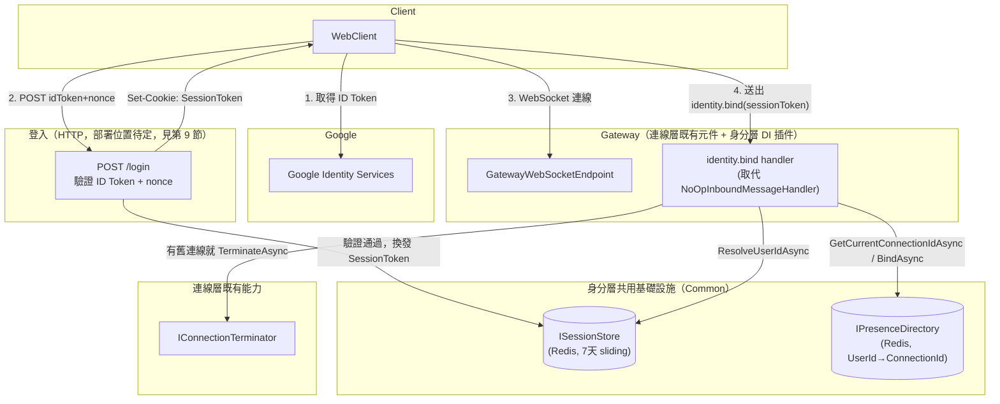
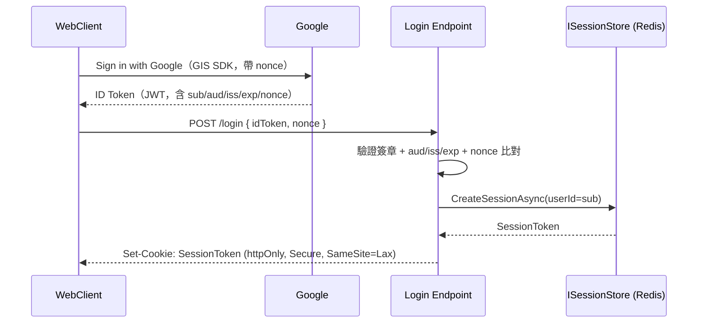
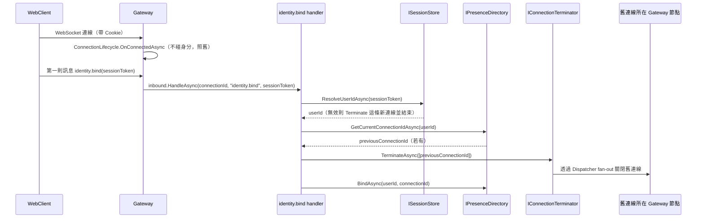

# 身分/使用者管理層架構設計（Identity Layer）

狀態：討論中 draft，尚未實作
技術棧：延續連線層的 .NET + NATS + Redis；登入改用 Google OAuth（Google Identity Services，前端直接取得 ID Token，見 ADR-1）
範圍：**使用者怎麼證明身分、登入狀態怎麼被系統記住、一個身分目前繫結在哪一條 ConnectionId 上**，不含房間、聊天等業務語意

## 1. 範圍界定

這層要解決的問題只有四個：

1. 使用者怎麼向系統證明自己是誰（Google OAuth 登入）。
2. 登入後的身分狀態怎麼被記住一段時間，讓瀏覽器重新整理、WebSocket 斷線重連不需要每次都重新登入（`Session`）。
3. 一個已登入身分，目前繫結在哪一條 `ConnectionId` 上——呼叫連線層 `IOutboundGateway.DeliverAsync` 前，上層（未來房間/聊天層）要把「使用者」轉換成一批 `ConnectionId`，答案要向這層查（`Presence`）。
4. 同一身分被判定為「重複登入/重複連線」時的處理規則（`Supersede`）。

明確排除：房間成員名單、聊天訊息收發、誰該收到訊息的業務判斷——這些留給更上層的房間/聊天層，此層只回答「這個身分現在對應哪個 `ConnectionId`」，不回答「這個房間該通知誰」。WebClient 登入 UI 的實作細節也不在此範疇。

## 2. 現有實作對照（`main` 分支）

- `AuthServer`：自架 OIDC Provider（ASP.NET Identity + 自建帳密頁面）——這次整個拿掉，改成直接對 Google OAuth 做驗證，系統不再自己當 IdP。
- `ChatConnector.AuthenticationController`：用 OIDC `Challenge`/`SignOut`，屬於「伺服器端導轉」流程（本文 ADR-1 討論的 A 方案），這次改走前端直接跟 Google 互動的 B 方案，不再需要導轉/callback endpoint。
- `SessionServer`：Redis 存 `Registration(SessionId, ConnectorId, Name)`，30 秒 TTL + 心跳續命——這個模式是新 `ConnectionDirectory` 的精神前身，但舊版把「身分」跟「連線」揉進同一張表（`SessionId → ConnectorId`）。這次拆成兩張語意不同的表：`ISessionStore`（身分層自己的登入狀態）與連線層既有的 `ConnectionDirectory`（`ConnectionId → NodeId`），兩者互不依賴。
- 舊 `ChatConnector` 連線建立時直接綁 `httpContext.User.Identity` 呼叫 `RegisterSessionCommand`——這正是 `connection-layer.md` 第 2 節第 5 點點名的耦合來源。這次改成：連線建立本身完全不碰身分（維持 ADR-1），身分綁定透過連線建立後的**第一則 inbound 訊息**處理（見第 6.3 節），不需要更動連線層程式碼。

## 3. 核心概念

| 概念 | 職責 |
|---|---|
| `UserIdentity` | 系統內部代表一個已登入身分，Key 用 Google `sub`（不用 email，見 ADR-6） |
| Google ID Token 驗證 | 前端用 Google Identity Services 取得 ID Token，後端驗證簽章 + `aud`/`iss`/`exp`/`nonce`（見 ADR-1、ADR-5） |
| `ISessionStore`（新，`Common`） | `SessionToken → UserId`，opaque token，Redis 存放，7 天、隨活動 sliding 續期（見 ADR-2、ADR-3） |
| Session Cookie | `httpOnly` + `Secure` + `SameSite=Lax`，存 `SessionToken` |
| `IPresenceDirectory`（新，`Common`） | `UserId → 目前的 ConnectionId`（單一值），實作 Supersede（見 ADR-4） |
| `identity.bind` inbound handler（新，Gateway 端 DI 插件，取代 `NoOpInboundMessageHandler`） | WebSocket 連線建立後收到的第一則訊息：驗證 Session、查/綁定 Presence、必要時踢掉舊連線 |
| `IConnectionTerminator`（連線層新增，非此層擁有） | 此層呼叫連線層的能力，強制關閉指定 `ConnectionId`。設計見 `connection-layer.md` ADR-7 |

## 4. 元件關係圖



## 5. 訊息序列

### 5.1 登入換發 Session



### 5.2 WebSocket 連線建立 + 身分綁定 + Supersede



## 6. 具體介面設計

### 6.1 `ISessionStore`（`Common`）

```csharp
namespace Common.Identity;

public interface ISessionStore
{
	ValueTask<string> CreateSessionAsync(string userId);
	ValueTask<string?> ResolveUserIdAsync(string sessionToken);
	ValueTask RefreshAsync(string sessionToken); // sliding 續期
	ValueTask RevokeAsync(string sessionToken); // 登出
}
```

實作沿用連線層已建立的 Redis 慣例：`internal class RedisSessionStore(IDatabase database) : ISessionStore`，key 例如 `Session:{token}` → `userId`，7 天 TTL，`RefreshAsync` 呼叫 `KeyExpireAsync` 續期（跟 `RedisConnectionDirectory.ActiveSessionAsync` 精神一致，只是續期的對象是「登入狀態」不是「連線」）。

### 6.2 `IPresenceDirectory`（`Common`）

```csharp
namespace Common.Identity;

public interface IPresenceDirectory
{
	ValueTask<string?> GetCurrentConnectionIdAsync(string userId);
	ValueTask BindAsync(string userId, string connectionId);
	ValueTask UnbindAsync(string userId, string connectionId);
}
```

Key 例如 `Presence:{userId}` → `connectionId`，**刻意不設 TTL**（見 ADR-7）。`BindAsync` 直接覆寫舊值；Supersede 的踢人動作由呼叫端（`identity.bind` handler）在覆寫前自己查出舊值再呼叫 `IConnectionTerminator`，`IPresenceDirectory` 本身不知道終止連線這件事。

### 6.3 `identity.bind` inbound handler（Gateway 端 DI 插件）

```csharp
namespace Identity; // 專案名稱待定

internal sealed class IdentityBindingInboundHandler(
	ISessionStore sessionStore,
	IPresenceDirectory presenceDirectory,
	IConnectionTerminator connectionTerminator) : IInboundMessageHandler
{
	public async ValueTask HandleAsync(string connectionId, string subject, ByteString payload, CancellationToken cancellationToken = default)
	{
		if (subject != "identity.bind") return; // 之後有其他 subject 時在這裡分派

		var sessionToken = payload.ToStringUtf8();
		var userId = await sessionStore.ResolveUserIdAsync(sessionToken).ConfigureAwait(false);

		if (userId is null)
		{
			await connectionTerminator.TerminateAsync([connectionId], cancellationToken).ConfigureAwait(false);
			return;
		}

		var previousConnectionId = await presenceDirectory.GetCurrentConnectionIdAsync(userId).ConfigureAwait(false);

		if (previousConnectionId is not null)
			await connectionTerminator.TerminateAsync([previousConnectionId], cancellationToken).ConfigureAwait(false);

		await presenceDirectory.BindAsync(userId, connectionId).ConfigureAwait(false);
	}
}
```

啟動時把這個實作換掉 `Gateway/Program.cs` 裡 `NoOpInboundMessageHandler` 的 DI 註冊即可，不需要改連線層任何程式碼（呼應 `NoOpInboundMessageHandler.cs` 上的既有註解）。

### 6.4 `POST /login`（概念，部署位置待定）

```csharp
var payload = await GoogleJsonWebSignature.ValidateAsync(idToken, new GoogleJsonWebSignature.ValidationSettings
{
	Audience = [ googleClientId ]
});
// 另外比對 payload 裡的 nonce claim 跟這次登入請求配發的 nonce 是否相符

var sessionToken = await sessionStore.CreateSessionAsync(payload.Subject);
// Set-Cookie: sessionToken, httpOnly=true, secure=true, sameSite=Lax, maxAge=7天
```

## 7. 架構決策記錄（ADR）

### ADR-1：採用前端 Sign in with Google（ID Token Flow），不用伺服器端 Authorization Code Flow

- **Context**：登入流程有兩種形狀——A. 伺服器端 OAuth（Challenge/Callback 導轉，需要 Client Secret）；B. 前端用 Google Identity Services 直接取得 ID Token，後端只驗簽章。
- **Decision**：採用 B。
- **Consequences**：
  - 不需要保管 Client Secret，也不需要後端處理 `redirect_uri`/`state` 這類導轉流程的實作細節——這剛好是歷史上最常見的 OAuth 實作漏洞來源（`state` 沒驗證好造成 login CSRF、`redirect_uri` 驗證寫成 prefix 比對造成 open redirect）。
  - 代價是 ID Token 會短暫經過前端 JS（頁面有 XSS 時有被讀走重放的風險，但 token 效期短且用途單一，傷害範圍比長效 session cookie 被偷小很多）；另外需要自己補 `nonce` 驗證防止「token 替換攻擊」（見 ADR-5），這在 A 方案裡是用 `state` 解決同一類問題。
  - Google Identity Services 是透過 JS callback 交付 token，不是舊版 OIDC Implicit Flow 的 URL fragment 方式，不會有 token 留在瀏覽器歷史/`Referer`/伺服器 log 的問題。

### ADR-2：Session token 用 opaque token + Redis，不用 JWT

- **Context**：Session 要支援 Supersede（見 ADR-4），代表需要「立即失效」某個舊 Session/連線的能力。
- **Decision**：Session 是後端產生的 opaque 隨機字串，比對存在 Redis 裡；不用自我驗證的 JWT。
- **Consequences**：JWT 的賣點是「不用查表就能驗證」，但這個賣點在需要立即 revoke 的場景裡本來就沒有意義（revoke 也得查黑名單/查表），等於白白背了簽發、驗證、金鑰輪替的複雜度卻拿不到好處。專案已經有 Redis 依賴（`ConnectionDirectory`），沿用同一套基礎設施最單純。

### ADR-3：Session 存活期獨立於 WebSocket 連線存活期

- **Context**：舊 `SessionServer` 把「登入狀態」跟「連線是否還活著」綁在同一個 30 秒 TTL + 心跳續命機制上，是本次要拆開的耦合之一。
- **Decision**：`Session` 是獨立的登入狀態（7 天，隨活動 sliding 續期），WebSocket 斷線重連（換分頁、換網路）不需要重新走 Google 登入。
- **Consequences**：需要自己設計 Session 續期時機（見第 9 節待確認事項），但符合一般網站「記住我」的使用者體驗預期，也讓身分層跟連線層的生命週期真正互相獨立。

### ADR-4：Supersede 定義為「同一身分同時只能有一條連線生效」

- **Context**：同一 Google 帳號重複連線時，要允許多連線並存還是踢掉舊連線；若允許，範圍要精確到「只有重新登入才踢」還是「任何第二條連線都踢」。
- **Decision**：任何時候有第二條連線嘗試綁定同一身分，就主動終止舊連線——不限於重新走過 Google 登入的情境。
- **Consequences**：`IPresenceDirectory` 的 schema 可以單純用「單一值」（`UserId → 一個 ConnectionId`），不需要處理「一個身分對應一組連線」的複雜度；代價是同一帳號不能同時開兩個分頁各自維持一條連線（後開的會把先開的踢斷）。這個決策直接促成了 ADR-7（連線層新增 `IConnectionTerminator`）。

### ADR-5：Google 登入請求帶 `nonce`，防 token 替換 / login CSRF

- **Context**：即使 `aud`/`iss`/`exp` 都驗證通過，攻擊者仍可能用自己合法取得的 ID Token，誘騙受害者瀏覽器把這個 token 送去登入 endpoint，讓受害者被登入成攻擊者的帳號。
- **Decision**：登入請求時配發一個隨機 `nonce`，要求它出現在回傳的 ID Token claim 裡，後端驗證時比對是否相符。
- **Consequences**：成本很低（多存一個暫存值、多比對一個字串），是這個流程的標準配備，不是可選的加強項。

### ADR-6：`UserIdentity` 的 Key 用 Google `sub`，不用 email

- **Context**：需要一個穩定、唯一對應一個 Google 帳號的識別碼。
- **Decision**：用 ID Token 裡的 `sub` claim。
- **Consequences**：`sub` 是 Google 文件明訂的穩定值；email 在某些帳號類型下可能變動，不適合當主鍵。

### ADR-7（條件觸發）：`IPresenceDirectory` 目前不加 TTL/心跳

- **Context**：連線斷線後，`Presence:{userId}` 若沒清乾淨會殘留指向一條已死的 `ConnectionId`。
- **Decision（暫緩）**：不特別處理。下次同身分登入時，對著這條殘留的舊 `ConnectionId` 呼叫 `IConnectionTerminator.TerminateAsync` 只會是無害的 no-op（沿用連線層 `ResolveNodesAsync` 查不到就省略、不報錯的既有慣例），不影響 Supersede 正確性；唯一的副作用是「這個身分目前在不在線上」這個查詢會不準，但目前產品範疇沒有上線狀態指示燈這類需求。
- **觸發條件**：未來如果要做上線/離線狀態顯示，才需要補心跳續命機制（可參考 `ConnectionHeartbeatService` 的模式）。

## 8. 明確排除於本階段

- 房間、聊天等業務語意，以及「誰該收到這則訊息」的決策。
- 上線/離線狀態指示燈功能（見 ADR-7）。
- 多連線並存情境下的已讀/同步狀態一致性——本次 Supersede 選擇單一連線，不適用。
- WebClient 登入 UI 的實作細節（按鈕外觀、載入態等）。

## 9. 待確認 / 後續事項

- `POST /login` endpoint 的部署位置尚未決定：獨立服務（類似舊 `AuthServer` 的精簡版）還是併入某個既有專案。這個決定不影響本文件已定案的介面設計，純粹是部署拓樸問題。
- Session 的 sliding 續期實際觸發時機還沒定案（例如：每次 WebSocket 重新連線時順便 `RefreshAsync`？還是需要獨立的 refresh 機制？）。
- 連線層需要新增的 `IConnectionTerminator` 目前只在 `connection-layer.md` ADR-7 完成設計，尚未實作。
