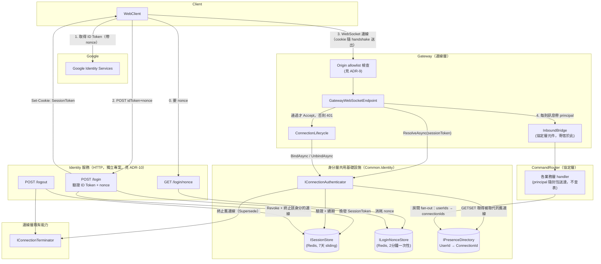
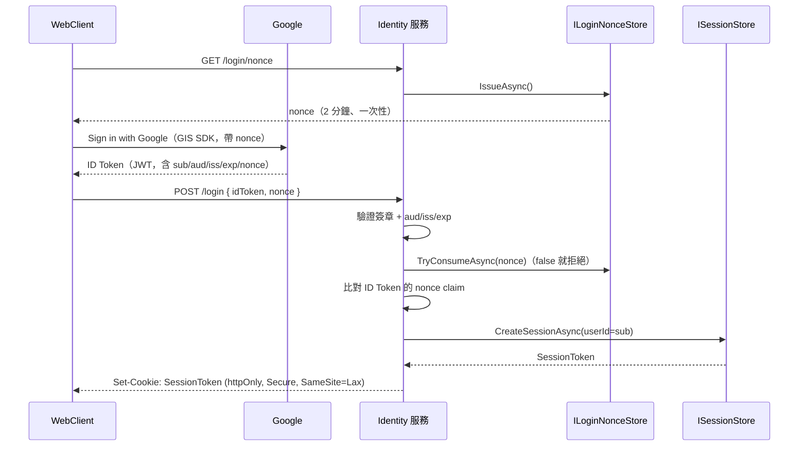
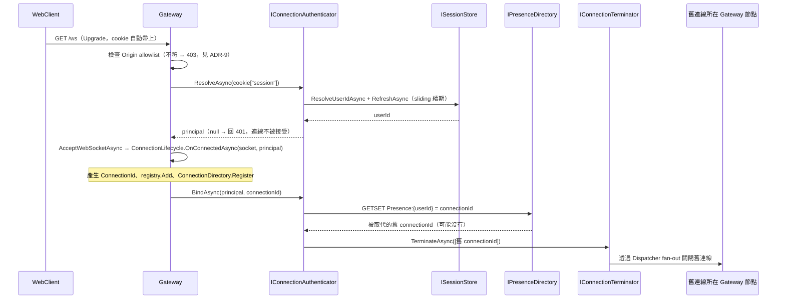
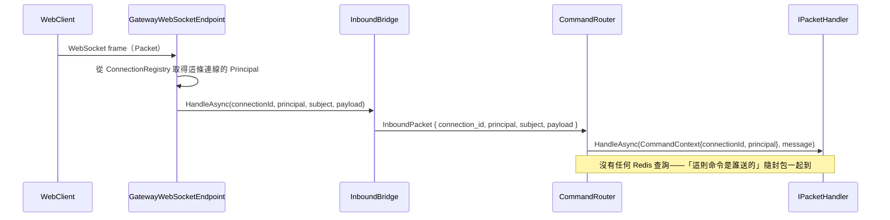
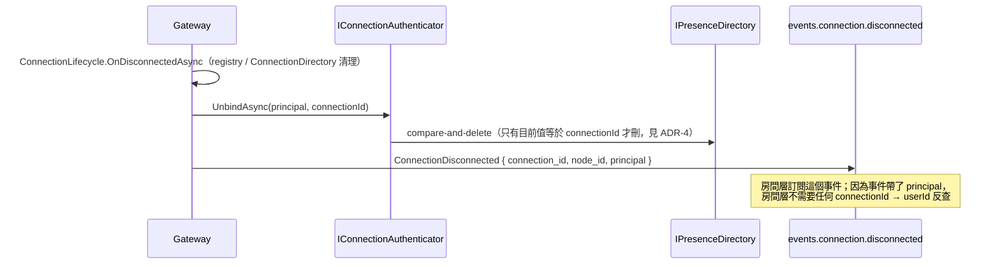

# 身分/使用者管理層架構設計（Identity Layer）

狀態：設計已定案（**handshake cookie 驗證**，見 ADR-8）；`Common/Identity/` 的三個 store 已實作，`IConnectionAuthenticator`、連線層接線與 Identity 服務尚未（見第 9 節）
技術棧：延續連線層的 .NET + NATS + Redis；登入改用 Google OAuth（Google Identity Services，前端直接取得 ID Token，見 ADR-1）
範圍：**使用者怎麼證明身分、登入狀態怎麼被系統記住、一個身分目前繫結在哪一條 ConnectionId 上**，不含房間、聊天等業務語意
依賴：驗證發生在 WebSocket handshake，所以本層需要連線層開一個 hook（見 ADR-8 與 `connection-layer.md` 第 6.8 節、ADR-9）；命令的解析與分派仍由協定層負責（[protocol-layer.md](protocol-layer.md)），但本層**不再註冊任何 handler 或 filter**

> 修正記錄（本版）：前一版把身分綁定設計成「連線建立後的第一則 inbound 訊息」（`identity.bind` 命令 + `IdentityBoundFilter` 守門 + `ConnectionId → UserId` 反向索引）。那個設計有一個致命矛盾：SessionToken 存在 `httpOnly` cookie 裡，**前端 JS 讀不到它**，`BindRequest.session_token` 根本無從填值。本版改為在 handshake 讀 cookie 驗證，連帶刪除了 `identity.bind` 命令、守門 filter 與反向索引三樣東西。取捨完整記錄在 ADR-8、ADR-9。

## 1. 範圍界定

這層要解決的問題只有四個：

1. 使用者怎麼向系統證明自己是誰（Google OAuth 登入）。
2. 登入後的身分狀態怎麼被記住一段時間，讓瀏覽器重新整理、WebSocket 斷線重連不需要每次都重新登入（`Session`）。
3. 一個已登入身分，目前繫結在哪一條 `ConnectionId` 上——呼叫連線層 `IOutboundGateway.DeliverAsync` 前，上層（房間/聊天層）要把「使用者」轉換成一批 `ConnectionId`，答案要向這層查（`Presence`）。
4. 同一身分被判定為「重複登入/重複連線」時的處理規則（`Supersede`）。

驗證的時機是**WebSocket handshake**：沒有通過的連線根本不會被接受（HTTP 401），所以系統裡不存在「已連線但還沒有身分」的中間狀態。

明確排除：房間成員名單、聊天訊息收發、誰該收到訊息的業務判斷——這些留給更上層的房間/聊天層，此層只回答「這個身分現在對應哪個 `ConnectionId`」，不回答「這個房間該通知誰」。WebClient 登入 UI 的實作細節也不在此範疇。

## 2. 現有實作對照（`main` 分支）

- `AuthServer`：自架 OIDC Provider（ASP.NET Identity + 自建帳密頁面）——這次整個拿掉，改成直接對 Google OAuth 做驗證，系統不再自己當 IdP。
- `ChatConnector.AuthenticationController`：用 OIDC `Challenge`/`SignOut`，屬於「伺服器端導轉」流程（本文 ADR-1 討論的 A 方案），這次改走前端直接跟 Google 互動的 B 方案，不再需要導轉/callback endpoint。
- `SessionServer`：Redis 存 `Registration(SessionId, ConnectorId, Name)`，30 秒 TTL + 心跳續命——這個模式是新 `ConnectionDirectory` 的精神前身，但舊版把「身分」跟「連線」揉進同一張表（`SessionId → ConnectorId`）。這次拆成兩張語意不同的表：`ISessionStore`／`IPresenceDirectory`（身分層自己的登入狀態與繫結）與連線層既有的 `ConnectionDirectory`（`ConnectionId → NodeId`），兩者互不依賴。
- 舊 `ChatConnector` 連線建立時直接綁 `httpContext.User.Identity` 呼叫 `RegisterSessionCommand`——`connection-layer.md` 第 2 節第 5 點點名的耦合來源。**本版在時機上跟舊實作一樣是 handshake**，所以要誠實說清楚差異在哪：
  - Gateway 拿到的是一個**不透明字串**（principal），它不知道那是 Google `sub`、不解讀、不用它做任何判斷，只負責隨每則 inbound 訊息轉交給上層。
  - Gateway **不呼叫任何業務命令**。舊版在 `OnConnectedAsync` 裡呼叫 `RegisterSessionCommand`、在 `OnDisconnectedAsync` 裡呼叫 `LeaveRoomCommand`（連線層直接認識房間）；本版連線層只呼叫一個身分層自己提供的 `IConnectionAuthenticator`，而且完全不認識房間——斷線退房走的是 best-effort 事件（`room-layer.md` ADR-3）。
  - 連線層的資料模型沒有因此長出身分概念：`ConnectionDirectory` 仍然只有 `ConnectionId → NodeId`，`Connection` 多的那個 `Principal` 欄位是一個轉手用的字串（處境跟 `Packet.subject` 一樣）。

## 3. 核心概念

| 概念 | 職責 |
|---|---|
| `UserIdentity` | 系統內部代表一個已登入身分，Key 用 Google `sub`（不用 email，見 ADR-6） |
| Google ID Token 驗證 | 前端用 Google Identity Services 取得 ID Token，後端驗證簽章 + `aud`/`iss`/`exp`/`nonce`（見 ADR-1、ADR-5） |
| `ISessionStore`（新，`Common.Identity`） | `SessionToken → UserId`，opaque token，Redis 存放，7 天、隨活動 sliding 續期（見 ADR-2、ADR-3） |
| `ILoginNonceStore`（新，`Common.Identity`） | ADR-5 的一次性 nonce：登入前配發、驗證時消耗 |
| Session Cookie | `httpOnly` + `Secure` + `SameSite=Lax`，存 `SessionToken`。**必須跟 Gateway 同源**，否則 handshake 帶不上（見 ADR-10） |
| `IPresenceDirectory`（新，`Common.Identity`） | `UserId → 目前的 ConnectionId`（單一值），實作 Supersede（見 ADR-4）與房間 fan-out 需要的批次正向解析 |
| `IConnectionAuthenticator`（新，`Common.Identity`） | 連線層在 handshake / 斷線時呼叫的唯一 hook：驗 Session、綁定 Presence、必要時踢掉舊連線、斷線時解除綁定（見 6.3） |
| principal | 驗證通過後隨每則訊息往上走的不透明字串（值就是 `UserId`）。連線層與協定層都只轉手、不解讀，見 `protocol-layer.md` ADR-9 |
| `IConnectionTerminator`（連線層既有，非此層擁有） | 此層呼叫連線層的能力，強制關閉指定 `ConnectionId`。設計見 `connection-layer.md` ADR-7 |

## 4. 元件關係圖



## 5. 訊息序列

### 5.1 登入換發 Session



### 5.2 WebSocket handshake 驗證 + Supersede



### 5.3 一則 inbound 命令帶著 principal 往上走



### 5.4 斷線解除綁定



## 6. 具體介面設計

### 6.1 `ISessionStore` / `ILoginNonceStore`（`Common.Identity`）

```csharp
namespace Common.Identity;

public interface ISessionStore
{
	ValueTask<string> CreateSessionAsync(string userId, CancellationToken cancellationToken = default);

	// 找不到或已過期回 null。
	ValueTask<string?> ResolveUserIdAsync(string sessionToken, CancellationToken cancellationToken = default);

	// sliding 續期，呼叫時機見 ADR-3 的補充。
	ValueTask RefreshAsync(string sessionToken, CancellationToken cancellationToken = default);

	// 登出。
	ValueTask RevokeAsync(string sessionToken, CancellationToken cancellationToken = default);
}

public interface ILoginNonceStore
{
	ValueTask<string> IssueAsync(CancellationToken cancellationToken = default);

	// 一次性：用 KeyDeleteAsync 的回傳值當守門，重放同一個 nonce 會拿到 false。
	ValueTask<bool> TryConsumeAsync(string nonce, CancellationToken cancellationToken = default);
}
```

`TryConsumeAsync` 用刪除的回傳值當原子守門，跟 `RedisRoomStore.TryCreateAsync` 用 `SetAddAsync` 回傳值守門是同一個手法——這類「只有一個呼叫端能成功」的需求在這個 codebase 一律靠 Redis 單一指令的回傳值，不用 read-then-write。

### 6.2 `IPresenceDirectory`（`Common.Identity`）

```csharp
namespace Common.Identity;

public interface IPresenceDirectory
{
	// 綁定並回傳「被這次綁定取代掉的舊 connectionId」（沒有則 null）。
	// 用 SET ... GET 一次原子完成讀舊值 + 寫新值，見 ADR-4。
	ValueTask<string?> BindAsync(string userId, string connectionId, CancellationToken cancellationToken = default);

	// 只有當目前值等於 connectionId 時才刪除（fencing，見 ADR-4）。
	ValueTask UnbindAsync(string userId, string connectionId, CancellationToken cancellationToken = default);

	// 房間 fan-out 用：一間房可能很多成員，逐筆查會變成 N 次來回。
	// 查不到的 userId（不在線）直接省略，沿用 ResolveNodesAsync 的既有慣例。
	// 見 room-layer.md 第 6.3 節與 ADR-1。
	ValueTask<IReadOnlyCollection<string>> ResolveConnectionsAsync(
		IReadOnlyCollection<string> userIds,
		CancellationToken cancellationToken = default);
}
```

只有一個 key：`Presence:{userId}` → `connectionId`，**刻意不設 TTL**（見 ADR-7），**刻意不加 Cluster hash tag**——不同 userId 的 key 分散在不同 slot，代價是 `ResolveConnectionsAsync` 不能用 MGET、要照 `RedisConnectionDirectory.ResolveNodesAsync` 用 `Parallel.ForEachAsync` + `MaxDegreeOfParallelism = 64`。這跟房間層 `{rooms}` 集中在同一 slot 的選擇相反，理由也相反：房間資料量小、需要跨 key 一致；Presence 是每個上線使用者一筆、只需要單 key 操作，該分散。

**刻意沒有的方法**：

- `GetCurrentConnectionIdAsync(userId)`——前一版設計用它做 Supersede（先查舊值再覆寫），`BindAsync` 改成回傳舊值之後就沒有呼叫端了。要查某個身分的連線一律用 `ResolveConnectionsAsync([userId])`。
- `GetBoundUserIdAsync(connectionId)` 與它背後的反向索引 `ConnectionUser:{connectionId}`——**整條刪除**。前一版它的唯一使用者是守門 filter，而 handshake 驗證讓 filter 不必存在；斷線清理也不需要它，因為斷線事件會帶 principal。連帶消失的是「反向 key 該設多久 TTL」這個懸案與它無上限成長的風險（詳見 ADR-8）。

`UnbindAsync` 的 compare-and-delete 用一段只碰單一 key 的 Lua（`if redis.call('GET', KEYS[1]) == ARGV[1] then return redis.call('DEL', KEYS[1]) end`）。**不能**把它跟其他 key 寫在同一支 Lua 裡——Presence 的 key 沒有 hash tag，Cluster 上跨 slot 的多 key script 會被拒絕。

### 6.3 `IConnectionAuthenticator`（`Common.Identity`）

連線層在 handshake 與斷線時呼叫的唯一 hook。把三件事（驗 Session、Supersede、解除綁定）包在身分層自己的元件裡，Gateway 因此只認識這個介面，不認識 `ISessionStore`／`IPresenceDirectory`／Supersede 規則：

```csharp
namespace Common.Identity;

public interface IConnectionAuthenticator
{
	// handshake：驗證 SessionToken 並順便 sliding 續期。回傳 null = 拒絕這條連線（Gateway 回 401）。
	// 參數刻意是 string?（Gateway 直接把 cookie 值丟進來，沒有 cookie 就是 null），
	// 不是 HttpContext——Common 不該取得 ASP.NET Core 的 framework reference。
	ValueTask<string?> ResolveAsync(string? sessionToken, CancellationToken cancellationToken = default);

	// 連線建立後：綁定 principal → connectionId，並終止被取代的舊連線（Supersede）。
	ValueTask BindAsync(string principal, string connectionId, CancellationToken cancellationToken = default);

	// 連線關閉後：解除綁定（fencing）。
	ValueTask UnbindAsync(string principal, string connectionId, CancellationToken cancellationToken = default);
}
```

實作是三個薄方法：`ResolveAsync` = `ResolveUserIdAsync` + `RefreshAsync`；`BindAsync` = `IPresenceDirectory.BindAsync` 後把回傳的舊 `connectionId` 丟給 `IConnectionTerminator.TerminateAsync`；`UnbindAsync` 直接轉呼叫。

呼叫點在連線層（`connection-layer.md` 第 6.8 節）：endpoint 在 `AcceptWebSocketAsync` **之前**呼叫 `ResolveAsync`（否則沒辦法回 401），`ConnectionLifecycle` 在 registry/directory 註冊完之後呼叫 `BindAsync`、在清理完之後呼叫 `UnbindAsync`。

**已知的小窗口**：連線被 accept、但 `BindAsync` 還沒完成的那幾毫秒內，`Presence:{userId}` 還指向舊連線（或不存在），房間 fan-out 找不到這條新連線。後果是「剛連上的瞬間可能漏收一則廣播」，跟房間層 ADR-2 明確不做補送的立場一致（重連後靠聊天層歷史記錄補齊），不特別處理。

### 6.4 Gateway 的 `Origin` 檢查（見 ADR-9）

allowlist 從設定讀（AppHost 注入，開發與正式環境各自的來源不同），比對失敗回 403 且**不 accept**。這不是可選的加強項，理由見 ADR-9。

實務上最容易踩的坑：本機開發時 Identity 服務與 Gateway 是同 host 不同 port，`http://localhost:5xxx` 與 `http://localhost:5yyy` 對 `SameSite` 而言算同 site（cookie 會送），但對 `Origin` 字串比對而言是不同值——**開發用的 port 必須進 allowlist**，否則本機是通的、上 stage 才炸（或反過來）。

### 6.5 Identity 服務的 HTTP endpoint

```csharp
// POST /login
var payload = await GoogleJsonWebSignature.ValidateAsync(idToken, new GoogleJsonWebSignature.ValidationSettings
{
	Audience = [ googleClientId ]
});
// 驗證簽章/aud/iss/exp 由上面這行負責；nonce 要自己比對（見 ADR-5）
if (!await nonceStore.TryConsumeAsync(request.Nonce) || payload.Nonce != request.Nonce)
	return Results.Unauthorized();

var sessionToken = await sessionStore.CreateSessionAsync(payload.Subject);
// Set-Cookie: sessionToken, httpOnly=true, secure=true, sameSite=Lax, maxAge=7天
```

| endpoint | 行為 |
|---|---|
| `GET /login/nonce` | `ILoginNonceStore.IssueAsync()`，回傳給前端交給 GIS |
| `POST /login` | 驗 ID Token + 消耗 nonce → `CreateSessionAsync` → `Set-Cookie` |
| `POST /logout` | `RevokeAsync(token)`、清 cookie，並**主動終止該身分目前的連線**——`ResolveConnectionsAsync([userId])` 拿到 connectionId 後呼叫 `IConnectionTerminator`。少了這步的話「登出後那條 WebSocket 仍然有效直到 client 自己關閉」，是明顯的安全瑕疵，而成本只是多兩個既有依賴 |

因此 Identity 服務需要：identity-store 的 Redis、NATS（`IConnectionTerminator` 要 publish 到 `dispatch.terminate`）、`Google.Apis.Auth`。

### 6.6 Redis key 設計

| key | 型別 | TTL | 用途 |
|---|---|---|---|
| `Session:{token}` | String | 7 天，sliding | → `userId`。續期時機見 ADR-3 |
| `Presence:{userId}` | String | 無（ADR-7） | → `connectionId`。`GETSET` 綁定、Lua compare-and-delete 解綁 |
| `LoginNonce:{nonce}` | String | 2 分鐘 | 一次性，`KeyDelete` 回傳值當守門 |

全部不加 hash tag（理由見 6.2）。三個 store 由 `AddIdentityStores(redisServiceKey)` 一起註冊為 singleton（`Common/IdentityLayerServiceCollectionExtensions.cs`）。

身分層用**自己的** Redis 資源（AppHost 的 `identity-store`），不共用連線層的 `connection-directory`——`Session` 是持久資料需要 AOF/RDB，連線層那個是純快取用途，設定需求不同；這也延續 `connection-layer.md` ADR-2 的擁有權原則。因為 `CommandRouter` 會同時需要多個 Redis，註冊一律走 keyed service（比照 `AddRoomStore(redisServiceKey)`）。

## 7. 架構決策記錄（ADR）

### ADR-1：採用前端 Sign in with Google（ID Token Flow），不用伺服器端 Authorization Code Flow

- **Context**：登入流程有兩種形狀——A. 伺服器端 OAuth（Challenge/Callback 導轉，需要 Client Secret）；B. 前端用 Google Identity Services 直接取得 ID Token，後端只驗簽章。
- **Decision**：採用 B。
- **Consequences**：
  - 不需要保管 Client Secret，也不需要後端處理 `redirect_uri`/`state` 這類導轉流程的實作細節——這剛好是歷史上最常見的 OAuth 實作漏洞來源（`state` 沒驗證好造成 login CSRF、`redirect_uri` 驗證寫成 prefix 比對造成 open redirect）。
  - 代價是 ID Token 會短暫經過前端 JS（頁面有 XSS 時有被讀走重放的風險，但 token 效期短且用途單一，傷害範圍比長效 session cookie 被偷小很多）；另外需要自己補 `nonce` 驗證防止「token 替換攻擊」（見 ADR-5），這在 A 方案裡是用 `state` 解決同一類問題。
  - Google Identity Services 是透過 JS callback 交付 token，不是舊版 OIDC Implicit Flow 的 URL fragment 方式，不會有 token 留在瀏覽器歷史/`Referer`/伺服器 log 的問題。

### ADR-2：Session token 用 opaque token + Redis，不用 JWT

- **Context**：Session 要支援 Supersede（見 ADR-4），代表需要「立即失效」某個舊 Session/連線的能力。
- **Decision**：Session 是後端產生的 opaque 隨機字串，比對存在 Redis 裡；不用自我驗證的 JWT。
- **Consequences**：JWT 的賣點是「不用查表就能驗證」，但這個賣點在需要立即 revoke 的場景裡本來就沒有意義（revoke 也得查黑名單/查表），等於白白背了簽發、驗證、金鑰輪替的複雜度卻拿不到好處。專案已經有 Redis 依賴（`ConnectionDirectory`），沿用同一套基礎設施最單純。
- **補充（本版）**：ADR-8 之後 Session 只在 handshake 被查一次，不在命令熱路徑上，「要查表」這個代價比前一版設計更小。

### ADR-3：Session 存活期獨立於 WebSocket 連線存活期

- **Context**：舊 `SessionServer` 把「登入狀態」跟「連線是否還活著」綁在同一個 30 秒 TTL + 心跳續命機制上，是本次要拆開的耦合之一。
- **Decision**：`Session` 是獨立的登入狀態（7 天，隨活動 sliding 續期），WebSocket 斷線重連（換分頁、換網路）不需要重新走 Google 登入。
- **Consequences**：符合一般網站「記住我」的預期，也讓身分層跟連線層的生命週期真正互相獨立。
- **續期時機（本版定案）**：就在 handshake 那次驗證之後順手 `KeyExpire`（`IConnectionAuthenticator.ResolveAsync` 內）。連線建立是低頻事件，多一次 Redis 寫入無所謂。前一版設計沒有這個著力點——那時唯一每次都會經過的地方是守門 filter，而那是**每則命令**一次寫入，成本完全不同。長時間掛著同一條連線不會續期，但 7 天的量級遠大於任何合理的連線壽命，不構成問題。

### ADR-4：Supersede 定義為「同一身分同時只能有一條連線生效」，用 `SET ... GET` + fencing 實作

- **Context**：同一 Google 帳號重複連線時，要允許多連線並存還是踢掉舊連線；若允許，範圍要精確到「只有重新登入才踢」還是「任何第二條連線都踢」。
- **Decision**：任何時候有第二條連線嘗試綁定同一身分，就主動終止舊連線——不限於重新走過 Google 登入的情境。實作上：
  - **綁定用 `SET ... GET`**（`StringSetAndGetAsync`，即 Redis 6.2 之後取代 `GETSET` 的寫法）一次原子完成「取回舊值 + 寫入新值」。這消掉了「先 GET 再 SET」的競爭：兩條連線同時在不同 Gateway 節點綁同一身分時，兩邊拿回的舊值不同、只有一個會成為最終值，不會留下一條「還活著但 Presence 已經不指向它」的孤兒連線。
  - **解綁必須 fencing**：只有當 `Presence:{userId}` 目前值等於要解綁的 `connectionId` 時才刪除。Supersede 時新連線先綁定、舊連線的斷線清理才跑到，無條件刪除會讓一個**正在線上**的使用者從 Presence 消失——後果是房間 fan-out 靜默跳過他（比 ADR-7 講的「殘留舊值」嚴重得多，殘留是無害的，誤刪是丟訊息）。這跟 `room-layer.md` ADR-4 是同一個 race 的另一半。
- **Consequences**：`IPresenceDirectory` 的 schema 可以單純用單一值，不需要處理「一個身分對應一組連線」的複雜度；代價是同一帳號不能同時開兩個分頁各自維持一條連線（後開的會把先開的踢斷）。這個決策直接促成了 ADR-7（連線層新增 `IConnectionTerminator`）。
- **後續確認**：房間層採用「成員名單以 `userId` 為鍵」（`room-layer.md` ADR-1），加上產品決定「一個使用者一次只能在一間房」，本 ADR 的單一值 schema 剛好夠用，不需要改成集合。房間層對 Supersede 也因此完全透明——同一身分換連線時，成員資格不受影響。

### ADR-5：Google 登入請求帶 `nonce`，防 token 替換 / login CSRF

- **Context**：即使 `aud`/`iss`/`exp` 都驗證通過，攻擊者仍可能用自己合法取得的 ID Token，誘騙受害者瀏覽器把這個 token 送去登入 endpoint，讓受害者被登入成攻擊者的帳號。
- **Decision**：登入請求時配發一個隨機 `nonce`（`ILoginNonceStore`，2 分鐘、一次性），要求它出現在回傳的 ID Token claim 裡，後端驗證時比對是否相符。
- **Consequences**：成本很低（多一個 endpoint、多存一個暫存值、多比對一個字串），是這個流程的標準配備，不是可選的加強項。**必須是一次性的**——只驗「這個 nonce 存在」而不消耗它，等於同一個 nonce 可以重放，防護等於沒做。

### ADR-6：`UserIdentity` 的 Key 用 Google `sub`，不用 email

- **Context**：需要一個穩定、唯一對應一個 Google 帳號的識別碼。
- **Decision**：用 ID Token 裡的 `sub` claim。
- **Consequences**：`sub` 是 Google 文件明訂的穩定值；email 在某些帳號類型下可能變動，不適合當主鍵。

### ADR-7（條件觸發）：`IPresenceDirectory` 目前不加 TTL/心跳

- **Context**：連線斷線後，`Presence:{userId}` 若沒清乾淨會殘留指向一條已死的 `ConnectionId`。
- **Decision（暫緩）**：不特別處理。斷線時會走 `UnbindAsync` 清理，process 被 kill 時清不掉的殘留也無害——下次同身分連線時，對著這條殘留的舊 `ConnectionId` 呼叫 `IConnectionTerminator.TerminateAsync` 只會是無害的 no-op（沿用連線層 `ResolveNodesAsync` 查不到就省略的既有慣例），不影響 Supersede 正確性。唯一的副作用是房間 fan-out 會把訊息投給一條不存在的連線（在 `Dispatcher` 那層就被省略），以及「這個身分在不在線上」這個查詢會不準，而目前產品範疇沒有上線狀態指示燈這類需求。
- **觸發條件**：未來如果要做上線/離線狀態顯示，才需要補心跳續命機制（可參考 `ConnectionHeartbeatService` 的模式）。

### ADR-8：身分驗證放在 WebSocket handshake，取代 `identity.bind` 命令

- **Context**：前一版設計是「連線先建立，第一則 inbound 訊息 `identity.bind` 帶著 SessionToken 來綁定身分」，並用一個守門 filter 擋住「還沒綁定就發業務命令」。這個設計有一個致命矛盾：SessionToken 存在 `httpOnly` cookie 裡（ADR-2 的正確選擇），**前端 JS 讀不到它**，`BindRequest.session_token` 無從填值。發現這件事之後有三條路：
  - **A. 短效一次性 bind ticket**：另開一個由 cookie 認證的 endpoint 換一張 30 秒、一次性的 ticket，JS 拿得到、放進 `BindRequest`。cookie 維持 `httpOnly`，Gateway 維持零身分認知。
  - **B. handshake 讀 cookie**：WebSocket handshake 本身就是一個 HTTP request，瀏覽器會照常帶 cookie，Gateway 直接驗。
  - **C. cookie 不設 `httpOnly`**：最省事，但 XSS 就能偷走 7 天的 session。直接排除——ADR-1 願意接受 ID Token 經過 JS 的理由是「效期短、用途單一」，那個理由反過來正是不能讓長效 session 曝露給 JS 的原因。
- **Decision**：採用 B。
- **Consequences**：
  - **消掉的是一整個中間狀態，不是一點樣板碼**。「已連線但還沒有身分」這個狀態不存在了，隨之消失的有：`identity.bind` 命令與 `BindRequest`/`BindReply` proto、`IdentityBindHandler`、`IdentityBoundFilter`、`ConnectionUser:{connectionId}` 反向索引與它的 TTL 懸案、bind 逾時與 bind 競爭的處理。
  - **每則命令少一次 Redis 讀取**。前一版的守門 filter 必須在每則 inbound 命令上查一次反向索引；現在 principal 隨封包走（`protocol-layer.md` ADR-9），`CommandRouter` 完全不查表就知道命令是誰送的。
  - **錯誤回報更乾淨**：Session 過期時 client 收到 HTTP 401，不是「連上了、送了 bind、才被踢斷」。
  - **`ConnectionDisconnected` 事件帶 principal**，所以房間層的斷線處理也不需要任何 `connectionId → userId` 反查。反向索引因此徹底沒有使用者。
  - **代價一**：連線層必須開兩個 hook（handshake 驗證、生命週期綁定/解綁），Gateway 因此取得 `IConnectionAuthenticator` 依賴，每個 Gateway 節點都要連 identity-store 的 Redis。`connection-layer.md` 第 1 節「連線層只認得 `ConnectionId`」那句話要跟著修正（見該文件 ADR-9）。
  - **代價二**：Supersede 的踢人動作跑在 Gateway 的連線建立路徑上。這是本 ADR 最尷尬的一點，形狀上跟舊 `main` 的 `RegisterSessionCommand` 很像；區別是 Gateway 只呼叫一個不知道內容的 hook、拿到的 principal 是不透明字串、而且完全沒有業務命令（見第 2 節）。
  - **代價三（安全）**：cookie 認證 + WebSocket 的組合天生有 CSWSH 風險，必須靠 ADR-9 的 `Origin` 驗證補回來。A 方案對此天生免疫（憑證不是 cookie，攻擊者頁面拿不到），這是它唯一實質勝過 B 的地方。
  - **代價四（部署）**：cookie 必須跟 Gateway 同源，Identity 服務的部署位置從「自由選擇」變成受約束（見 ADR-10）。
- **重新評估的觸發條件**：如果哪天 Identity 服務與 Gateway 被迫跨站（cookie 只能降成 `SameSite=None`），`Origin` 驗證會變成唯一防線，屆時應該重新評估 A 方案。

### ADR-9：必須驗證 handshake 的 `Origin` header

- **Context**：WebSocket handshake **不受 CORS 約束**——任何網站都可以對 Gateway 開一條 WebSocket，而瀏覽器會照常帶上受害者的 cookie（Cross-Site WebSocket Hijacking）。ADR-8 選了 cookie 認證，就繼承了這個風險。
- **Decision**：Gateway 在 accept 之前比對 `Origin` 是否在 allowlist 內，不符回 403。allowlist 從設定注入。
- **Consequences**：
  - `SameSite=Lax` 其實也擋得住（WS handshake 從攻擊者頁面發起算 cross-site subresource，不是 top-level navigation，Lax cookie 不會送），所以這是雙重防護；但**不能只靠 SameSite**——它的前提是「cookie 真的維持 Lax」，而 ADR-10 一旦被推翻（跨站部署）就得降成 `None`，那時 `Origin` 是唯一防線。兩者都做，成本只是一個字串比對。
  - allowlist 是設定而非常數，開發/正式環境各自維護。**本機開發的 port 一定要記得放進去**（見 6.4 那個坑）。
  - 非瀏覽器 client（測試工具、未來的原生 app）不會帶 `Origin`。目前策略是「沒有 `Origin` 就拒絕」，因為現階段唯一的 client 就是瀏覽器；未來要支援原生 client 時，那類 client 也不會用 cookie 認證，屆時需要另一條驗證路徑（例如 `Authorization` header），這條規則要一起重新設計。

### ADR-10：Identity 服務獨立成專案，但必須與 Gateway 同源部署

- **Context**：`POST /login` 那組 endpoint 可以併進 Gateway 專案（同源免費、cookie 最單純），也可以獨立成一個服務。ADR-8 之後 cookie 必須跟著 handshake 送到 Gateway，所以「同源」不再是可選項——不同 host 就得把 cookie 降成 `SameSite=None; Secure` 並失去 ADR-9 的第二層防護。
- **Decision**：獨立成 `Identity` 專案，但部署時與 Gateway 走同一個註冊網域（正式環境靠同一個 ingress 分路徑，本機開發靠 allowlist 容納不同 port）。
- **Consequences**：
  - Gateway 已經因為 ADR-8 吃下 handshake 驗證這個耦合；如果再把 Google ID Token 驗證、nonce store、cookie 簽發全部塞進去，那個專案就從「連線層」變成「連線層＋身分層」，未來想把 Gateway 換成別的 edge（k8s ingress、雲端 WebSocket 服務）會被綁死。獨立專案讓 Gateway 保留的身分依賴只有 `IConnectionAuthenticator` 一個介面。
  - 代價是本機開發要處理跨 port 的 `Origin` allowlist 與 cookie domain，而「同源」這個約束變成部署時必須記得的隱性條件——它在程式碼與 diff 上完全看不出來，所以寫在這裡。
  - AppHost 需要新增 `identity` 專案資源與 `identity-store`（Redis）。

## 8. 明確排除於本階段

- 房間、聊天等業務語意，以及「誰該收到這則訊息」的決策。
- 上線/離線狀態指示燈功能（見 ADR-7）。
- 多連線並存情境下的已讀/同步狀態一致性——本次 Supersede 選擇單一連線，不適用。
- 非瀏覽器 client 的認證路徑（見 ADR-9 最後一條）。
- WebClient 登入 UI 的實作細節（按鈕外觀、載入態等）。

## 9. 待確認 / 後續事項

- **已完成**：`Common/Identity/` 的三個 store 與 DI 註冊。`ISessionStore`／`RedisSessionStore`、`ILoginNonceStore`／`RedisLoginNonceStore`、`IPresenceDirectory`／`RedisPresenceDirectory`、`IdentityKeys`、`OpaqueToken`、`Common/IdentityLayerServiceCollectionExtensions.cs` 的 `AddIdentityStores(redisServiceKey)`，測試在 `Common.Tests/Identity/`。刻意先只做這一層——不動任何 process，可以獨立驗證。實作時確認的兩件事：`StringSetAndGetAsync` 在 StackExchange.Redis 3.x 只剩帶 `keepTtl` 的多載；`KeyExpireAsync(key, ttl)` 解析到的是帶 `ExpireWhen` 的多載（測試的 `Received` 斷言必須對上實際被呼叫的那一個，否則會出現「明明呼叫了卻說沒收到」）。
- **待做**：`IConnectionAuthenticator`（6.3）與連線層的接線。它需要 `IConnectionTerminator`，而後者要 NATS——所以那一步會同時動到 Gateway 的 DI 與 AppHost，跟本層第一步刻意分開。
- ~~`POST /login` endpoint 的部署位置尚未決定。~~ **已決定**：獨立 `Identity` 專案，但必須與 Gateway 同源（ADR-10）。
- ~~Session 的 sliding 續期實際觸發時機還沒定案。~~ **已決定**：在 handshake 的 `ResolveAsync` 內續期（ADR-3）。
- ~~連線層需要新增的 `IConnectionTerminator`。~~ 已實作完成。
- ~~ADR-8 反向索引 `ConnectionUser:{connectionId}` 的 TTL 長度與續期方式尚未決定。~~ **已消失**：反向索引整條刪除（新 ADR-8）。
- 連線層的 close description 是中性字串（`"Connection terminated by server."`），**不會**告訴 client「你被新連線取代了」——Supersede 是本層語意，連線層刻意不知道（見 `connection-layer.md` 第 6.6 節）。如果 WebClient 需要區分「被踢掉」與「一般斷線」以顯示不同提示，得由本層在 `TerminateAsync` 之前先送一則訊息給舊連線，或替 `TerminateRequest` 補一個 `reason` 欄位。**尚未決定要不要做**——但 ADR-8 之後這個需求變得更明顯了：被 Supersede 踢掉的舊分頁只會看到連線莫名斷掉，而它自己的 session 其實仍然有效，重連又會把新分頁踢掉，形成兩個分頁互踢。要嘛給 client 一個明確的 reason 讓它停止重連，要嘛接受這個行為。
- Session 是持久資料，`identity-store` 的 Redis 要開 AOF/RDB。這跟房間層的 `room-store` 是同一類需求，而 `room-layer.md` ADR-7 已經預告房間資料未來要遷到正式儲存——屆時 Session 要不要一起遷（還是留在 Redis，因為它本來就是 key-value 且有 TTL 語意）需要一起決定。
- Google Cloud 的 OAuth client id 與授權來源設定（authorized JavaScript origins）是實作前的外部前置作業，不在 code 裡。
