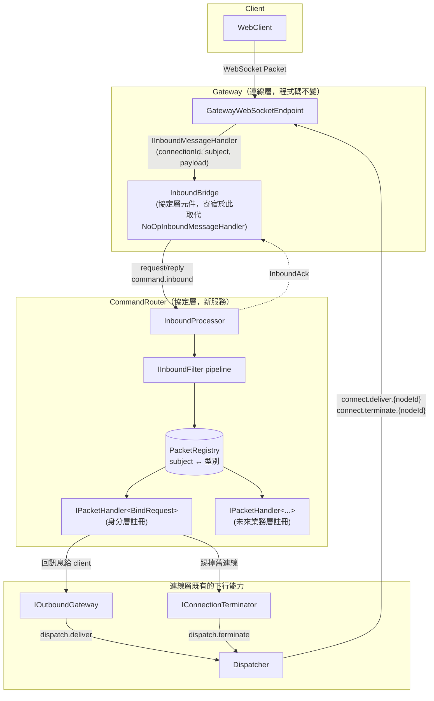
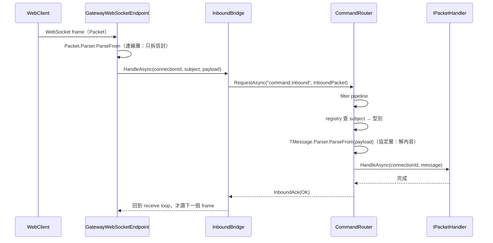
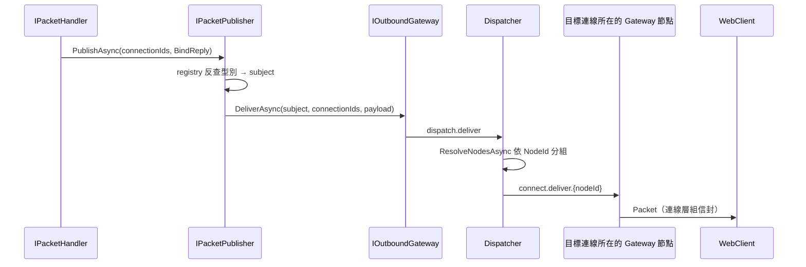
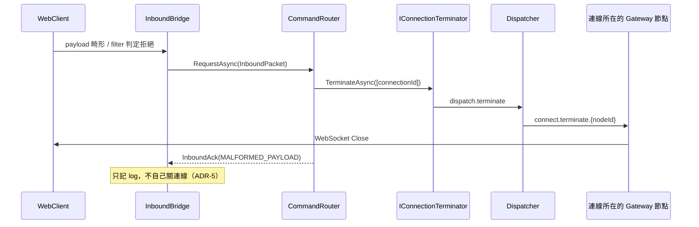

# 協定層架構設計（Protocol Layer）

狀態：機制已實作（`Common/Protocol/` + `CommandRouter/`），尚未有任何層註冊命令——registry 目前是空的
技術棧：延續連線層的 .NET + NATS（Adaptare）+ protobuf
範圍：**client 封包內容的解析、subject 與型別的對應、分派給對的 handler**，不含任何具體命令的業務語意

## 1. 範圍界定

這層要解決的問題只有四個：

1. **解析**：把連線層交出來的不透明 `payload` 轉成具體的 protobuf 訊息型別。
2. **分派**：依 subject 找到該處理它的 handler，取代單一 `IInboundMessageHandler` 插槽裡不斷增長的 if/else。
3. **協定層級的錯誤政策**：未知 subject、payload 畸形、handler 例外，各自該怎麼處置，只在一個地方定義。
4. **跨切面著力點**：per-subject 觀測、per-connection 限流、命令的前置條件檢查（例如「未綁定身分前只接受 `identity.bind`」）。

**與連線層的邊界**（延續既有決定，本文件不改動它）：`Packet` 信封（`subject` + `payload`）的組裝與拆解仍屬連線層——`GatewayWebSocketEndpoint` 拆、`Connection.SendAsync` 組。連線層看得到 `subject` 但不解讀其語意，`payload` 全程是不透明的 `ByteString`。協定層接手的正是 `payload` 的型別對應與內容解析。

明確排除：具體命令要做什麼（身分綁定屬身分層、房間/聊天屬更上層，它們只是在這層註冊 handler）、連線本身的維護（連線層）、下行的路由與 fan-out（`Dispatcher`）。

## 2. 現有實作對照

**`main` 分支**——沒有「統一入口」的概念，解析散在 Connector、分派靠 NATS subject：

- `ChatConnector/Models/ClientConnectHandler.cs` `OnReceiveAsync`：解析 `Packet` 後包成 `SendQueueCommand` 就丟出去，Connector 本身不認識任何命令。
- `ChatConnector/Models/SendQueueCommandService.cs`：`messageQueueService.PublishAsync(command.Subject, ...)`——**`command.Subject` 完全來自 client 封包**，等於客戶端可以決定訊息要發布到哪個內部 NATS subject。內容會先被包一層 `QueuePacket`，所以不一定能構成有效的內部訊息，但「客戶端能決定發布目標」本身就是不該存在的能力。這是 ADR-3 要避免的東西。
- 同一個 `OnReceiveAsync` 裡 `httpContext.RequestServices.CreateScope()` 沒有 `using`，scope 不會被釋放。

**`feature/rebuild` 現況**：

- `Gateway/Models/NoOpInboundMessageHandler.cs`：插槽佔位，只記 log。**本層實作後已刪除**，那個 DI 註冊改成 `AddInboundBridge()`。
- `docs/architecture/identity-layer.md` 第 6.3 節的 `if (subject != "identity.bind") return; // 之後有其他 subject 時在這裡分派`——這行註解就是本文件要取代的設計。單一插槽會讓每個新增功能都去改同一個檔案。

## 3. 核心概念

| 概念 | 職責 |
|---|---|
| `InboundPacket`（proto，新） | Gateway → CommandRouter 的信封：`connection_id` + `subject` + `payload` |
| `InboundAck`（proto，新） | CommandRouter → Gateway 的處理結果。**只用於順序控制與觀測**，Gateway 不依據它做任何動作（見 ADR-5） |
| `InboundBridge`（協定層元件，寄宿在 Gateway process） | 取代 `NoOpInboundMessageHandler` 的 DI 註冊。把 `(connectionId, subject, payload)` 用 request/reply 送給 CommandRouter，收到 ack 才讓 receive loop 讀下一個 frame |
| `CommandRouter`（新服務） | 訂閱 `command.inbound`（掛 queue group），跑 filter pipeline → 查 registry → 解析 → 分派 |
| `PacketRegistry` | `subject ↔ 訊息型別` 的唯一對應表，**入站解析與出站序列化共用同一份** |
| `IPacketHandler<TMessage>` | 各層/各功能自己實作的命令 handler，向 CommandRouter 註冊 |
| `IInboundFilter` | 分派前的前置條件檢查，只看得到 `connectionId` + `subject`，看不到 payload（見 ADR-6） |
| `IPacketPublisher` | 出口：把 typed 訊息轉成 `(subject, bytes)` 後呼叫既有的 `IOutboundGateway`，下行一律經 `Dispatcher`（見 ADR-5） |

## 4. 元件關係圖



## 5. 訊息序列

### 5.1 一則 inbound 命令的完整路徑



最後兩步是 ADR-2 的重點：因為 receive loop 是「處理完才讀下一個 frame」（`Gateway/Services/GatewayWebSocketEndpoint.cs:84`），單一連線同一時間最多只有一則訊息在 in-flight，端到端順序因此被保證。

### 5.2 handler 產生下行訊息



`IPacketPublisher` 只做「型別 → subject + 序列化」，之後完全走連線層既有路徑，沒有任何新的下行通道。

### 5.3 協定違反 → 終止連線



這裡有個要注意的交錯：等待 ack 的 Gateway 節點，跟收到 terminate 的 Gateway 節點是同一個。`Connection.CloseOutputAsync` 會在 receive loop 還在 await ack 時把 close frame 送出去，socket 狀態變成 `CloseSent`；ack 回來後 receive loop 檢查 `connection.State == WebSocketState.Open` 不成立就自然結束，`finally` 照原本流程跑 `OnDisconnectedAsync`。兩者不會互相踩到——`Connection` 的 `m_SendLock` 已經保證送出類的呼叫互相排隊。（連線層刻意用 `CloseOutputAsync` 而非 `CloseAsync`，正是為了不跟 receive loop 搶同一個 receive，見 `connection-layer.md` 第 6.6 節。）

## 6. 具體介面設計

### 6.1 Proto（`Common/Protos/protocol.proto`，新檔案）

`connection.proto` 保持不動——那是連線層自己的檔案，下面這些是協定層自己的傳輸格式：

```protobuf
syntax = "proto3";
option csharp_namespace = "Chat.Protos";
package chat;

// Gateway（InboundBridge）-> CommandRouter：一則來自 client 的封包，附上它來自哪條連線。
message InboundPacket {
	string connection_id = 1;
	string subject = 2;
	bytes payload = 3;
}

// CommandRouter -> Gateway（InboundBridge）：處理結果。
// 只用於順序控制與觀測，Gateway 不依據它做任何動作（見 ADR-5）。
message InboundAck {
	enum Status {
		OK = 0;
		UNKNOWN_SUBJECT = 1;
		MALFORMED_PAYLOAD = 2;
		REJECTED_BY_FILTER = 3;
		HANDLER_FAILED = 4;
	}

	Status status = 1;
	string detail = 2;
}
```

### 6.2 `InboundBridge`（協定層元件，寄宿在 Gateway process）

```csharp
namespace Common.Protocol; // 寄宿在 Gateway，所以必須放共用組件而不是 CommandRouter 專案

// 取代 Gateway/Program.cs 裡 NoOpInboundMessageHandler 的 DI 註冊。
// 這是協定層的元件、只是寄宿在 Gateway process，連線層程式碼不需要任何修改。
internal sealed class InboundBridge(
	IMessageSender messageSender,
	ILogger<InboundBridge> logger) : IInboundMessageHandler
{
	private const string InboundSubject = "command.inbound";
	private static readonly TimeSpan _Timeout = TimeSpan.FromSeconds(10); // 為什麼是 10 秒見第 9 節

	public async ValueTask HandleAsync(
		string connectionId,
		string subject,
		ByteString payload,
		CancellationToken cancellationToken = default)
	{
		var packet = new InboundPacket
		{
			ConnectionId = connectionId,
			Subject = subject,
			Payload = payload
		};

		using var timeout = CancellationTokenSource.CreateLinkedTokenSource(cancellationToken);
		timeout.CancelAfter(_Timeout);

		try
		{
			var reply = await messageSender
				.RequestAsync<byte[], byte[]>(InboundSubject, packet.ToByteArray(), timeout.Token)
				.ConfigureAwait(false);

			var ack = InboundAck.Parser.ParseFrom(reply);

			if (ack.Status != InboundAck.Types.Status.Ok)
				logger.LogWarning(
					"{ConnectionId} {Subject} rejected: {Status} {Detail}",
					connectionId, subject, ack.Status, ack.Detail);
		}
		catch (OperationCanceledException) when (!cancellationToken.IsCancellationRequested)
		{
			// CommandRouter 沒回應。這個例外往上丟之後會被連線層當成正常關站吞掉
			// （GatewayWebSocketEndpoint.cs:36），所以 log 一定要在這裡記。
			logger.LogError("{ConnectionId} {Subject} timed out waiting for the command router.", connectionId, subject);
			throw;
		}
	}
}
```

用 `RequestAsync<byte[], byte[]>` 而非泛型 protobuf 型別，是沿用 `DispatchHandler`/`DeliverPacketHandler` 既有的「Adaptare 只搬 `byte[]`、protobuf 自己解」慣例。

### 6.3 `PacketRegistry` 與 `IPacketHandler<TMessage>`

```csharp
namespace Common.Protocol;

public interface IPacketHandler<TMessage> where TMessage : IMessage<TMessage>, new()
{
	ValueTask HandleAsync(string connectionId, TMessage message, CancellationToken cancellationToken = default);
}
```

`new()` 約束是為了讓協定層自己用 `new MessageParser<TMessage>(() => new TMessage())` 建 parser。protobuf 產生的類別有 `static Parser` 但泛型約束拿不到它；初版設計要求 handler 用 `static abstract MessageParser<TMessage> Parser` 交出來，實作時發現沒必要——parser 是訊息型別的性質，不是 handler 的性質，讓 handler 宣告它是白給的樣板碼。

註冊時把 subject 一起宣告，讓每個 subject 字面值在整個 codebase 只出現一次：

```csharp
// 身分層在 CommandRouter 的組裝處註冊自己的命令
services.AddPacketHandler<BindRequest, IdentityBindHandler>("identity.bind");

// 只出現在下行的訊息型別也要宣告 subject，這樣 IPacketPublisher 才反查得到
services.AddOutboundPacket<BindReply>("identity.bind.reply");

// filter 同樣由各層自己註冊
services.AddInboundFilter<IdentityBoundFilter>();
```

`AddPacketHandler` 會順便把 handler 註冊為 **scoped**（見第 9 節的 DI scope 決議）。

`PacketRegistry` 是這些註冊的彙總，同時服務兩個方向：`subject → (parser, handler)` 給入站用，`型別 → subject` 給出站用。兩個實作細節：

- 只用 `AddOutboundPacket` 註冊的 subject，`IsInboundSubject` 會回 `false`——client 送這種 subject 上來，對協定層而言等同未知 subject，不是「有註冊但沒 handler」的錯誤。
- 重複的 subject 或重複的訊息型別在建構 registry 時直接丟例外。`CommandRouter/Program.cs` 在 `host.Run()` 之前就解析一次 registry 並把對應表寫進 log，讓這個 fail fast 發生在啟動時而不是第一則訊息進來時（緩解 ADR-4 失去編譯期檢查的代價）。

### 6.4 `IInboundFilter`

```csharp
namespace Common.Protocol;

public enum FilterDecision
{
	Allow,
	Drop,      // 忽略這則封包，連線保留
	Terminate, // 視為協定違反，CommandRouter 統一呼叫 IConnectionTerminator
}

public interface IInboundFilter
{
	int Order { get; }

	// 刻意只給 connectionId 與 subject：filter 是前置條件檢查，不該需要理解 payload。
	ValueTask<FilterDecision> EvaluateAsync(
		string connectionId,
		string subject,
		CancellationToken cancellationToken = default);
}
```

處置動作（`IConnectionTerminator`、log、metrics）一律由 CommandRouter 統一執行，filter 只回傳判斷。身分層的「未綁定前只接受 `identity.bind`」就是註冊一個這種 filter（見第 10 節：身分層需要補一個目前沒有的反向查詢）。

### 6.5 出口：`IPacketPublisher`

```csharp
namespace Common.Protocol;

public interface IPacketPublisher
{
	ValueTask PublishAsync<TMessage>(
		IReadOnlyCollection<string> connectionIds,
		TMessage message,
		CancellationToken cancellationToken = default)
		where TMessage : IMessage<TMessage>;
}
```

實作只有三行：registry 反查 subject → `message.ToByteString()` → 呼叫既有的 `IOutboundGateway.DeliverAsync`。呼叫端從此不再手寫 subject 字串、不再自己 `ToByteArray()`。

### 6.6 `CommandRouter` 服務的組裝樣貌

```csharp
var builder = Host.CreateApplicationBuilder(args);
{
	builder.AddServiceDefaults();

	// 下行要用 IOutboundGateway / IConnectionTerminator，兩者都要 Redis + NATS
	builder.AddRedisClient("connection-directory");
	builder.AddNatsClient("message-bus");
	builder.Services.AddConnectionDirectory();
	builder.Services.AddOutboundGateway();
	builder.Services.AddConnectionTerminator();

	// 協定層自己
	builder.Services.AddPacketRegistry();

	// 各層在這裡註冊自己的命令與 filter（身分層尚未實作，所以目前這裡是空的）

	builder.Services
		.AddMessageQueue()
		.AddNatsMessageQueue(config => config
			.ConfigureResolveConnection(sp => (NatsConnection)sp.GetRequiredService<INatsConnection>())
			.AddProcessor<InboundProcessor>("command.inbound", "command.inbound")); // 第二個參數為 queue group
}
```

`InboundProcessor : IMessageProcessor<byte[], byte[]>`（Adaptare 的 request/reply handler 型別，`HandleAsync` 回傳 reply）。`AddProcessor<TProcessor>(subject, queueGroup)` 這個多載實測存在，與 `Dispatcher/Program.cs` 的 `AddHandler` 寫法一致。

## 7. 架構決策記錄（ADR）

### ADR-1：協定層獨立成服務，Gateway 只保留一個 thin bridge

- **Context**：`IInboundMessageHandler` 是單一插槽。若讓各層直接在 Gateway process 內實作，Gateway 會逐漸變成業務邏輯的宿主，部署上跟業務綁在一起。
- **Decision**：協定層獨立成 `CommandRouter` 服務；Gateway 只寄宿一個 `InboundBridge`。
- **Consequences**：Gateway 維持純管道，跟下行的 `Dispatcher` 形成對稱；業務 handler 可以獨立更新、獨立擴展。代價有三個：每則 inbound 多一次網路 hop；`CommandRouter` 成為所有業務 handler 的宿主 process（未來某個業務要獨立擴展，再讓它訂閱自己的 subject 拆出去）；`CommandRouter` 全掛時 inbound 全斷，但下行（`Dispatcher`）不受影響。

### ADR-2：Gateway → CommandRouter 用 request/reply，不用 fire-and-forget publish

- **Context**：拆成獨立服務 + queue group 之後，同一條連線的兩則訊息會被分到不同複本並行處理，訊息順序不再保證。對聊天系統這是實質錯誤（聊天記錄順序錯亂），而且第一個踩到的是身分綁定——`identity.bind` 還沒處理完，後面的業務訊息就先被處理了。
- **Decision**：`InboundBridge` 用 `IMessageSender.RequestAsync` 送出並等待 `InboundAck` 才返回。因為連線層的 receive loop 是「`await` 完 `HandleAsync` 才讀下一個 frame」（`GatewayWebSocketEndpoint.cs:84`），單一連線同時最多一則訊息 in-flight，端到端順序因此被保證；不同連線之間仍完全並行（各自有獨立的 receive loop）。
- **Consequences**：不需要引入 `connectionId` 分片，`connection-layer.md` ADR-5 維持暫緩。代價：每則 inbound 多一次 NATS round-trip；單一連線的 inbound 吞吐上限變成 1/RTT（叢集內亞毫秒級，聊天場景遠遠夠用，但不適用高頻串流類的 subject）；`CommandRouter` 變慢或掛掉會直接反壓到 receive loop——這其實是想要的行為，避免 Gateway 無上限累積待處理訊息。

### ADR-3：固定使用單一 NATS subject `command.inbound`，不把 client 的 subject 拼進 NATS subject

- **Context**：更省事的做法是 `PublishAsync($"command.inbound.{clientSubject}", ...)`，讓 NATS 自己做分派、CommandRouter 連 registry 都不用寫。舊 `main` 分支正是這個方向，而且更徹底——`SendQueueCommandService` 直接把 client 給的 subject 當 NATS subject 用。
- **Decision**：固定單一 subject，分派由 `CommandRouter` 內部的 registry 負責。
- **Consequences**：客戶端無法決定訊息發布到哪個 NATS subject，內部 messaging 拓樸不再有一部分由客戶端輸入決定；未知 subject、payload 畸形、限流、per-subject 觀測都有唯一的著力點；「未綁定身分前只接受 `identity.bind`」這種跨命令規則也才有地方放（靠 NATS 分派的話每個 handler 都得自己檢查）。代價：`CommandRouter` 不能靠 NATS subject 做水平分流，所有 inbound 都經過同一個 queue group——要分流是加複本，不是加 subject。

### ADR-4：`subject ↔ 型別` 用 DI 收集的 registry，不用 `oneof` 大信封也不用 `Any`

- **Context**：三種常見做法——(a) registry；(b) 一個 `oneof` 涵蓋所有命令的大信封；(c) protobuf `Any` 自帶型別資訊。
- **Decision**：採用 (a)。
- **Consequences**：協定層本身不認識任何具體命令型別，新增命令只動自己模組的檔案，不會出現「所有功能都要改同一個 proto」的瓶頸（那是 (b) 的問題）；subject 保留為可讀的路由鍵與觀測維度（(c) 會讓 subject 變成冗余）；入站解析與出站序列化共用同一份對應表。代價：失去 `oneof` 的編譯期 exhaustiveness，漏註冊要到 runtime 才發現——用啟動時 fail fast + 印出整份對應表來緩解，但這確實比編譯期檢查弱。

### ADR-5：下行一律經 `Dispatcher`，協定層不自己開第二條下行通道

- **Context**：`InboundAck` 是 CommandRouter 回 Gateway 的既有通道，技術上可以順便夾帶「關掉這條連線」或「把這則訊息回給 client」，省一次繞行——特別是目標連線往往就在發出 request 的那個 Gateway 節點上。
- **Decision**：不這樣做。ack 只表達處理結果，僅用於順序控制與觀測。任何要送回 client 的訊息走 `IPacketPublisher` → `IOutboundGateway` → `dispatch.deliver` → `Dispatcher`；任何要關的連線走 `IConnectionTerminator` → `dispatch.terminate` → `Dispatcher`。
- **Consequences**：下行只有一條路徑，`InboundBridge` 完全不需要知道「投遞」或「終止連線」這些概念，維持 thin；也不會出現「同一件事有兩套機制、行為卻不完全一致」的長期維護問題。代價：即使目標連線就在原本那個節點上，訊息仍會繞 `CommandRouter` → `Dispatcher` → 同一個 Gateway 一圈，多一次 hop 加一次 Redis 查詢。這個浪費是刻意接受的。

### ADR-6：前置條件用 filter pipeline，由各層自己註冊

- **Context**：「未綁定身分前只接受 `identity.bind`」需要一個統一的著力點，但若由協定層直接實作，協定層就反過來依賴身分層。
- **Decision**：協定層只定義 `IInboundFilter`（只看得到 `connectionId` + `subject`），身分層自己註冊 filter；處置動作由 CommandRouter 統一執行。
- **Consequences**：依賴方向維持向下，協定層不認識身分概念，延續 `connection-layer.md` ADR-1 的精神。代價：身分層需要一個目前設計裡沒有的「`ConnectionId` → 是否已綁定」查詢（見第 10 節）。

### ADR-7（條件觸發）：`CommandRouter` 依 `connectionId` 分片

- **Context**：若 ADR-2 的「每連線 1/RTT」吞吐上限成為實際瓶頸。
- **Decision（暫緩）**：屆時才考慮由 `InboundBridge` 依 `hash(connectionId)` 分流到固定的 shard subject，改用 fire-and-forget 但保住每連線順序。
- **觸發條件**：需要實測數據證明 request/reply 的吞吐不足。這與 `connection-layer.md` ADR-5 是同一類決策，應該一起評估。

### ADR-8：狀態違反才終止連線，內容錯誤只記 log 並忽略

- **Context**：協定層會遇到三類壞輸入——未知 subject、payload 解析失敗、以及「這條連線現在不該送這個 subject」（例如還沒綁定身分就發業務命令）。本文件初稿的傾向是未知 subject 忽略、payload 畸形 terminate，但這個不對稱撐不住檢驗。
- **Decision**：依「壞的是這一則訊息，還是這條連線」劃線。
  - **內容錯誤**（未知 subject、payload 解析失敗）→ 記 log + metrics，忽略該則訊息，**連線保留**。
  - **狀態違反**（`IInboundFilter` 回傳 `Terminate`，例如未綁定身分就送業務命令）→ 終止連線。
- **Consequences**：
  - 未知 subject 不能 terminate 的理由很實際：WebClient 是從靜態站台載入的，rolling deploy 期間必然出現「新 client + 舊 `CommandRouter`」，terminate 會造成大量斷線。要記 **warning** 而非 debug 並加 counter，因為它同時是「版本錯位」與「有人在亂送」的訊號。
  - payload 畸形也不 terminate，是因為 client 幾乎都會自動重連，terminate 會變成「重連 → 送同一個壞封包 → 又被踢」的緊迫迴圈，而每次重連的成本（WebSocket handshake + Redis 寫入）比直接忽略那則訊息貴得多——為了防濫用反而製造更大的負載。
  - 濫用不靠 terminate 防，靠限流與訊息大小上限（見第 9 節），那才是對症的工具。
  - 代價：client 送出壞封包時只會「什麼都沒發生」，不會收到錯誤回應。要讓 client 知道就得在協定裡加一種錯誤訊息型別，屬於各命令自己的協定設計（見第 9 節 handler 例外那條），本層不強制。
  - **對上層的隱含要求**：正因為本層對錯誤是「記 log + 忽略」，業務層自己的失敗（密碼錯誤、被封鎖、權限不足）**必須**用明確的下行訊息回覆，不能靠關連線或沉默——否則 client 會什麼都收不到、看起來像卡住。`room-layer.md` 的 `RoomOperationReply` 就是照這條要求設計的。

## 8. 明確排除於本階段

- 具體命令的業務語意：身分綁定屬身分層、房間/聊天屬更上層，本層只提供註冊與分派機制。
- WebClient / client SDK 端的封包封裝與下行分派。
- inbound 訊息的持久化與重送：目前用 core NATS（無 JetStream），處理失敗就是失敗，不設 retry queue。要不要引入 JetStream 是獨立議題。
- 連線斷開事件的對外通知（見第 9 節）。

## 9. 待確認 / 後續事項

- **已完成**：協定層機制全部實作。`Common/Protocol/`（`IPacketHandler`、`IInboundFilter`、`PacketRegistration`、`PacketRegistry`、`IPacketPublisher`/`PacketPublisher`、`InboundBridge`）、`Common/Protos/protocol.proto`、`Common/ProtocolLayerServiceCollectionExtensions.cs`、`CommandRouter/`（`InboundProcessor` + `Program.cs`）。`Gateway/Program.cs` 的 `NoOpInboundMessageHandler` 註冊換成 `AddInboundBridge()`（該檔案已刪除），AppHost 新增 `command-router` 資源。**尚未有任何層註冊命令**，所以現在任何 client 命令都會被回 `UNKNOWN_SUBJECT`——這是預期狀態，等身分層實作。
- **已完成**：`AddOutboundGateway()`／`AddConnectionTerminator()`／`AddInboundBridge()` 共用的 Adaptare 設定移到 `Common/NatsMessagingRegistration.cs` 的 `AddNatsMessaging()`（原本叫 `AddConnectionLayerMessaging()`，現在協定層也要用，名字不該再綁連線層）。共用設定用 marker 只跑一次，但那個 marker 擋不住「應用程式為了註冊自己的 handler 又呼叫一次 `AddNatsMessageQueue`」——Gateway 與 Dispatcher 正是這樣。實測 Adaptare 容許這種重複呼叫、`IMessageSender` 仍解得出來，`Common.Tests/Protocol/NatsMessagingRegistrationTests.cs` 把 Gateway 與 CommandRouter 兩種註冊組合都釘住了。
- **已驗證**：端到端跑過一次真的 AppHost（Redis + NATS 容器 + 兩個 Gateway 複本 + Dispatcher + CommandRouter）。WebSocket client 連上 Gateway、送出 `Packet`，連線在超過 bridge 的 10 秒 timeout 之後仍然是 `Open` 且能繼續送第二則訊息，最後乾淨完成 close handshake——證明 `AddProcessor` 的 request/reply 在真的 NATS 上有來有回（若 ack 沒回來，連線會在 10 秒被關掉）。順帶確認 NATS server 回報的 `MaxPayload` 就是 1048576，跟第 9 節限流那條引用的 1MB 一致。
- **已決定**：服務專案名為 `CommandRouter`，NATS subject 前綴為 `command.inbound`（沿用「前綴對應目標角色」的既有慣例：`dispatch.*` 給 `Dispatcher`、`connect.*` 給 Gateway 節點）。`Command` 這個字是用來跟 `Dispatcher` 區隔——`Dispatcher` 搬的是不理解內容的投遞封包，這個服務處理的是已解析成型別的命令；單獨叫 `Router` 會跟 `Dispatcher` 語意撞車（兩者幾乎同義，光看專案清單 `Gateway / Dispatcher / Router / Common` 猜不出哪個是上行哪個是下行）。排除 `Ingress`：k8s Ingress 有既定含義（HTTP 反向代理／入口控制器），會被誤認成基礎設施元件。排除 `Protocol`：協定層的共用抽象已經用 `Common.Protocol` 命名空間，服務同名會打架。**保留的風險**：ADR-1 預期未來某個業務會拆成自己的宿主 process，屆時「唯一的 CommandRouter」這個命名會變尷尬（不會有 `CommandRouter2`）。真要拆時再改名，subject 前綴要一起改，成本不小但可控。
- **已決定**：`InboundBridge` 的 timeout 為 **10 秒**，逾時就讓連線關閉（client 重連重送）。關鍵是先認清 timeout 在防什麼——NATS 有 no-responders 機制，`CommandRouter` 整個掛掉時 `RequestAsync` 會立刻失敗而不是等到逾時（Adaptare 怎麼把這個表面化，實作時要確認），所以 timeout 只覆蓋「Router 活著但太慢」也就是過載。既然是過載，就要給得寬鬆到能吸收 GC pause 與 Redis failover（Sentinel／Cluster failover 常在數秒級）而不誤殺大量活著的連線；handler 本身只是幾次 Redis 往返，正常是毫秒級。**不選「記 log 後繼續讀下一個 frame」**，因為那則逾時的訊息可能還在路上、稍後才被 Router 處理，ADR-2 好不容易保住的單連線順序就破了。要接受的粗糙處：例外往上丟會被 `GatewayWebSocketEndpoint.cs:36` 的 `catch (OperationCanceledException)` 吞掉、socket 直接被 dispose，client 看到的是 1006 abnormal closure 而不是乾淨的 close frame（所以 log 必須記在 bridge 裡，6.2 已這樣寫）。想要乾淨關閉得讓 bridge 自己呼叫 `IConnectionTerminator` 繞 Dispatcher 回到同一個 Gateway——為一個關閉繞一圈不值得。
- **已決定**：未知 subject 與 payload 畸形**都是 log + 忽略，不關連線**，見 ADR-8。這修正了本節先前「未知 subject 忽略、payload 畸形 terminate」的傾向。
- **已決定**：`CommandRouter` **一開始就 per-command 開 DI scope**，handler 註冊為 scoped，`ISessionStore`／`IPresenceDirectory`／`PacketRegistry` 維持 singleton。目前所有依賴都是 Redis singleton、確實不需要 scope，但 `using var scope = scopeFactory.CreateScope()` 是三行的事，而事後補是破壞性的——handler 的生命週期假設一旦改變會產生 captive dependency 那類難查的問題。而且「一則命令」對應「一個 request」是 .NET 的預設心智模型，將來寫 handler 的人會直覺假設 scoped 語意。（舊 `main` 的 `ClientConnectHandler.OnReceiveAsync` 正是 `CreateScope()` 沒有 `using` 的 scope 洩漏，這區域值得一開始就做對。）
- **已決定**：限流分三塊處理。
  - **訊息大小上限：已實作**（連線層）。`GatewayWebSocketEndpoint` 的 receive loop 原本用 `MemoryStream` 累積分片但沒有總量上限，client 送一個永不結束的分片就能吃光節點記憶體；而且 payload 之後要 publish 到 NATS（預設 `max_payload` 1MB），收得下也送不出去。已加上 256 KB 上限，超過就以 `MessageTooBig` 關閉。詳見 `connection-layer.md` 第 9 節。
  - **per-connection 速率限流：先不做**。ADR-2 的 request/reply 已經給了天然節流——單一連線同時只有一則訊息 in-flight，吞吐上限就是 1/RTT，「client 極快速度連發」這個威脅已被結構性地擋掉大半。真要做的話放 `InboundBridge`（Gateway 端），因為一條連線固定在一個節點上，計數器可以純記憶體、不用 Redis，而且能在付出 NATS 往返成本**之前**就擋掉。等有實測數據再決定參數。
  - **per-subject／per-user 業務限流：等有業務規則再做**（例如「每人每秒最多 10 則聊天」），屆時放 `CommandRouter` 的 filter，需要 Redis 做跨節點計數。
- **handler 例外時要不要回訊息給 client**：ack 會帶 `HANDLER_FAILED` 讓 CommandRouter 記 log 與 metrics，但「client 要不要收到一則錯誤訊息」屬於各命令自己的協定設計，本層不強制。
- **上層目前收不到「連線已斷開」的通知**：`ConnectionLifecycle.OnDisconnectedAsync` 只清 registry 與 directory，沒有任何對外事件。**房間層設計完成後這已經從「將來會需要」變成硬前置**（`room-layer.md` ADR-3），也是本層 principal 生命週期（現在靠 TTL 撐著）的前置。屬於連線層的變更，見 `connection-layer.md` 第 9 節。
- **principal 的歸屬討論現在有依據了**：房間層確認了正向解析（principal／userId → connections）**確實需要存在**、而且**必須是批次的**（一間房可能很多成員，逐筆查會變成 N 次來回）。原本擔心「是不是為了罕見的『送給某個 user』在過度設計」已經被排除——房間 fan-out 是主流量。剩下的決定只有擁有者：本層的 `IConnectionPrincipals`（不透明字串、與 `connectionId → principal` 同一個擁有者）還是身分層的 `IPresenceDirectory`（目前文件裡的擁有者）。房間層只有一處呼叫端，事後搬家成本很低。

## 10. 對既有文件的影響

### `identity-layer.md`（已同步修訂）

- **第 3 節表格**：`identity.bind inbound handler（Gateway 端 DI 插件）` 那一列拆成兩列——`IdentityBindHandler`（註冊在 `CommandRouter` 的 `IPacketHandler<BindRequest>`）與 `IdentityBoundFilter`（註冊在 `CommandRouter` 的 `IInboundFilter`）。取代 `NoOpInboundMessageHandler` 的是協定層的 `InboundBridge`，不是身分層。
- **第 4 節元件關係圖**：新增 `CommandRouter` subgraph，`IB` 從 `Gateway` 移進去，`Gateway` 內改放 `InboundBridge`。
- **第 5.2 節序列圖**：`Gateway` 與 handler 之間插入 `CommandRouter` 這一跳，並在結尾補上 `InboundAck` 與「Gateway 才讀下一個 frame」。
- **第 6.2 節**：`IPresenceDirectory` 新增 `GetBoundUserIdAsync(connectionId)`。
- **第 6.3 節**：`IdentityBindingInboundHandler : IInboundMessageHandler` 連同 `if (subject != "identity.bind") return;` 改寫成 `IPacketHandler<BindRequest>`，`payload.ToStringUtf8()` 換成 typed 欄位，新增 `BindRequest { string session_token = 1; }` 放身分層自己的 proto。原本「啟動時把這個實作換掉 `NoOpInboundMessageHandler` 的 DI 註冊即可」那句已移除。
- **新增第 6.4 節**：`IdentityBoundFilter`，原本的 `POST /login` 順移為 6.5。
- **新增 ADR-8**：ADR-6 的 filter 需要「`ConnectionId` → 是否已綁定」的查詢，而該文件原本只有 `UserId → ConnectionId` 單向，因此新增反向 key `ConnectionUser:{connectionId} → userId`。反向 key 必須設 TTL（正向 key 不設 TTL 的理由不適用——反向 key 每條連線一筆、不會被覆寫），TTL 長度留在該文件第 9 節待決。

### `connection-layer.md` 不需要修改設計

協定層只使用連線層既有的 `IInboundMessageHandler` 插槽、`IOutboundGateway`、`IConnectionTerminator`，沒有要求連線層新增或改變任何東西。本層 ADR-5 與 ADR-6 的前置條件 `IConnectionTerminator`（該文件 ADR-7）已實作完成，`CommandRouter` 只要 `AddConnectionTerminator()` 就能用。
