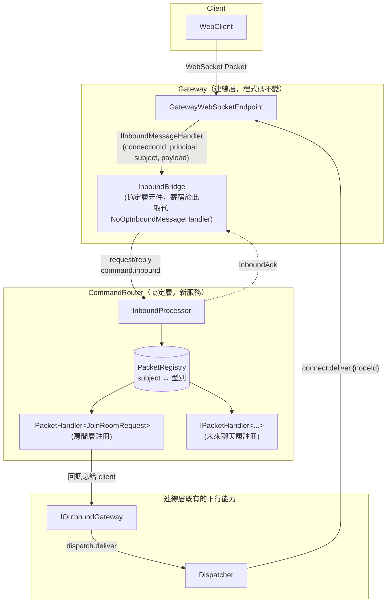
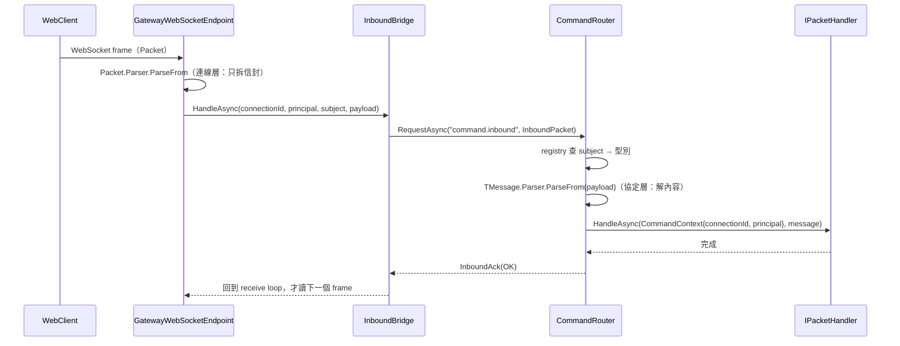
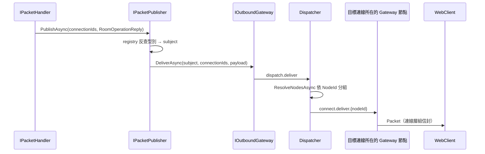

# 協定層架構設計（Protocol Layer）

狀態：機制已實作（`Common/Protocol/` + `CommandRouter/`，含 ADR-9 的 `CommandContext`），房間層 15 個 + 聊天層 5 個 = 已註冊 20 個 subject。**`IInboundFilter` 已移除**，見 ADR-6
技術棧：延續連線層的 .NET + NATS（Adaptare）+ protobuf
範圍：**client 封包內容的解析、subject 與型別的對應、分派給對的 handler**，不含任何具體命令的業務語意

> 修正記錄（身分層定案後）：身分驗證改到 WebSocket handshake（`identity-layer.md` ADR-8），所以本層**不再有身分層註冊的 handler 或守門 filter**，第一批註冊的命令預期來自房間層。相對的，`InboundPacket` 多帶一個 principal，handler 與 filter 的參數改成 `CommandContext`——「這則命令是誰送的」隨封包一起到，本層不查表。見 ADR-9。

## 1. 範圍界定

這層要解決的問題只有四個：

1. **解析**：把連線層交出來的不透明 `payload` 轉成具體的 protobuf 訊息型別。
2. **分派**：依 subject 找到該處理它的 handler，取代單一 `IInboundMessageHandler` 插槽裡不斷增長的 if/else。
3. **協定層級的錯誤政策**：未知 subject、payload 畸形、handler 例外，各自該怎麼處置，只在一個地方定義。
4. **跨切面著力點**：per-subject 觀測、per-connection／per-user 限流、命令的前置條件檢查。
   **這一點的預測後來大半落空**，誠實記在這裡：per-user 限流最後落在 handler（`chat-layer.md` ADR-7），而「前置條件檢查」的機制（`IInboundFilter`）因此被移除（ADR-6）。剩下真的由本層承擔的是 per-subject 觀測與錯誤政策，也就是第 3 點。

**與連線層的邊界**（延續既有決定，本文件不改動它）：`Packet` 信封（`subject` + `payload`）的組裝與拆解仍屬連線層——`GatewayWebSocketEndpoint` 拆、`Connection.SendAsync` 組。連線層看得到 `subject` 但不解讀其語意，`payload` 全程是不透明的 `ByteString`。協定層接手的正是 `payload` 的型別對應與內容解析。

明確排除：具體命令要做什麼（身分綁定屬身分層、房間/聊天屬更上層，它們只是在這層註冊 handler）、連線本身的維護（連線層）、下行的路由與 fan-out（`Dispatcher`）。

## 2. 現有實作對照

**`main` 分支**——沒有「統一入口」的概念，解析散在 Connector、分派靠 NATS subject：

- `ChatConnector/Models/ClientConnectHandler.cs` `OnReceiveAsync`：解析 `Packet` 後包成 `SendQueueCommand` 就丟出去，Connector 本身不認識任何命令。
- `ChatConnector/Models/SendQueueCommandService.cs`：`messageQueueService.PublishAsync(command.Subject, ...)`——**`command.Subject` 完全來自 client 封包**，等於客戶端可以決定訊息要發布到哪個內部 NATS subject。內容會先被包一層 `QueuePacket`，所以不一定能構成有效的內部訊息，但「客戶端能決定發布目標」本身就是不該存在的能力。這是 ADR-3 要避免的東西。
- 同一個 `OnReceiveAsync` 裡 `httpContext.RequestServices.CreateScope()` 沒有 `using`，scope 不會被釋放。

**`feature/rebuild` 現況**：

- `Gateway/Models/NoOpInboundMessageHandler.cs`：插槽佔位，只記 log。**本層實作後已刪除**，那個 DI 註冊改成 `AddInboundBridge()`。
- 身分層文件前一版第 6.3 節有一行 `if (subject != "identity.bind") return; // 之後有其他 subject 時在這裡分派`——這行註解就是本文件要取代的設計（單一插槽會讓每個新增功能都去改同一個檔案）。那個 handler 現在連存在的必要都沒有了（`identity-layer.md` ADR-8），但這個論點對後續每一個業務命令都成立。

## 3. 核心概念

| 概念 | 職責 |
|---|---|
| `InboundPacket`（proto，新） | Gateway → CommandRouter 的信封：`connection_id` + `principal` + `subject` + `payload` |
| `InboundAck`（proto，新） | CommandRouter → Gateway 的處理結果。**只用於順序控制與觀測**，Gateway 不依據它做任何動作（見 ADR-5） |
| `InboundBridge`（協定層元件，寄宿在 Gateway process） | 取代 `NoOpInboundMessageHandler` 的 DI 註冊。把 `(connectionId, principal, subject, payload)` 用 request/reply 送給 CommandRouter，收到 ack 才讓 receive loop 讀下一個 frame |
| `CommandRouter`（新服務） | 訂閱 `command.inbound`（掛 queue group），查 registry → 解析 → 分派 |
| `PacketRegistry` | `subject ↔ 訊息型別` 的唯一對應表，**入站解析與出站序列化共用同一份** |
| `CommandContext`（新） | 一則命令的脈絡：`ConnectionId` + `Principal`。handler 收它，見 ADR-9 |
| `IPacketHandler<TMessage>` | 各層/各功能自己實作的命令 handler，向 CommandRouter 註冊 |
| `IPacketPublisher` | 出口：把 typed 訊息轉成 `(subject, bytes)` 後呼叫既有的 `IOutboundGateway`，下行一律經 `Dispatcher`（見 ADR-5） |

## 4. 元件關係圖



**圖上沒有 `IConnectionTerminator`，這是刻意的。** 前一版有一條 `H1 -- 踢掉舊連線 --> CT`，那是身分層還會在本層註冊 handler 時畫的。`IInboundFilter` 移除之後（ADR-6），`CommandRouter` 這個 process **完全沒有終止連線的能力**——它連 `AddConnectionTerminator()` 都不再呼叫。終止連線目前只剩身分層的 Supersede 在用（`identity-layer.md` ADR-4），發生在 Gateway 與 `WebBff`。

## 5. 訊息序列

### 5.1 一則 inbound 命令的完整路徑



最後兩步是 ADR-2 的重點：因為 receive loop 是「處理完才讀下一個 frame」（`Gateway/Services/GatewayWebSocketEndpoint.cs:84`），單一連線同一時間最多只有一則訊息在 in-flight，端到端順序因此被保證。

### 5.2 handler 產生下行訊息



`IPacketPublisher` 只做「型別 → subject + 序列化」，之後完全走連線層既有路徑，沒有任何新的下行通道。

### 5.3 ~~協定違反 → 終止連線~~ **本層不再有這條路徑**

原本這裡有一張「payload 畸形 / filter 判定拒絕 → `CommandRouter` 呼叫 `IConnectionTerminator` → `Dispatcher` → Gateway 送 Close」的序列圖。**它已經不存在了**，兩個原因疊起來：

- payload 畸形從來就不終止連線（ADR-8 把它改成 log + 忽略），所以那張圖的第一個觸發條件在 ADR-8 之後就是錯的；
- 剩下的觸發條件是 `IInboundFilter` 回傳 `Terminate`，而整個 filter 機制已移除（ADR-6）。

結果是 `CommandRouter` **沒有任何終止連線的能力**，這件事現在是結構上的（`InboundProcessor` 不注入 `IConnectionTerminator`、`Program.cs` 不呼叫 `AddConnectionTerminator()`），不是靠測試盯著。要重新加回來得同時動這兩處——**這個成本是刻意留下的摩擦**，避免有人日後為了「方便」就把踢連線塞回熱路徑。

下面這段交錯的觀察**仍然成立**，只是觸發者換成身分層的 Supersede（`identity-layer.md` ADR-4），而它發生在 Gateway 與 `WebBff`，不在 `CommandRouter`：

等待 ack 的 Gateway 節點，跟收到 terminate 的 Gateway 節點是同一個。`Connection.CloseOutputAsync` 會在 receive loop 還在 await ack 時把 close frame 送出去，socket 狀態變成 `CloseSent`；ack 回來後 receive loop 檢查 `connection.State == WebSocketState.Open` 不成立就自然結束，`finally` 照原本流程跑 `OnDisconnectedAsync`。兩者不會互相踩到——`Connection` 的 `m_SendLock` 已經保證送出類的呼叫互相排隊。（連線層刻意用 `CloseOutputAsync` 而非 `CloseAsync`，正是為了不跟 receive loop 搶同一個 receive，見 `connection-layer.md` 第 6.6 節。）

## 6. 具體介面設計

### 6.1 Proto（`Common/Protos/protocol.proto`，新檔案）

`connection.proto` 保持不動——那是連線層自己的檔案，下面這些是協定層自己的傳輸格式：

```protobuf
syntax = "proto3";
option csharp_namespace = "Chat.Protos";
package chat;

// Gateway（InboundBridge）-> CommandRouter：一則來自 client 的封包，
// 附上它來自哪條連線、以及那條連線在 handshake 驗證通過的 principal（見 ADR-9）。
message InboundPacket {
	string connection_id = 1;
	string subject = 2;
	bytes payload = 3;
	string principal = 4;
}

// CommandRouter -> Gateway（InboundBridge）：處理結果。
// 只用於順序控制與觀測，Gateway 不依據它做任何動作（見 ADR-5）。
message InboundAck {
	enum Status {
		// OK 刻意不是 0——proto3 不序列化預設值，0 bytes 的回覆跟「沒有人回覆」無法區分。
		// 這是踩過的 bug，完整脈絡見第 9 節。
		UNSPECIFIED = 0;
		OK = 1;
		UNKNOWN_SUBJECT = 2;
		MALFORMED_PAYLOAD = 3;
		HANDLER_FAILED = 5;

		// 4 曾經是 REJECTED_BY_FILTER，隨 IInboundFilter 一起移除（ADR-6）。保留編號而不是
		// 讓 HANDLER_FAILED 往前補，避免同一個數字在新舊版本間有兩種意思。
		reserved 4;
		reserved "REJECTED_BY_FILTER";
	}

	Status status = 1;
	string detail = 2;
}
```

### 6.2 `InboundBridge`（協定層元件，寄宿在 Gateway process）

```csharp
namespace Common.Protocol; // 寄宿在 Gateway，所以必須放共用組件而不是 CommandRouter 專案

// 取代 Gateway/Program.cs 裡 NoOpInboundMessageHandler 的 DI 註冊。
// 這是協定層的元件、只是寄宿在 Gateway process，連線層程式碼不需要任何修改。
internal sealed class InboundBridge(
	IMessageSender messageSender,
	ILogger<InboundBridge> logger) : IInboundMessageHandler
{
	private const string InboundSubject = "command.inbound";
	private static readonly TimeSpan _Timeout = TimeSpan.FromSeconds(10); // 為什麼是 10 秒見第 9 節

	public async ValueTask HandleAsync(
		string connectionId,
		string principal,
		string subject,
		ByteString payload,
		CancellationToken cancellationToken = default)
	{
		var packet = new InboundPacket
		{
			ConnectionId = connectionId,
			Principal = principal,   // 連線層在 handshake 驗到的不透明字串，這裡只轉手
			Subject = subject,
			Payload = payload
		};

		using var timeout = CancellationTokenSource.CreateLinkedTokenSource(cancellationToken);
		timeout.CancelAfter(_Timeout);

		try
		{
			var reply = await messageSender
				.RequestAsync<byte[], byte[]>(InboundSubject, packet.ToByteArray(), timeout.Token)
				.ConfigureAwait(false);

			var ack = InboundAck.Parser.ParseFrom(reply);

			if (ack.Status != InboundAck.Types.Status.Ok)
				logger.LogWarning(
					"{ConnectionId} {Subject} rejected: {Status} {Detail}",
					connectionId, subject, ack.Status, ack.Detail);
		}
		catch (OperationCanceledException) when (!cancellationToken.IsCancellationRequested)
		{
			// CommandRouter 沒回應。這個例外往上丟之後會被連線層當成正常關站吞掉
			// （GatewayWebSocketEndpoint.cs:36），所以 log 一定要在這裡記。
			logger.LogError("{ConnectionId} {Subject} timed out waiting for the command router.", connectionId, subject);
			throw;
		}
	}
}
```

用 `RequestAsync<byte[], byte[]>` 而非泛型 protobuf 型別，是沿用 `DispatchHandler`/`DeliverPacketHandler` 既有的「Adaptare 只搬 `byte[]`、protobuf 自己解」慣例。

### 6.3 `PacketRegistry` 與 `IPacketHandler<TMessage>`

```csharp
namespace Common.Protocol;

// 一則命令的脈絡。用 struct 包起來而不是兩個平行參數，理由見 ADR-9。
public readonly record struct CommandContext(string ConnectionId, string Principal);

public interface IPacketHandler<TMessage> where TMessage : IMessage<TMessage>, new()
{
	ValueTask HandleAsync(CommandContext context, TMessage message, CancellationToken cancellationToken = default);
}
```

`new()` 約束是為了讓協定層自己用 `new MessageParser<TMessage>(() => new TMessage())` 建 parser。protobuf 產生的類別有 `static Parser` 但泛型約束拿不到它；初版設計要求 handler 用 `static abstract MessageParser<TMessage> Parser` 交出來，實作時發現沒必要——parser 是訊息型別的性質，不是 handler 的性質，讓 handler 宣告它是白給的樣板碼。

註冊時把 subject 一起宣告，讓每個 subject 字面值在整個 codebase 只出現一次：

```csharp
// 各層在 CommandRouter 的組裝處註冊自己的命令（例子取自房間層，見 room-layer.md 6.4）
services.AddPacketHandler<JoinRoomRequest, RoomJoinHandler>("room.join");

// 只出現在下行的訊息型別也要宣告 subject，這樣 IPacketPublisher 才反查得到
services.AddOutboundPacket<RoomOperationReply>("room.reply");
```

`AddPacketHandler` 會順便把 handler 註冊為 **scoped**（見第 9 節的 DI scope 決議）。

`PacketRegistry` 是這些註冊的彙總，同時服務兩個方向：`subject → (parser, handler)` 給入站用，`型別 → subject` 給出站用。兩個實作細節：

- 只用 `AddOutboundPacket` 註冊的 subject，`IsInboundSubject` 會回 `false`——client 送這種 subject 上來，對協定層而言等同未知 subject，不是「有註冊但沒 handler」的錯誤。
- 重複的 subject 或重複的訊息型別在建構 registry 時直接丟例外。`CommandRouter/Program.cs` 在 `host.Run()` 之前就解析一次 registry 並把對應表寫進 log，讓這個 fail fast 發生在啟動時而不是第一則訊息進來時（緩解 ADR-4 失去編譯期檢查的代價）。

### 6.4 ~~`IInboundFilter`~~ **已移除**

本節原本定義一個 `FilterDecision { Allow, Drop, Terminate }` 加一個有 `Order` 的 `IInboundFilter`，讓各層註冊分派前的前置條件檢查，處置動作由 `CommandRouter` 統一執行。**整組東西已經從 codebase 移除**（`Common/Protocol/IInboundFilter.cs`、`AddInboundFilter<T>()`、`InboundProcessor` 的 filter 迴圈、`InboundAck.REJECTED_BY_FILTER`）。

移除的判準不是「用不到就砍」，而是 ADR-6 自己寫下的了斷條件到期了——完整脈絡在那條 ADR，這裡只記結果與代價。

**設計本身沒有錯，錯在需求消失了。** 它是為「未綁定身分前只接受 `identity.bind`」而建，而 handshake 驗證讓那個狀態根本不存在（`identity-layer.md` ADR-8）。之後唯一的候選是 per-user 業務限流，聊天層 ADR-7 判給了 handler，理由很硬：`FilterDecision` **沒有辦法回一則訊息給 client**，而 ADR-8 對上層的隱含要求正是「業務失敗必須用明確的下行訊息回覆」。被限流的人收到 `Drop` 就是沉默——那正是要避免的狀況。

**移除的代價**（不是零）：

- 「在 payload 解析之前擋掉」這個著力點沒了。實際損失很小——payload 解析是一次小訊息的 protobuf parse，真正的成本在它之後。
- 真的出現「狀態違反」需求時要重新加回來，而且要同時動 `InboundProcessor` 的建構子與 `CommandRouter/Program.cs`。**這個摩擦是刻意的**（見 5.3）。
- 跨切面著力點少了一個。§1 第 4 點列的四件事裡，per-subject 觀測與限流都還有地方放（`InboundProcessor` 本身、handler），「命令的前置條件檢查」現在沒有統一的位置——**這是本次移除唯一真正失去的東西**，記在這裡而不是假裝它不存在。

### 6.5 出口：`IPacketPublisher`

```csharp
namespace Common.Protocol;

public interface IPacketPublisher
{
	ValueTask PublishAsync<TMessage>(
		IReadOnlyCollection<string> connectionIds,
		TMessage message,
		CancellationToken cancellationToken = default)
		where TMessage : IMessage<TMessage>;
}
```

實作只有三行：registry 反查 subject → `message.ToByteString()` → 呼叫既有的 `IOutboundGateway.DeliverAsync`。呼叫端從此不再手寫 subject 字串、不再自己 `ToByteArray()`。

### 6.6 `CommandRouter` 服務的組裝樣貌

```csharp
var builder = Host.CreateApplicationBuilder(args);
{
	builder.AddServiceDefaults();

	// 下行只要 IOutboundGateway，它要 Redis + NATS。
	// 刻意沒有 AddConnectionTerminator()——本層沒有終止連線的路徑了（ADR-6、5.3）。
	builder.AddRedisClient("connection-directory");
	builder.AddNatsClient("message-bus");
	builder.Services.AddConnectionDirectory();
	builder.Services.AddOutboundGateway();

	// 協定層自己
	builder.Services.AddPacketRegistry();

	// 各層在這裡註冊自己的命令（目前是房間層，聊天層待實作）

	builder.Services
		.AddMessageQueue()
		.AddNatsMessageQueue(config => config
			.ConfigureResolveConnection(sp => (NatsConnection)sp.GetRequiredService<INatsConnection>())
			.AddProcessor<InboundProcessor>("command.inbound", "command.inbound")); // 第二個參數為 queue group
}
```

`InboundProcessor : IMessageProcessor<byte[], byte[]>`（Adaptare 的 request/reply handler 型別，`HandleAsync` 回傳 reply）。`AddProcessor<TProcessor>(subject, queueGroup)` 這個多載實測存在，與 `Dispatcher/Program.cs` 的 `AddHandler` 寫法一致。

## 7. 架構決策記錄（ADR）

### ADR-1：協定層獨立成服務，Gateway 只保留一個 thin bridge

- **Context**：`IInboundMessageHandler` 是單一插槽。若讓各層直接在 Gateway process 內實作，Gateway 會逐漸變成業務邏輯的宿主，部署上跟業務綁在一起。
- **Decision**：協定層獨立成 `CommandRouter` 服務；Gateway 只寄宿一個 `InboundBridge`。
- **Consequences**：Gateway 維持純管道，跟下行的 `Dispatcher` 形成對稱；業務 handler 可以獨立更新、獨立擴展。代價有三個：每則 inbound 多一次網路 hop；`CommandRouter` 成為所有業務 handler 的宿主 process（未來某個業務要獨立擴展，再讓它訂閱自己的 subject 拆出去）；`CommandRouter` 全掛時 inbound 全斷，但下行（`Dispatcher`）不受影響。

### ADR-2：Gateway → CommandRouter 用 request/reply，不用 fire-and-forget publish

- **Context**：拆成獨立服務 + queue group 之後，同一條連線的兩則訊息會被分到不同複本並行處理，訊息順序不再保證。對聊天系統這是實質錯誤（聊天記錄順序錯亂）。初稿還舉了另一個例子——`identity.bind` 還沒處理完，後面的業務訊息就先被處理了——那個例子隨 `identity-layer.md` ADR-8 消失了（handshake 驗證沒有這種先後關係），但**本 ADR 不依賴它**：房間層一樣有「`room.join` 還沒完成就收到 `room.leave`」這類必須維持順序的命令對。
- **Decision**：`InboundBridge` 用 `IMessageSender.RequestAsync` 送出並等待 `InboundAck` 才返回。因為連線層的 receive loop 是「`await` 完 `HandleAsync` 才讀下一個 frame」（`GatewayWebSocketEndpoint.cs:148`，本文件原本寫 `:84`，行號已漂），單一連線同時最多一則訊息 in-flight，端到端順序因此被保證；不同連線之間仍完全並行（各自有獨立的 receive loop）。
- **Consequences**：不需要引入 `connectionId` 分片，`connection-layer.md` ADR-5 維持暫緩。代價：每則 inbound 多一次 NATS round-trip；單一連線的 inbound 吞吐上限變成 1/RTT（叢集內亞毫秒級，聊天場景遠遠夠用，但不適用高頻串流類的 subject）；`CommandRouter` 變慢或掛掉會直接反壓到 receive loop——這其實是想要的行為，避免 Gateway 無上限累積待處理訊息。
- **這條 ADR 的 Context 在 2026-08-12 才第一次成真**：AppHost 對 `command-router` 開了 `WithReplicas(2)`（`chat-layer.md` §11 的 B5）。在那之前只有一個複本，「同一條連線的兩則訊息被分到不同複本」根本不可能發生——也就是說**這個機制存在了很久，但它防的那個情境從來沒出現過**。開複本之前重新檢查了一遍它是否成立（receive loop 確實還是等 ack 才讀下一個 frame），結論是它從第一天就是為這一刻寫的，不需要任何變更。

### ADR-3：固定使用單一 NATS subject `command.inbound`，不把 client 的 subject 拼進 NATS subject

- **Context**：更省事的做法是 `PublishAsync($"command.inbound.{clientSubject}", ...)`，讓 NATS 自己做分派、CommandRouter 連 registry 都不用寫。舊 `main` 分支正是這個方向，而且更徹底——`SendQueueCommandService` 直接把 client 給的 subject 當 NATS subject 用。
- **Decision**：固定單一 subject，分派由 `CommandRouter` 內部的 registry 負責。
- **Consequences**：客戶端無法決定訊息發布到哪個 NATS subject，內部 messaging 拓樸不再有一部分由客戶端輸入決定；未知 subject、payload 畸形、限流、per-subject 觀測都有唯一的著力點；跨命令規則（初稿舉的例子是「未綁定身分前只接受 `identity.bind`」，那個需求已隨 `identity-layer.md` ADR-8 消失；仍然成立的是未來「每人每秒最多 10 則聊天」這類 per-user 限流）也才有地方放，靠 NATS 分派的話每個 handler 都得自己檢查。代價：`CommandRouter` 不能靠 NATS subject 做水平分流，所有 inbound 都經過同一個 queue group——要分流是加複本，不是加 subject。

### ADR-4：`subject ↔ 型別` 用 DI 收集的 registry，不用 `oneof` 大信封也不用 `Any`

- **Context**：三種常見做法——(a) registry；(b) 一個 `oneof` 涵蓋所有命令的大信封；(c) protobuf `Any` 自帶型別資訊。
- **Decision**：採用 (a)。
- **Consequences**：協定層本身不認識任何具體命令型別，新增命令只動自己模組的檔案，不會出現「所有功能都要改同一個 proto」的瓶頸（那是 (b) 的問題）；subject 保留為可讀的路由鍵與觀測維度（(c) 會讓 subject 變成冗余）；入站解析與出站序列化共用同一份對應表。代價：失去 `oneof` 的編譯期 exhaustiveness，漏註冊要到 runtime 才發現——用啟動時 fail fast + 印出整份對應表來緩解，但這確實比編譯期檢查弱。

### ADR-5：下行一律經 `Dispatcher`，協定層不自己開第二條下行通道

- **Context**：`InboundAck` 是 CommandRouter 回 Gateway 的既有通道，技術上可以順便夾帶「關掉這條連線」或「把這則訊息回給 client」，省一次繞行——特別是目標連線往往就在發出 request 的那個 Gateway 節點上。
- **Decision**：不這樣做。ack 只表達處理結果，僅用於順序控制與觀測。任何要送回 client 的訊息走 `IPacketPublisher` → `IOutboundGateway` → `dispatch.deliver` → `Dispatcher`；任何要關的連線走 `IConnectionTerminator` → `dispatch.terminate` → `Dispatcher`。
- **Consequences**：下行只有一條路徑，`InboundBridge` 完全不需要知道「投遞」或「終止連線」這些概念，維持 thin；也不會出現「同一件事有兩套機制、行為卻不完全一致」的長期維護問題。代價：即使目標連線就在原本那個節點上，訊息仍會繞 `CommandRouter` → `Dispatcher` → 同一個 Gateway 一圈，多一次 hop 加一次 Redis 查詢。這個浪費是刻意接受的。

### ADR-6：~~前置條件用 filter pipeline，由各層自己註冊~~ → **機制已移除**

- **Context**：「未綁定身分前只接受 `identity.bind`」需要一個統一的著力點，但若由協定層直接實作，協定層就反過來依賴身分層。
- **Decision**：協定層只定義 `IInboundFilter`（只看得到 `CommandContext` + `subject`），各層自己註冊 filter；處置動作由 CommandRouter 統一執行。
- **Consequences**：依賴方向維持向下，協定層不認識身分概念，延續 `connection-layer.md` ADR-1 的精神。
- **修正（身分層定案後）**：本 ADR 的 Context 舉的那個例子**已經不存在了**——handshake 驗證讓「已連線但未綁定身分」這個狀態消失（`identity-layer.md` ADR-8），身分層不會註冊任何 filter，原本記在這裡的代價（身分層要補一個 `ConnectionId → 是否已綁定` 的反向查詢）也一併消失。機制保留，但要誠實承認**目前沒有任何使用者**：它的下一個候選是 per-user 業務限流（第 9 節）。這種「為了一個後來消失的需求而建立的機制」值得記著——如果限流最後也不放這裡，就該考慮把 `IInboundFilter` 整個拿掉，而不是留一個沒人用的擴充點。
- **執行（聊天層設計完成後）**：**上面那個條件成立了，機制已移除。** 限流確定放 `ChatSendHandler`（`chat-layer.md` ADR-7），理由是 `FilterDecision` 回不了訊息給 client 而 ADR-8 要求業務失敗必須明確回覆。從機制建立到移除，它經歷了四層的設計（連線、協定、身分、房間）加一層的設計定稿（聊天）**沒有累積到任何一個使用者**，這是足夠的證據。
  - 移除的範圍：`Common/Protocol/IInboundFilter.cs`（連 `FilterDecision`）、`AddInboundFilter<T>()`、`InboundProcessor` 的 filter 迴圈與 `RejectAsync`、`InboundProcessor` 對 `IConnectionTerminator` 的依賴、`CommandRouter/Program.cs` 的 `AddConnectionTerminator()`、`InboundAck.REJECTED_BY_FILTER`（改成 `reserved 4`）。
  - **連帶結果比預期大**：`CommandRouter` 因此完全失去終止連線的能力（見 5.3）。這不是移除 filter 的目標，是它的副產品——而且是好的副產品，因為 ADR-8 的立場本來就是「本層不靠關連線處理壞輸入」，現在那件事從約定變成型別上做不到。
  - **`Integration.Tests` 少了一個替身**：那裡原本註冊一個會丟例外的 `NoopConnectionTerminator`，註解寫的理由是「協定層的 filter 政策需要這個依賴存在」。它存在的唯一原因就是這個機制，一起刪掉了。
  - **這條 ADR 保留不刪**，因為「一個為了後來消失的需求而建立、並在自己寫下的條件到期時被移除的機制」比一條乾淨的 ADR 更有參考價值。ADR-3 那三個「靠 NATS 分派就沒地方放跨命令規則」的論證仍然成立，只是那個地方現在是 `InboundProcessor` 與 handler，不是 filter。

### ADR-7（條件觸發）：`CommandRouter` 依 `connectionId` 分片

- **Context**：若 ADR-2 的「每連線 1/RTT」吞吐上限成為實際瓶頸。
- **Decision（暫緩）**：屆時才考慮由 `InboundBridge` 依 `hash(connectionId)` 分流到固定的 shard subject，改用 fire-and-forget 但保住每連線順序。
- **觸發條件**：需要實測數據證明 request/reply 的吞吐不足。這與 `connection-layer.md` ADR-5 是同一類決策，應該一起評估。

### ADR-8：~~狀態違反才終止連線~~，內容錯誤只記 log 並忽略——**本層現在完全不終止連線**

- **Context**：協定層會遇到三類壞輸入——未知 subject、payload 解析失敗、以及「這條連線現在不該送這個 subject」。本文件初稿的傾向是未知 subject 忽略、payload 畸形 terminate，但這個不對稱撐不住檢驗。
- **Decision**：依「壞的是這一則訊息，還是這條連線」劃線。
  - **內容錯誤**（未知 subject、payload 解析失敗）→ 記 log + metrics，忽略該則訊息，**連線保留**。
  - ~~**狀態違反**（`IInboundFilter` 回傳 `Terminate`）→ 終止連線。~~ **這一半已經沒有了。** 原本的例子（未綁定身分就送業務命令）隨 handshake 驗證消失，而唯一能觸發它的機制隨 ADR-6 移除。第三類壞輸入因此**沒有任何處置路徑**——真的出現時要先重新引入一個機制，而不是有現成的插槽可以用。
- **Consequences**：
  - **「本層不關使用者的連線」從約定變成結構**：`InboundProcessor` 不注入 `IConnectionTerminator`，`CommandRouter` 不註冊它。下面那些「為什麼不 terminate」的論證因此不再需要有人記得遵守。相對的，`CommandRouter.Tests` 裡那幾個 `DidNotReceive().TerminateAsync(...)` 斷言被一個「建構子參數裡沒有 `IConnectionTerminator`」的斷言取代——跟 `room-layer.md` ADR-5 在 `RoomKickHandler` 上用的是同一招。
  - 未知 subject 不能 terminate 的理由很實際：WebClient 是從靜態站台載入的，rolling deploy 期間必然出現「新 client + 舊 `CommandRouter`」，terminate 會造成大量斷線。要記 **warning** 而非 debug 並加 counter，因為它同時是「版本錯位」與「有人在亂送」的訊號。
  - payload 畸形也不 terminate，是因為 client 幾乎都會自動重連，terminate 會變成「重連 → 送同一個壞封包 → 又被踢」的緊迫迴圈，而每次重連的成本（WebSocket handshake + Redis 寫入）比直接忽略那則訊息貴得多——為了防濫用反而製造更大的負載。
  - 濫用不靠 terminate 防，靠限流與訊息大小上限（見第 9 節），那才是對症的工具。
  - 代價：client 送出壞封包時只會「什麼都沒發生」，不會收到錯誤回應。要讓 client 知道就得在協定裡加一種錯誤訊息型別，屬於各命令自己的協定設計（見第 9 節 handler 例外那條），本層不強制。
  - **對上層的隱含要求**：正因為本層對錯誤是「記 log + 忽略」，業務層自己的失敗（密碼錯誤、被封鎖、權限不足）**必須**用明確的下行訊息回覆，不能靠關連線或沉默——否則 client 會什麼都收不到、看起來像卡住。`room-layer.md` 的 `RoomOperationReply` 就是照這條要求設計的。

### ADR-9：principal 隨封包走，本層不維護任何 `connectionId → 身分` 的對照表

- **Context**：業務 handler 幾乎都需要「這則命令是誰送的」——房間層的成員名單就是以 `userId` 為鍵（`room-layer.md` ADR-1）。前一版設計裡這個答案要查 Redis：守門 filter 查一次反向索引確認「已綁定」，handler 再查一次拿 `userId`，**同一個事實在同一則命令裡查兩次**。當時懸而未決的是這張表該由本層擁有（`IConnectionPrincipals`）還是身分層擁有（`IPresenceDirectory`）。
- **Decision**：**都不擁有**。身分驗證改到 handshake（`identity-layer.md` ADR-8）之後，principal 由連線層在 `InboundPacket.principal` 帶上來，本層直接包成 `CommandContext` 交給 handler。協定層不存、不查、不驗證這個字串，也不知道它的值代表什麼。
- **Consequences**：
  - **每則命令少一到兩次 Redis 讀取**，而且那是在 ADR-2 的 request/reply 熱路徑上（單一連線的吞吐上限是 1/RTT，省下的往返是實質的）。
  - 懸案結束：`IConnectionPrincipals` 不會存在。身分層的 `IPresenceDirectory` 仍然擁有**反方向**的 `userId → connectionId`（房間 fan-out 需要，見 `identity-layer.md` 6.2），但那是投遞用的正向解析，跟「命令是誰送的」不是同一件事，不要再把兩者混在一起討論。
  - **信任邊界要說清楚**：`InboundPacket.principal` 由 Gateway 填寫，`CommandRouter` 無條件相信它。這是安全上的信任假設，成立的前提是 `command.inbound` 這個 subject 只有 Gateway 能 publish（叢集內部的 NATS，未對外開放）。哪天 NATS 對外開放或有非 Gateway 的發布者，這個假設就破了——**這種假設在 diff 上完全看不出來，所以寫在這裡**。
  - **用 `CommandContext` struct 而不是兩個平行參數**：目前只有兩個欄位，多帶一個 `string` 參數本來就夠。選 struct 的理由跟第 9 節「一開始就開 DI scope」是同一個——事後往 `IPacketHandler` 加參數是破壞性變更，會動到所有 handler 與所有測試；而未來會想放進來的東西是可預期的（trace id、收到訊息的時間戳、per-command metrics 標籤）。代價是多一個型別、以及呼叫端要寫 `context.ConnectionId` 而不是 `connectionId`。
  - handler 拿到的 principal **不保證對應的連線還活著**（client 可能在 ack 回去之前就斷線）。這跟本層既有的假設一致：下行投遞查不到連線就省略（`ResolveNodesAsync` 慣例），handler 不需要特別處理。

## 8. 明確排除於本階段

- 具體命令的業務語意：身分綁定屬身分層、房間/聊天屬更上層，本層只提供註冊與分派機制。
- WebClient / client SDK 端的封包封裝與下行分派。
- inbound 訊息的持久化與重送：目前用 core NATS（無 JetStream），處理失敗就是失敗，不設 retry queue。要不要引入 JetStream 是獨立議題。
- 連線斷開事件的對外通知（見第 9 節）。

## 9. 待確認 / 後續事項

- **已完成**：協定層機制全部實作。`Common/Protocol/`（`IPacketHandler`、`PacketRegistration`、`PacketRegistry`、`IPacketPublisher`/`PacketPublisher`、`InboundBridge`）、`Common/Protos/protocol.proto`、`Common/ProtocolLayerServiceCollectionExtensions.cs`、`CommandRouter/`（`InboundProcessor` + `Program.cs`）。`Gateway/Program.cs` 的 `NoOpInboundMessageHandler` 註冊換成 `AddInboundBridge()`（該檔案已刪除），AppHost 新增 `command-router` 資源。原本預期第一批註冊來自身分層，`identity-layer.md` ADR-8 之後改為**房間層**——現在 registry 有 20 個 subject（房間層 15 + 聊天層 5，啟動時會印出來）。
- **已完成（ADR-6 的了斷）**：`IInboundFilter` 整組移除，範圍與連帶結果記在 ADR-6 的「執行」段。
- **已完成（ADR-9）**：`InboundPacket.principal`、`Common/Protocol/CommandContext.cs`、`IPacketHandler` 改收 `CommandContext`、`InboundBridge.HandleAsync` 多一個 `principal` 參數、`InboundProcessor` 組出 context 並傳給 dispatch。跟連線層的 handshake 驗證是同一次跨層變更（`connection-layer.md` 第 9 節）。
- **已修正的 bug（房間層端到端驗證時抓到的第二個）**：共用的 `AddNatsMessaging()` 會讓**每個下行訊息被投遞兩次**。`AddNatsMessageQueue()` 每被呼叫一次就多一個 `IMessageQueueBackgroundRegistration`，而 handler 的設定是共用的 options——所以「共用設定呼叫一次 + host 為了註冊自己的 handler 再呼叫一次」等於每個訂閱被建立兩份。marker 只擋得住我們自己的重複呼叫，擋不住 host 那一次；下面那條「實測 Adaptare 容許這種重複呼叫」的結論只驗了「`IMessageSender` 解得出來」，**沒有驗訂閱有沒有被建立兩份**。
  - 這個 bug 也撐過了兩次端到端驗證：在房間層出現之前，下行只有 `terminate`（重複關同一條連線是 no-op）與 ack（request/reply 只取第一個回覆），重複完全看不出來。
  - 修法：**移除 `AddNatsMessaging()`**，改成每個 host 在自己的 `Program.cs` 裡明確組一次完整的鏈。共用的兩行因此在四個 `Program.cs` 各出現一次——刻意付的重複代價，換來「不可能註冊兩次」在每個 `Program.cs` 裡看得見，而不是藏在一個 marker 後面。回歸測試改成**數 `IMessageQueueBackgroundRegistration` 的註冊次數**，而不是只驗「解得出 `IMessageSender`」。
  - 當時還「發現」了「同一條鏈裡混用 `AddProcessor` 與 `AddHandler` 時 handler 完全收不到訊息」——**那是誤判，已推翻**。實測（`scratchpad/AdaptareWireProbe`）兩者在同一條鏈裡都會被呼叫；而且它們本來就是不同語意，混用是正常用法：**processor 有回覆、發布端會等它處理完成；handler 是 fire-and-forget**。當時真正壞掉的是發布端的 cancellation token，過程見 `room-layer.md` 第 9 節。`CommandRouter` 現在同時掛 `AddProcessor<InboundProcessor>` 與 `AddHandler<RoomDisconnectHandler>`。
  - **這次誤判之所以成立，是因為它跟上面那個重複註冊 bug 疊在同一次執行裡**：唯一觀察到「handler 收不到」的那一輪，重複註冊還沒修。單一現象同時有兩個以上可疑原因時，**要先把原因逐個隔離再下結論**，不要把「修好之後就通了」當成因果。
- **已完成（已被上面那條取代）**：`AddOutboundGateway()`／`AddConnectionTerminator()`／`AddInboundBridge()` 共用的 Adaptare 設定移到 `Common/NatsMessagingRegistration.cs` 的 `AddNatsMessaging()`（原本叫 `AddConnectionLayerMessaging()`，現在協定層也要用，名字不該再綁連線層）。共用設定用 marker 只跑一次，但那個 marker 擋不住「應用程式為了註冊自己的 handler 又呼叫一次 `AddNatsMessageQueue`」——Gateway 與 Dispatcher 正是這樣。實測 Adaptare 容許這種重複呼叫、`IMessageSender` 仍解得出來，`Common.Tests/Protocol/NatsMessagingRegistrationTests.cs` 把 Gateway 與 CommandRouter 兩種註冊組合都釘住了。
- **已驗證**：端到端跑過一次真的 AppHost（Redis + NATS 容器 + 兩個 Gateway 複本 + Dispatcher + CommandRouter）。WebSocket client 連上 Gateway、送出 `Packet`，連線在超過 bridge 的 10 秒 timeout 之後仍然是 `Open` 且能繼續送第二則訊息，最後乾淨完成 close handshake——證明 `AddProcessor` 的 request/reply 在真的 NATS 上有來有回（若 ack 沒回來，連線會在 10 秒被關掉）。順帶確認 NATS server 回報的 `MaxPayload` 就是 1048576，跟第 9 節限流那條引用的 1MB 一致。
- **已決定**：服務專案名為 `CommandRouter`，NATS subject 前綴為 `command.inbound`（沿用「前綴對應目標角色」的既有慣例：`dispatch.*` 給 `Dispatcher`、`connect.*` 給 Gateway 節點）。`Command` 這個字是用來跟 `Dispatcher` 區隔——`Dispatcher` 搬的是不理解內容的投遞封包，這個服務處理的是已解析成型別的命令；單獨叫 `Router` 會跟 `Dispatcher` 語意撞車（兩者幾乎同義，光看專案清單 `Gateway / Dispatcher / Router / Common` 猜不出哪個是上行哪個是下行）。排除 `Ingress`：k8s Ingress 有既定含義（HTTP 反向代理／入口控制器），會被誤認成基礎設施元件。排除 `Protocol`：協定層的共用抽象已經用 `Common.Protocol` 命名空間，服務同名會打架。**保留的風險**：ADR-1 預期未來某個業務會拆成自己的宿主 process，屆時「唯一的 CommandRouter」這個命名會變尷尬（不會有 `CommandRouter2`）。真要拆時再改名，subject 前綴要一起改，成本不小但可控。
- **已決定**：`InboundBridge` 的 timeout 為 **10 秒**，逾時就讓連線關閉（client 重連重送）。關鍵是先認清 timeout 在防什麼——NATS 有 no-responders 機制，`CommandRouter` 整個掛掉時 `RequestAsync` 會立刻失敗而不是等到逾時（Adaptare 怎麼把這個表面化，實作時要確認），所以 timeout 只覆蓋「Router 活著但太慢」也就是過載。既然是過載，就要給得寬鬆到能吸收 GC pause 與 Redis failover（Sentinel／Cluster failover 常在數秒級）而不誤殺大量活著的連線；handler 本身只是幾次 Redis 往返，正常是毫秒級。**不選「記 log 後繼續讀下一個 frame」**，因為那則逾時的訊息可能還在路上、稍後才被 Router 處理，ADR-2 好不容易保住的單連線順序就破了。要接受的粗糙處：例外往上丟會被 `GatewayWebSocketEndpoint.cs:36` 的 `catch (OperationCanceledException)` 吞掉、socket 直接被 dispose，client 看到的是 1006 abnormal closure 而不是乾淨的 close frame（所以 log 必須記在 bridge 裡，6.2 已這樣寫）。想要乾淨關閉得讓 bridge 自己呼叫 `IConnectionTerminator` 繞 Dispatcher 回到同一個 Gateway——為一個關閉繞一圈不值得。
- **已修正的 bug（房間層端到端驗證時抓到）**：`InboundAck` 的 `Status.OK` 原本是 **0**，而 proto3 不序列化預設值——所以「成功」的 ack 是 **0 bytes**，經過 NATS 回來被 Adaptare 交出來時是 `null`，`InboundAck.Parser.ParseFrom(null)` 直接丟 `ArgumentNullException`，連線當場死掉。**每一個成功的命令都會殺掉連線。**
  - 這個 bug 在 registry 還是空的時候**完全看不到**：那時每則命令的 ack 都是 `UNKNOWN_SUBJECT`（非預設值，有 bytes）。之前那次端到端驗證（本節上方「已驗證」那條）正是在這個狀態下跑的，所以它證明的其實是「失敗的 ack 走得通」。第一個成功的命令才踩到。
  - 單元測試也抓不到：mock 回傳的是 `ack.ToByteArray()` 也就是 `byte[0]`，而 `ParseFrom(byte[0])` 是合法的。**只有真的 NATS 往返會把 0 bytes 變成 null。**
  - 修法：`Status` 加上 `UNSPECIFIED = 0`、`OK` 改成 1，讓成功的 ack 必然非空；`InboundBridge` 則把空回覆當成「沒有人處理這則命令」（NATS no-responders）並往上丟關掉連線——不能當成成功，那則命令根本沒被處理，ADR-2 保住的順序就破了。
  - **一般化的教訓**：任何「全欄位都是預設值」的 protobuf 訊息序列化後是 0 bytes，而在 request/reply 上「0 bytes 的回覆」跟「沒有回覆」無法區分。設計 reply 型別時，至少要有一個欄位在成功路徑上是非預設值。
- **已決定**：未知 subject 與 payload 畸形**都是 log + 忽略，不關連線**，見 ADR-8。這修正了本節先前「未知 subject 忽略、payload 畸形 terminate」的傾向。
- **已決定**：`CommandRouter` **一開始就 per-command 開 DI scope**，handler 註冊為 scoped，`ISessionStore`／`IPresenceDirectory`／`PacketRegistry` 維持 singleton。目前所有依賴都是 Redis singleton、確實不需要 scope，但 `using var scope = scopeFactory.CreateScope()` 是三行的事，而事後補是破壞性的——handler 的生命週期假設一旦改變會產生 captive dependency 那類難查的問題。而且「一則命令」對應「一個 request」是 .NET 的預設心智模型，將來寫 handler 的人會直覺假設 scoped 語意。（舊 `main` 的 `ClientConnectHandler.OnReceiveAsync` 正是 `CreateScope()` 沒有 `using` 的 scope 洩漏，這區域值得一開始就做對。）
- **已決定**：限流分三塊處理。
  - **訊息大小上限：已實作**（連線層）。`GatewayWebSocketEndpoint` 的 receive loop 原本用 `MemoryStream` 累積分片但沒有總量上限，client 送一個永不結束的分片就能吃光節點記憶體；而且 payload 之後要 publish 到 NATS（預設 `max_payload` 1MB），收得下也送不出去。已加上 256 KB 上限，超過就以 `MessageTooBig` 關閉。詳見 `connection-layer.md` 第 9 節。
  - **per-connection 速率限流：先不做**。ADR-2 的 request/reply 已經給了天然節流——單一連線同時只有一則訊息 in-flight，吞吐上限就是 1/RTT，「client 極快速度連發」這個威脅已被結構性地擋掉大半。真要做的話放 `InboundBridge`（Gateway 端），因為一條連線固定在一個節點上，計數器可以純記憶體、不用 Redis，而且能在付出 NATS 往返成本**之前**就擋掉。等有實測數據再決定參數。
  - ~~**per-subject／per-user 業務限流：等有業務規則再做**（例如「每人每秒最多 10 則聊天」），屆時放 `CommandRouter` 的 filter，需要 Redis 做跨節點計數。~~ **已有業務規則，但落點不是 filter**：`chat-layer.md` ADR-7 把「每人每秒 10 則」放進 `ChatSendHandler`，因為 `FilterDecision` 回不了訊息給 client。Redis 跨節點計數這半猜對了（`INCR Chat:rate:{userId}:{unixSecond}` + `EXPIRE 2`）。**這條預測落空正是 `IInboundFilter` 被移除的直接原因**，見 ADR-6。
- **handler 例外時要不要回訊息給 client**：ack 會帶 `HANDLER_FAILED` 讓 CommandRouter 記 log 與 metrics，但「client 要不要收到一則錯誤訊息」屬於各命令自己的協定設計，本層不強制。
- ~~**上層目前收不到「連線已斷開」的通知**~~ **已解除**：連線層新增了 `events.connection.disconnected`（`connection-layer.md` 第 6.7 節、ADR-8）。本層不需要訂閱它——ADR-9 之後協定層沒有任何跟連線綁定的狀態要清理（`Principal:{connectionId}` 那張表不存在了）。訂閱端目前預期只有房間層。
- ~~**principal 的歸屬討論**~~ **已結案（ADR-9）**：不由任何一層存表，principal 隨 `InboundPacket` 走。房間層需要的**反方向**批次解析（`userId → connectionIds`）歸身分層的 `IPresenceDirectory`（`identity-layer.md` 6.2），本層的 `IConnectionPrincipals` 不會存在。

## 10. 對既有文件的影響

### `identity-layer.md`（該文件已改寫，本節保留變更軌跡）

協定層機制定案時，身分層曾照本層的形狀改寫過一輪：`IdentityBindHandler : IPacketHandler<BindRequest>`、`IdentityBoundFilter : IInboundFilter`、以及為了讓 filter 能回答「這條連線綁定了沒」而新增的反向索引 `ConnectionUser:{connectionId}`。**那一輪的東西後來全部被移除**——身分驗證改到 handshake（該文件 ADR-8），所以身分層不再向本層註冊任何 handler 或 filter，反向索引與它懸而未決的 TTL 長度一起消失。

現在兩層之間的關聯是：

- 本層向身分層要的東西：**沒有**。principal 由連線層帶上來（ADR-9），本層不需要身分層提供任何查詢。
- 身分層向本層要的東西：**沒有**。房間 fan-out 要的 `ResolveConnectionsAsync` 屬於身分層自己的 `IPresenceDirectory`，跟本層無關。

這是這輪修訂最值得記下來的結果：兩層原本被設計成互相咬合（本層的 filter 需要身分層的反向查詢、身分層需要本層的 handler 插槽），現在完全解耦。

### `connection-layer.md` 需要修改（原本判斷為不需要）

本節原本寫「協定層只使用連線層既有的 `IInboundMessageHandler` 插槽、`IOutboundGateway`、`IConnectionTerminator`，沒有要求連線層新增或改變任何東西」。ADR-9 之後這句話不成立：

- `IInboundMessageHandler.HandleAsync` 多一個 `principal` 參數——連線層的對外介面第一次因為上層需求而改變。
- 連線層要把 principal 記在 `Connection` 上、receive loop 取出後交給 bridge。這是 handshake 驗證的連帶結果，見該文件第 6.8 節與 ADR-9。

`IOutboundGateway`、`IConnectionTerminator` 兩個介面本身仍然完全不變。但本節原本那句「`CommandRouter` 只要 `AddConnectionTerminator()` 就能用」**已經不適用**——ADR-6 之後 `CommandRouter` 不再呼叫它，本層對連線層要的下行能力只剩 `IOutboundGateway`。`IConnectionTerminator` 的使用者現在只有 Gateway 與 `WebBff`（身分層的 Supersede 與登出）。

### `room-layer.md`

- 房間層 handler 的簽章改為 `HandleAsync(CommandContext context, TMessage message, ...)`，而且**不需要自己查 `userId`**——`context.Principal` 就是。該文件第 5 節的序列圖原本都從「handler 已經知道 userId」開始，這個假設現在成立了（前一版設計裡它其實是缺一步的）。

### `chat-layer.md`

- **ADR-7 觸發了本文件 ADR-6 的了斷**：限流放 handler，`IInboundFilter` 因此移除。那條 ADR 的 §10 已經預告「變更本文件不做，但條件已成立」，現在做了。
- ADR-2 的「單一連線 1/RTT」第一次有會實際觸碰它的命令（`chat.history`）。
- **ADR-7（依 `connectionId` 分片）與 `chat-layer.md` ADR-9（依 `roomId` 分區）互斥**：分區鍵只能選一個，兩條要一起評估。
- **本層的「跨連線沒有順序保證」是上層測試必須知道的事**：ADR-2 只保證單一連線同時一則 in-flight，兩條連線之間完全並行。`E2E.Tests` 的 `Ban_BlocksRejoin_AndUnbanReverses` 就是因為忽略這一點而在「alice 送 unban、bob 立刻送 join」處有一個真實的競爭——修法是等 alice 的 `room.reply` 再讓 bob 送出。**任何跨連線的先後假設都必須用一則下行訊息同步**，這條要求對聊天層與 webClient 同樣成立。
