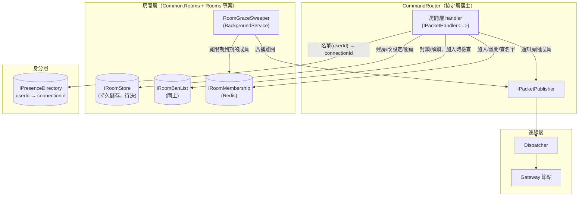
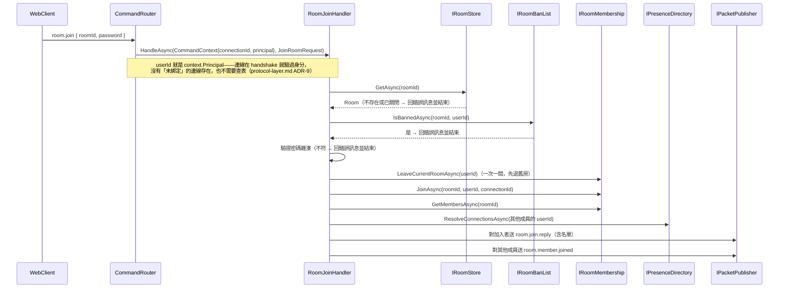
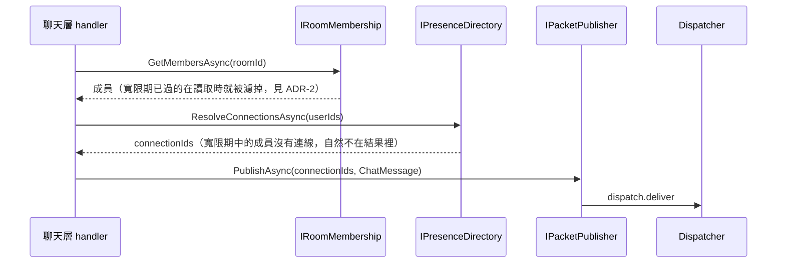
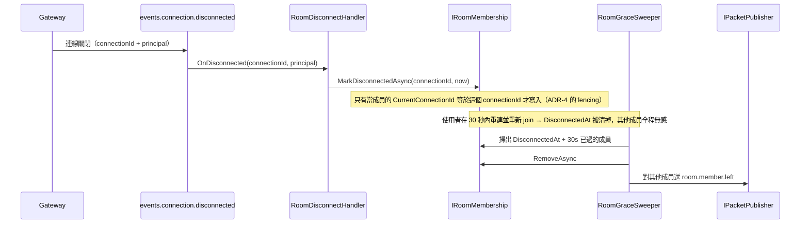
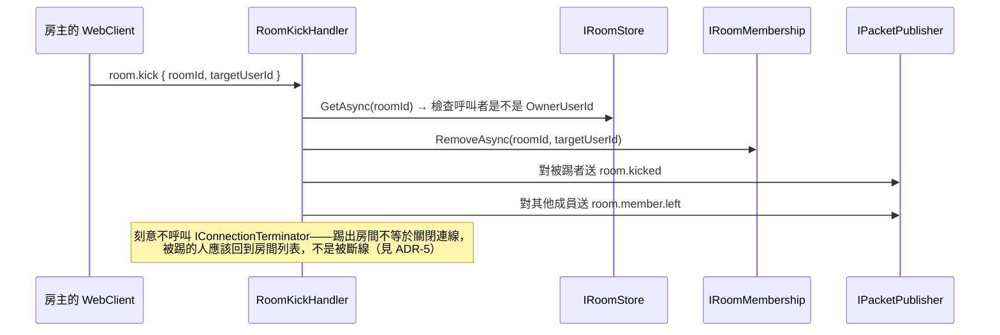

# 房間層架構設計（Room Layer）

狀態：**已實作**（持久層、`IRoomMembership`、8 個 handler、`RoomGraceSweeper`、斷線事件訂閱端）。實作時偏離文件的地方與剩下的待確認事項見第 9 節
技術棧：延續既有的 .NET + NATS（Adaptare）+ Redis；房間本身的持久儲存待決（見第 9 節）
範圍：**房間的生命週期、成員名單、房間後台管理，以及「這個房間該通知哪些連線」**，不含訊息內容與歷史記錄
依賴：命令的解析與分派由協定層負責（[protocol-layer.md](protocol-layer.md)）；「這個使用者現在在哪條連線上」向身分層查（[identity-layer.md](identity-layer.md)）

## 1. 範圍界定

這層要解決的問題：

1. 房間的生命週期：建立（可設密碼）、修改設定、關閉／刪除。
2. 成員名單：加入（驗密碼、查封鎖）、離開、查詢名單。
3. 房間後台的四項管理能力：踢出成員、封鎖使用者、關閉房間、修改房間設定。
4. **把 `roomId` 解析成一批 `ConnectionId`**，交給協定層的出口投遞。

明確排除：訊息本身與歷史記錄（聊天層）、身分怎麼證明（身分層）、連線怎麼被持有與投遞（連線層）。

**與聊天層的邊界**：房間層回答「誰該收到」，聊天層回答「內容是什麼、要不要存」。聊天層收到一則訊息時，向房間層取得該房間的連線名單，再自己呼叫 `IPacketPublisher`。這延續了 `connection-layer.md` ADR-3 的分工——決定名單的那一層跟負責投遞的那一層是分開的。

## 2. 現有實作對照（`main` 分支）

- `ChatConnector/Models/JoinRoomCommand.cs`、`LeaveRoomCommand.cs` 及對應的 `*CommandService`：房間的加入／離開直接寫在 Connector 裡，跟連線處理揉在同一個專案。這次房間層是獨立的一層，handler 註冊到 `CommandRouter`，Connector（現在的 Gateway）完全不認識房間。
- 舊實作沒有密碼房、沒有封鎖名單、沒有後台管理，也沒有房間列表的持久儲存——這些都是本次新增。
- 舊實作的 `LeaveRoomCommand` 在 `ClientConnectHandler.OnDisconnectedAsync` 裡被直接呼叫，也就是「斷線即退房」。本次改成有寬限期（見 ADR-2），而 Gateway 已經不再認識房間，所以斷線退房不能再用這種寫法（見 ADR-3 與第 9 節的斷線事件前置需求）。

## 3. 核心概念

| 概念 | 職責 |
|---|---|
| `Room` | `RoomId`、名稱、密碼雜湊（可為空＝公開房）、`OwnerUserId`、建立時間、是否已關閉 |
| `IRoomStore`（新） | 房間本身的建立／查詢／列表／更新／關閉。**持久資料**，儲存選擇待決（見第 9 節） |
| `IRoomBanList`（新） | `roomId → {userId}` 封鎖名單。持久資料，跟 `IRoomStore` 同一個儲存 |
| `IRoomMembership`（新） | `roomId → {成員}` 與 `userId → roomId`（一次一間，所以反向是單一值）。**暫時狀態**，放 Redis |
| `RoomMember` | `UserId`、`JoinedAt`、`CurrentConnectionId`、`DisconnectedAt?`（寬限期用，見 ADR-2） |
| 寬限期 | 成員的連線斷掉後仍留在名單上 30 秒（暫定值）。實作方式見 ADR-2 |
| 房間命令 | `room.create` / `room.join` / `room.leave` / `room.list` / `room.kick` / `room.ban` / `room.close` / `room.update`，全部註冊到 `CommandRouter` |

## 4. 元件關係圖



## 5. 訊息序列

### 5.1 加入房間



### 5.2 房間內廣播（聊天層的呼叫路徑）



### 5.3 斷線 → 寬限期 → 逾期退房



### 5.4 踢出成員（後台）



## 6. 具體介面設計

### 6.1 `IRoomStore` / `IRoomBanList`（`Common.Rooms`）

```csharp
namespace Common.Rooms;

public sealed record Room(
	string RoomId,
	string Name,
	string? PasswordHash,   // null = 公開房
	string OwnerUserId,
	DateTimeOffset CreatedAt);

public interface IRoomStore
{
	ValueTask<Room?> GetAsync(string roomId, CancellationToken cancellationToken = default);

	ValueTask<IReadOnlyCollection<Room>> ListAsync(CancellationToken cancellationToken = default);

	// 已存在則回 false，不覆寫。
	ValueTask<bool> TryCreateAsync(Room room, CancellationToken cancellationToken = default);

	// 房間不存在則回 false。
	ValueTask<bool> TryUpdateSettingsAsync(string roomId, string name, string? passwordHash, CancellationToken cancellationToken = default);

	// 真的刪除，封鎖名單一起走。房間不存在則回 false。
	ValueTask<bool> TryDeleteAsync(string roomId, CancellationToken cancellationToken = default);
}

public interface IRoomBanList
{
	ValueTask<bool> IsBannedAsync(string roomId, string userId, CancellationToken cancellationToken = default);
	ValueTask BanAsync(string roomId, string userId, CancellationToken cancellationToken = default);
	ValueTask UnbanAsync(string roomId, string userId, CancellationToken cancellationToken = default);
}
```

~~「關閉房間」用 `IsClosed` 而不是真的刪除：歷史訊息屬於聊天層，房間紀錄如果直接消失，歷史訊息就會變成孤兒（要不要一併刪除是聊天層的決定，見第 9 節）。~~

**這個理由已經作廢。** 聊天層的決定就是一併刪除——關房＝刪房，`messages` 與 `room_bans` 靠 `ON DELETE CASCADE` 跟著走（[chat-layer.md](chat-layer.md) ADR-10，產品決定：這是 demo，歷史訊息沒有長期保留的價值）。`IsClosed` 唯一的存在理由是掩護孤兒訊息，前提消失之後它自己也該消失：

- `Room.IsClosed` 移除，`ListOpenAsync` → `ListAsync`，`TryCloseAsync` → `TryDeleteAsync`（「房間不存在則回 false」自然保住 idempotency），`RoomOperationReply.ROOM_CLOSED` 併入 `ROOM_NOT_FOUND`。
- **「已關閉的房間」這個狀態在系統裡不再存在**——房間只有「在」與「不在」。
- ~~**實作併入 PostgreSQL 遷移**：`RedisRoomStore` / `RedisRoomBanList` 反正要被取代，現在先改 Redis 版本等於同一個 refactor 做兩次。~~ **已改為先做，而且已經做完**（見第 9 節）。「做兩次」成立但範圍比字面小：只有 `TryCloseAsync` 那一個方法白做，換來的是語意變更那一步不需要容器、紅掉時只有一個可能的原因。**`IsClosed` 已經從系統裡消失。**
- **對前端的硬要求**：刪除不可逆、沒有垃圾桶，webClient 的「關閉房間」必須二次確認。

**為什麼不是 `GetAsync` + `UpdateAsync`**：初版設計是那樣，但 read-modify-write 會 lost update——兩個房主同時改設定、或 `room.update` 跟 `room.close` 併發都會出問題。而且**併發語意不是事後可以換掉的東西**，它會滲進每個呼叫端的寫法，所以在還沒有任何實作之前就先改掉。每個變更操作現在都是「一次到位、回傳有沒有生效」。

**刻意接受的競爭**（實作時沒有用 Lua 消除，理由寫在這裡以免日後被「修正」成錯的東西）：

- ~~`TryUpdateSettingsAsync` 與 `TryCloseAsync` 併發：可能改到一個正在被關閉的房間的設定。無害——已關閉的房間，設定沒有意義。**遷移後這條會變乾淨**：真刪之後 `UPDATE ... WHERE room_id = $1` 影響 0 列、直接回 `false`。~~ **這個預測是錯的，而且錯的方向相反：真刪讓這條從「無害」變成「殭屍房」。** 「UPDATE 影響 0 列」是 Postgres 的性質，Redis 的 `HSET` 對不存在的 key 會**建立**它——update 撞上 delete 會把房間寫回來一半（只有 `name` 與 `password_hash`，沒有房主、不在 index 上，但 `GetAsync` 查得到、`room.join` 進得去）。這是先在 Redis 上做 ADR-10 才會遇到的問題，設計文件從來沒有想像過這個中間狀態。**實作用一段 `EXISTS` 守門的 Lua 消除它**（`{rooms}` 的 hash tag 當初就是為這種情況付的代價），順手把原本的 read-modify-write 收成一次往返。Postgres 版不需要那段 Lua。
- ~~兩個 `TryCloseAsync` 併發：兩邊都可能回 `true`，`RoomClosed` 因此廣播兩次。~~ **已消失。** `DEL` 的回傳值就是守門，只有一個呼叫刪得到，另一個回 `false` 就不廣播——對稱於 `TryCreateAsync` 的 `SADD`。client 端對重複關閉通知的 idempotent 要求仍然留著，但理由換成 `RoomMemberLeft` 那個（見 6.5）。
- `TryCreateAsync` **不能**有競爭：這是唯一需要真正原子的操作，實作用 Redis `SADD` 的回傳值當守門（見下方 key 設計）。

**`OwnerUserId` 不可變更**這件事是刻意的，而且被後台流程依賴：`room.kick` / `room.close` / `room.update` 都是「先讀房間檢查是不是房主、再動作」，看起來像 TOCTOU，但因為房主永遠不會變所以安全。**如果以後要加「轉移房主」功能，這三個流程都要重新檢視。**

**Redis key 設計**（provisional，見 ADR-7）：

| key | 型別 | 用途 |
|---|---|---|
| `{rooms}:index` | Set | 所有 roomId。`TryCreateAsync` 用 `SADD` 的回傳值當原子守門，同時也是 `ListOpenAsync` 的來源 |
| `{rooms}:room:{roomId}` | Hash | `name` / `password_hash` / `owner_user_id` / `created_at` / `is_closed` |
| `{rooms}:ban:{roomId}` | Set | 封鎖的 userId。`SISMEMBER`／`SADD`／`SREM` 本身就是原子的，`IRoomBanList` 因此不需要 Try 語意 |

`{rooms}` 是 Redis Cluster 的 hash tag，讓房間層所有 key 落在同一個 slot。這是刻意的取捨：代價是這批資料集中在一個節點、無法靠 Cluster 分散，換來的是「同一個操作可以跨 key 保持一致」（例如未來真的需要 Lua 時）。房間資料量小、變更頻率低，可以接受；哪天那個 slot 變成熱點再重新評估。連線層走的是相反選擇——`Conn:{connectionId}` 刻意分散在不同 slot，也因此 `ResolveNodesAsync` 不能用 MGET（見 `connection-layer.md` 6.2）。

`ListOpenAsync` 是 `SMEMBERS` 之後逐筆 `HGETALL`（併發上限比照 `RedisConnectionDirectory` 的 64），也就是 N+1。房間數量小的時候沒問題，這正是 §8 把分頁列為「先不做」時心裡有數的成本。

`TryCreateAsync` 若在 `SADD` 成功之後、`HSET` 之前失敗，index 裡會留下一個沒有 hash 的 roomId。讀取端一律把「hash 不存在」視為房間不存在並跳過，所以那只是垃圾不是錯誤；而且 roomId 由呼叫端每次新產生，重試不會撞到同一個 id。

### 6.2 `IRoomMembership`（`Common.Rooms`，Redis）

```csharp
namespace Common.Rooms;

public sealed record RoomMember(
	string UserId,
	DateTimeOffset JoinedAt,
	string CurrentConnectionId,
	DateTimeOffset? DisconnectedAt);   // 非 null = 正在寬限期中

public interface IRoomMembership
{
	// 讀取時就把寬限期已過的成員濾掉（見 ADR-2），呼叫端不需要自己算。
	ValueTask<IReadOnlyCollection<RoomMember>> GetMembersAsync(string roomId, CancellationToken cancellationToken = default);

	ValueTask<string?> GetCurrentRoomAsync(string userId, CancellationToken cancellationToken = default);

	ValueTask JoinAsync(string roomId, string userId, string connectionId, CancellationToken cancellationToken = default);

	ValueTask RemoveAsync(string roomId, string userId, CancellationToken cancellationToken = default);

	// 只有當該成員的 CurrentConnectionId 等於傳入值時才寫入 DisconnectedAt（ADR-4 的 fencing）。
	ValueTask MarkDisconnectedAsync(string userId, string connectionId, CancellationToken cancellationToken = default);

	// 給 sweeper 用：寬限期已過、還沒被移除的成員。
	ValueTask<IReadOnlyCollection<(string RoomId, string UserId)>> ListExpiredAsync(CancellationToken cancellationToken = default);
}
```

**`MarkDisconnectedAsync` 為什麼要帶 `userId`**（初版只有 `connectionId`）：成員以 `userId` 為鍵存放，只給 `connectionId` 就必須維護一張 `connectionId → (roomId, userId)` 的反向索引——正是身分層刪掉的那種表。斷線事件會帶 principal（`connection-layer.md` ADR-9），所以那張表不需要存在。`connectionId` 仍然要傳，因為 fencing 要靠它。

**時間戳由 store 自己蓋**（初版的 `at` 參數已移除）：`RedisRoomMembership` 注入 `TimeProvider`，讀取時的過濾與寬限期到期時間都用同一個時鐘，呼叫端不必管。

**沒有 `LeaveCurrentRoomAsync`**（5.1 的序列圖原本有）：handler 需要舊房間的 `roomId` 才能對舊房間廣播 `RoomMemberLeft`，包進 store 方法裡就拿不到。改成 `GetCurrentRoomAsync` + `RemoveAsync` 在 handler 裡組合。

**`RemoveAsync` 需要 fencing**：`userId → roomId` 的指向只在還指向這個房間時才刪，否則會把使用者剛加入的新房間指向蓋掉。這是同一個 race 的第三個實例（另兩個是本層 ADR-4 的斷線標記與 `identity-layer.md` ADR-4 的 Presence 解綁），用單 key 的 compare-and-delete Lua 解決。

**Redis 資料結構**：`{rooms}:members:{roomId}`（Hash，field = userId、value 是 `joinedAt|connectionId|disconnectedAt?` 打包成一個字串，fan-out 一次 HGETALL 就拿完整間房）、`{rooms}:userroom:{userId}`（String）、`{rooms}:grace`（Sorted Set，score = 到期時間、member = `roomId|userId`）。

有了 `{rooms}:grace`，「掃出寬限期已過的成員」就是一次 `ZRANGEBYSCORE`，不必掃過所有房間。而 `MarkDisconnectedAsync` 的「檢查 fencing + 寫 `DisconnectedAt` + 排進 sweeper 待辦」是一段跨兩個 key 的 Lua——**這正是 6.1 的 hash tag 當初付代價換來的東西**（那節寫「換來的是同一個操作可以跨 key 保持一致，例如未來真的需要 Lua 時」）。只做前兩件事 sweeper 永遠不知道，只做第三件讀取時的過濾會漏掉。

`JoinAsync` 同時做三件事：寫入 `Room:{roomId}:members`、寫入 `UserRoom:{userId} → roomId`、清掉可能存在的 `DisconnectedAt`。因為「一次只能在一間」，`UserRoom:{userId}` 是單一值，`JoinAsync` 直接覆寫。

### 6.3 房間層需要身分層提供的能力

fan-out 的名單是 `userId` 的集合，所以需要**批次**的正向解析。這個方法**已經確定歸身分層的 `IPresenceDirectory`**（`identity-layer.md` 6.2）：

```csharp
ValueTask<IReadOnlyCollection<string>> ResolveConnectionsAsync(
	IReadOnlyCollection<string> userIds,
	CancellationToken cancellationToken = default);
```

一間房可能有很多成員，逐筆查會變成 N 次來回，所以批次進、批次出、查不到的（不在線／寬限期中）直接省略。歸屬之所以塵埃落定，是因為協定層那個競爭選項（`IConnectionPrincipals`）已經不存在了——principal 隨封包走，協定層不存任何身分對照表（`protocol-layer.md` ADR-9）。

**反方向的查詢房間層不需要**：handler 要知道「這則命令是誰送的」，答案在 `CommandContext.Principal` 裡；斷線事件也直接帶 principal。所以房間層完全不需要 `connectionId → userId` 的反查。

### 6.4 命令與訊息型別

```protobuf
// room.proto（房間層自己的 proto）
message CreateRoomRequest { string name = 1; string password = 2; }   // password 空字串 = 公開房
message JoinRoomRequest   { string room_id = 1; string password = 2; }
message LeaveRoomRequest  { string room_id = 1; }
message ListRoomsRequest  {}
message KickMemberRequest { string room_id = 1; string target_user_id = 2; }
message BanMemberRequest  { string room_id = 1; string target_user_id = 2; bool unban = 3; }
message CloseRoomRequest  { string room_id = 1; }
message UpdateRoomRequest { string room_id = 1; string name = 2; string password = 3; bool clear_password = 4; }
```

下行：

```protobuf
message RoomOperationReply {
	enum Status { OK = 0; ROOM_NOT_FOUND = 1; WRONG_PASSWORD = 2; BANNED = 3; NOT_OWNER = 4; ROOM_CLOSED = 5; }
	Status status = 1;
	string room_id = 2;
}

message RoomJoined      { string room_id = 1; repeated string member_user_ids = 2; }
message RoomMemberJoined{ string room_id = 1; string user_id = 2; }
message RoomMemberLeft  { string room_id = 1; string user_id = 2; }
message RoomKicked      { string room_id = 1; }
message RoomClosed      { string room_id = 1; }
message RoomList        { repeated RoomSummary rooms = 1; }
message RoomSummary     { string room_id = 1; string name = 2; bool has_password = 3; int32 member_count = 4; }
```

註冊（在 `CommandRouter/Program.cs`，由房間層自己的 `AddRoomPackets()` 擴充方法包起來）：

```csharp
services.AddPacketHandler<JoinRoomRequest, RoomJoinHandler>("room.join");
services.AddOutboundPacket<RoomOperationReply>("room.reply");
services.AddOutboundPacket<RoomMemberJoined>("room.member.joined");
// ...其餘同理
```

**業務錯誤一定要用下行訊息回覆**，這是協定層 ADR-8 的必然結果：協定層對「內容錯誤」的政策是記 log + 忽略、不關連線，所以密碼錯誤、被封鎖、不是房主這類業務失敗如果不明確回一則 `RoomOperationReply`，client 會什麼都收不到、看起來像卡住。

### 6.5 `RoomGraceSweeper`

```csharp
// 寬限期到期的成員需要「N 秒後被移除並廣播離開」，但目前技術棧沒有排程能力
// （core NATS 沒有延遲投遞、也沒有引入 JetStream），所以用低頻掃描補。見 ADR-2。
internal sealed class RoomGraceSweeper(
	IRoomMembership membership,
	IPacketPublisher packetPublisher,
	ILogger<RoomGraceSweeper> logger) : BackgroundService
```

掃描間隔暫定 10 秒（沿用 `ConnectionHeartbeatService` 的量級）。**必須是 idempotent 的**：`CommandRouter` 是多複本，每個複本都會跑自己的 sweeper，同一個過期成員可能被多個複本同時處理。`RemoveAsync` 要能安全地重複呼叫，廣播重複則由 client 端容忍（收到不存在成員的 `RoomMemberLeft` 就忽略）。

## 7. 架構決策記錄（ADR）

### ADR-1：成員名單以 `userId` 為鍵，不是 `connectionId`

- **Context**：成員名單可以記 `userId` 也可以記 `connectionId`。記 `connectionId` 的話 fan-out 不需要任何額外查詢（名單直接就是投遞目標），比較省。
- **Decision**：記 `userId`。
- **Consequences**：這是「斷線重連對其他成員無感」（ADR-2）逼出來的——寬限期內連線已經不存在，只有 `userId` 能代表這個成員。代價是每次 fan-out 都要多一次 `userId → connectionId` 的批次解析，而且那個索引必須存在（這正是身分層 `IPresenceDirectory.ResolveConnectionsAsync` 的存在理由，見 6.3 與第 10 節）。另一個好處是後台名單顯示的是「誰」而不是一串連線 id，而且身分層的 Supersede（同一身分換連線）對房間層完全透明。

### ADR-2：斷線後保留 30 秒寬限期，用「讀取時過濾 + 低頻掃描」實作

- **Context**：斷線重連（網路抖動、換分頁、Supersede）不該讓其他成員看到「離開又加入」。但「N 秒後做一件事」需要排程能力，而目前是 core NATS、沒有延遲投遞、也沒有引入 JetStream。
- **Decision**：成員記錄帶 `DisconnectedAt`。**讀取名單時就把寬限期已過的濾掉**（保證 fan-out 與名單查詢的正確性，不依賴任何排程）；另外跑一個低頻的 `RoomGraceSweeper` 負責真正移除與廣播 `RoomMemberLeft`。
- **Consequences**：正確性不依賴 sweeper——就算 sweeper 掛了，名單查詢與 fan-out 仍然正確，只是「離開」的廣播會遲到、Redis 裡會累積幽靈成員。sweeper 只負責「讓別人知道」與清理。代價是多一個 `BackgroundService`，而且它在多複本下會重複執行，所以移除與廣播都必須 idempotent。30 秒與 10 秒掃描間隔都是憑經驗抓的暫定值，未經負載測試（同 `connection-layer.md` 第 9 節那兩個值的處理方式）。
- **實作時發現的必要條件**：client 重連之後會**再送一次 `room.join`**（它得重新建立狀態），所以 `RoomJoinHandler` 必須先判斷「這個人已經在名單上了嗎」，是的話**不廣播 `RoomMemberJoined`**。少了這個判斷，其他成員每次對方網路抖動都會看到一次加入事件，本 ADR 承諾的「什麼都看不到」就是空的。判斷依據是 join 之前的名單（含寬限期中的成員），有測試釘住。
- **不做的事**：寬限期內送出的訊息**不補送**。使用者重連後靠聊天層的歷史記錄補齊——`product-scope.md` 已經把訊息記錄列入範疇，歷史記錄就是真相來源，即時投遞掉一則不是致命問題。這也讓 `protocol-layer.md` 第 8 節「不引入 JetStream／retry」的決定更站得住腳。

### ADR-3：斷線退房不能寫在 Gateway 裡

- **Context**：舊 `main` 分支在 `ClientConnectHandler.OnDisconnectedAsync` 裡直接呼叫 `LeaveRoomCommand`——連線層直接認識房間概念，正是這次要拆掉的耦合。
- **Decision**：房間層透過連線層的**斷線事件**得知連線消失，Gateway 不認識房間。
- **Consequences**：`connection-layer.md` 目前**沒有**這個事件（`ConnectionLifecycle.OnDisconnectedAsync` 只清自己的 registry 與 ConnectionDirectory），所以這是房間層的硬前置需求，見第 9 節。代價是斷線事件本質上不可靠（process 被 kill 時發不出來），所以寬限期的清理不能只依賴它——這正好是 ADR-2 選「讀取時過濾」而不是「收到事件才處理」的另一個理由。

### ADR-4：`MarkDisconnectedAsync` 用 `connectionId` 做 fencing

- **Context**：Supersede 會讓同一個使用者在極短時間內換連線：新連線綁定（清掉 `DisconnectedAt`）之後，**舊連線的斷線事件才抵達**，如果無條件寫入 `DisconnectedAt`，這個明明在線的使用者會被標記成離線，30 秒後被 sweeper 踢出房間。
- **Decision**：成員記錄保存 `CurrentConnectionId`，`MarkDisconnectedAsync(connectionId, ...)` 只在兩者相符時才寫入。
- **Consequences**：房間層因此要存一個 `connectionId`，但它只用於這個比對、不用於投遞（投遞一律走 `userId → connectionId` 的即時解析），所以不算把連線概念滲進成員語意。這種「事件遲到造成的錯誤覆寫」在 diff 上完全看不出來，是刻意寫進文件的。

### ADR-5：踢出房間不等於關閉連線

- **Context**：連線層已經有 `IConnectionTerminator`，踢人時順手把連線關掉是最省事的做法。
- **Decision**：`room.kick` 只把成員移出房間並送 `RoomKicked`，不動連線。
- **Consequences**：被踢的人回到房間列表、還能加入別的房間，符合一般聊天室的預期。要「連號都不准用」是封鎖（`room.ban`）或身分層的層級，不是房間層關連線。代價是被踢者理論上可以立刻再 `room.join` 同一間房——所以後台的正常用法是「踢出＋封鎖」，UI 上應該把兩者做成一個動作。

### ADR-6：房間密碼存雜湊，不存可還原的形式

- **Context**：房間密碼是成員之間共享的祕密，不是使用者憑證，所以有人會覺得可以直接存明文以便房主查看。
- **Decision**：存雜湊（加 per-room salt）。房主忘記密碼就用 `room.update` 設一組新的，不提供「查看目前密碼」。
- **Consequences**：`RoomSummary` 只揭露 `has_password` 布林值。代價是房主無法在 UI 上看到現在的密碼，只能重設——對一個 Demo 專案來說這個取捨很划算，避免了「儲存可還原的密碼」這個一旦做錯就很難補救的決定。

### ADR-7（provisional）：房間與封鎖名單先放 Redis，跟聊天層一起遷到正式儲存

- **Context**：`IRoomStore` / `IRoomBanList` 是持久資料（房間關掉之後歷史訊息還要能查），不該只放 Redis。但真正逼出「需要可查詢的持久儲存」的是聊天層的訊息記錄（要分頁、可能要搜尋），而那還沒設計。另一個選項是先只寫一個 in-memory 實作、等儲存決定了再寫真的。
- **Decision**：先寫 Redis 實作並明確標為 provisional。正式儲存的選擇跟聊天層的訊息記錄**一起做**，屆時遷移。
- **Consequences**：
  - 抽象是跟一個**真的**實作一起設計的，不是只對著 in-memory dictionary 驗證過。這個 repo 有前例：`IConnectionDirectory` 跟 `RedisConnectionDirectory` 一起設計，所以「Cluster 跨 slot 不能 MGET」在設計階段就被發現並寫進 ADR，而不是實作到一半才炸。這次同樣抓到了 hash tag 的取捨與 `TryCreateAsync` 的原子性需求（見 6.1）。
  - 代價是屆時要遷一次資料。量很小（房間 + 封鎖名單），可以接受。
  - Redis 要開持久化（AOF／RDB）才配得上「持久資料」這個定位，這跟連線層那個純快取用途的 Redis 需求不同。所以房間層用**自己的** Redis 資源（AppHost 的 `room-store`），不共用 `connection-directory`——同時也符合 `connection-layer.md` ADR-2 的擁有權原則：每一層的基礎設施由自己擁有。因為同一個 process（`CommandRouter`）會同時需要兩個 Redis，房間層的 client 必須用 keyed service 註冊。

## 8. 明確排除於本階段

- 訊息內容、訊息歷史記錄與其查詢（聊天層）。
- 房間人數上限與相應的拒絕邏輯——`product-scope.md` 沒有規模數字，沒有依據就不先訂。
- 全站管理員／多位房間管理員：後台權限目前只認 `OwnerUserId`（見第 9 節）。
- 房間列表的分頁與搜尋：`ListOpenAsync` 先回全部，等房間數量成為問題再說。
- 私訊／1-on-1：`product-scope.md` 第 3 節已排除。
- 寬限期內訊息的補送（見 ADR-2）。

## 9. 待確認 / 後續事項

- **已完成**：持久層的抽象與 Redis 實作。`Common/Rooms/`（`Room`、`IRoomStore`、`IRoomBanList`、`RedisRoomStore`、`RedisRoomBanList`、`RoomKeys`）與 `Common/RoomLayerServiceCollectionExtensions.cs` 的 `AddRoomStore(redisServiceKey)`。過程中把 6.1 的介面從 `Get` + `Update` 改成意圖式操作（見該節），並確認了 hash tag 的取捨。**`IRoomMembership` 還沒實作**——它是暫時狀態不是持久層，會跟 handler 一起做。
- **已完成**：`IRoomMembership`／`RedisRoomMembership`（6.2）、`room.proto`、8 個 handler、`RoomBroadcaster`、`RoomPassword`（PBKDF2-SHA256、per-room salt、固定時間比較）、`RoomGraceSweeper`、`RoomDisconnectHandler`，以及 `AddRoomPackets()`／`AddRoomMembershipMaintenance()`。`CommandRouter` 掛上 `room-store` 與 `identity-store` 兩個 keyed Redis，AppHost 新增 `room-store`。**協定層的 registry 從此有內容**——「任何 client 命令都回 `UNKNOWN_SUBJECT`」那個中間態結束了。
- **文件原本缺的兩件事**（兩件都會直接壞掉，已補上並有測試）：
  1. **切換房間時要對舊房間廣播 `RoomMemberLeft`**。5.1 的序列圖只畫了退舊房與加入新房，沒有通知舊房間的成員——少了它，舊房間的 client 名單上會留一個永遠不會消失的幽靈（sweeper 只處理寬限期到期，明確離開不走那條路）。
  2. **重連時不能廣播 `RoomMemberJoined`**（見 ADR-2 的補充）。
- **實作時的其他決定**：
  - **建房不順便加入**。`room.join` 有自己一整套流程（退舊房、廣播、回名單），複製一份只會讓兩邊行為漂移；client 建完房自己送 `room.join`。要不要改成自動加入是產品決定。
  - **`room.leave` 會檢查「你真的在這間房嗎」**，不是無條件 `RemoveAsync`：無條件的話 client 傳錯 `roomId` 會靜默成功，而且我們會對一間他不在的房間廣播他離開。新增 `NOT_A_MEMBER` 狀態。
  - **`room.close` 先讀名單、再關房、廣播後才清成員**。不清成員的話 `GetMembersAsync` 會一直回一群不該存在的人。
  - **`room.list` 的人數用 `GetMembersAsync().Count`** 而不是數 hash 的欄位數，否則會把寬限期已過、還沒被 sweeper 清掉的幽靈算進去。代價是在 `ListOpenAsync` 的 N+1 之上又多一輪 N——§8 把分頁列為「先不做」時心裡有數的成本又長了一點。
  - **`RoomBroadcaster` 的回覆直接送回 `context.ConnectionId`**，不查 Presence：那條連線就在 context 裡，而且 Presence 可能已經指向別的連線（Supersede），查了反而回錯人。
- **端到端驗證（跑真的 AppHost，兩個 client 分別連到兩個 Gateway 複本，所以每次廣播都必須跨節點）：22 項全部通過。** 涵蓋建房、密碼房（對／錯）、加入與名單、`room.list` 的人數與 `has_password`、非房主被拒、踢人（含 ADR-5 的「連線不關」）、封鎖後不能加入、改設定清掉密碼、關房與已關閉房間、**跨節點的 `RoomMemberJoined`／`RoomMemberLeft`／`RoomClosed` 廣播**，以及**寬限期完整的一輪**（斷線標記 → 重連無感 → 到期後 sweeper 廣播離開，log 確認 `Marking` ×5、`Swept` ×1）。
  - **驗證已經是 repo 裡的專案：`E2E.Tests`**（10 項，43 秒）。原本那份腳本放在暫存目錄，隨 session 一起蒸發了——而文件上寫著它「可重複執行」，所以那句話有一段時間是假的。現在它用 `Aspire.Hosting.Testing` 自己啟整個 AppHost（4 個服務含 Gateway ×2 replica + 4 個容器），不需要手動抄 Aspire 分配的 port。
    - **預設會被 Skip**，要 `CHATSYSTEM_E2E=1` 才跑（需要 Docker）：`$env:CHATSYSTEM_E2E='1'; dotnet test E2E.Tests`。理由是它會把 `dotnet test` 從 2 秒變成 1 分鐘——常跑不動的測試等於沒有測試。
    - **假登入後門只在測試 process 的環境變數裡打開**（`Login__AllowFakeIdTokens=true`），repo 裡不會有一份「後門是開的」設定檔。同時釘住 `ASPNETCORE_ENVIRONMENT=Development`，因為那是後門的第二道鎖，也是 Gateway 讀到 Origin allowlist 的條件（allowlist 空的是 fail-closed，會全部 403）。
    - **跨節點是被斷言的，不是被推論的**：連線前後各照一張 `Conn:*` 的快照，差集就是剛開的那條連線，於是問得出它落在哪個 `nodeId`。
      - **原本的寫法是「開兩條、斷言 `nodeId` 不同」，那讓這個測試隨啟動時序紅掉。** 原因不在產品，在 `AppHostFixture` 的就緒檢查：它打的是 Aspire 放在 replica 前面的 **proxy**，一次成功的 GET 只證明**至少一個** replica 會回應，**分不出後面站著一個還是兩個**（該 fixture 刻意不猜 `gateway-0`／`gateway-1` 這種衍生名字，理由寫在那裡）。第二個 replica 還沒開始聽的時候，開幾條連線都會落在同一個節點。這條測試因此在同一台機器上約 1/3 到 3/3 的機率紅，而每一次紅都是假警報。
      - **改成「開到落在不同節點為止」**（`ConnectToAnotherNodeAsync`，30 秒期限，沒中的連線立刻丟棄）。**斷言的強度一項都沒少**——後面那個廣播仍然一定跨節點；差別只在「環境還沒就緒」不再被當成「產品壞了」。試到期限還是同一個節點就丟例外，訊息明說「實際上只有一個 replica 在服務，所以紅掉是對的」。代價是幾條丟棄的連線與約 1 秒。
      - 一併補掉一個原本只是剛好沒踩到的時序：`Conn:*` 是 handshake 完成**之後**才寫進 Redis 的，所以要**等**新連線出現，不能只照一張快照。
    - 這一組刻意**不**重跑 `Integration.Tests` 已經釘住的每一條 handler 行為，而是偏重下面那三件 Direct 蓋不到的事。
  - **`38a8716` 之後重跑過一次全綠**（那個 commit 把事件通道從原生 NATS 收回 Adaptare、`CommandRouter` 的鏈裡多掛一個 `AddHandler`、`Gateway` 少一個 exchange——三處都落在「只有真 NATS 蓋得到」的範圍）。寬限期那一條實測 **39 秒**（5 秒確認沒有動靜 + 30 秒寬限期 + sweeper 間隔），時間對得上真實機制而不是提早收到。
  - **功能面已經搬進 `Integration.Tests`**（跑在 `Adaptare.Direct` 上，不需要 NATS／Redis／AppHost，全部 0.6 秒跑完）。那條路徑上是真的元件：`InboundBridge` → `InboundProcessor` → `PacketRegistry` → 房間層 handler → `RoomBroadcaster` → `PacketPublisher` → `OutboundGateway` → 真的 `DispatchHandler`，只有 store 換成 in-memory 替身、最末端換成記錄用的 handler。**寬限期那一輪也在裡面**（用可推進的 `TimeProvider` + 直接呼叫 `SweepAsync`，把真 NATS 要等 60 秒的那一項變成毫秒級）。
  - 真 NATS 的端到端仍然不可取代的三件事：**production 的 messaging 接線**（每個 `Program.cs` 那條鏈綁 transport，換不成 Direct）、**wire format**（Direct 傳同一個參考，不會像 NATS 把 0 bytes 變成 null——第一個 bug 正是那類）、**跨節點 fan-out**（一個 process 只有一個 Direct queue）。
  - 到達全綠之前修了三個 bug，全部**不在房間層**：`InboundAck` 的空 ack（任何成功的命令都會殺掉連線）、`AddNatsMessaging()` 造成的下行訊息重複投遞、以及斷線事件被自己的 cancellation token 掐死。前兩個見 `protocol-layer.md` 第 9 節，第三個見下面。
  - **已修：每個下行訊息被投遞兩次。** client 收到兩份 `room.joined`、兩份 `room.reply`（「密碼錯」那個檢查會失敗就是因為吃到重複的 create reply；「重連無感」會失敗是因為吃到重複的 `RoomMemberJoined`）。原因是 `AddNatsMessageQueue()` 在同一個 process 被呼叫兩次——一次來自 `AddNatsMessaging()` 的共用設定，一次來自 host 自己註冊 handler 那條鏈——每多一次就多一個 `IMessageQueueBackgroundRegistration`，而 handler 設定是共用的 options，所以每個訂閱被建立兩份。修法與回歸測試見 `Common/NatsMessagingRegistration.cs` 與 `protocol-layer.md` 第 9 節。**修好這一個，12 項檢查裡有 11 項通過。**
  - **已修：斷線事件抵達不了房間層**（修好之前寬限期的整個機制是死的——沒有人被標記、`{rooms}:grace` 永遠空的、sweeper 永遠沒事做）。
    - **真正的原因**：`GatewayWebSocketEndpoint` 的 `finally` 把 minimal API 注入的 `CancellationToken` 傳進斷線清理，而那就是 `HttpContext.RequestAborted`——**client 一斷線它就已經被取消**。拿它去做斷線清理等於「因為連線斷了，所以不清理連線」。Adaptare 尊重取消，所以 publish 丟 `OperationCanceledException`、訊息沒上 wire；而 `ConnectionLifecycle` 接住那個例外之後只記 `LogDebug`（理由寫的是「關站時每條連線都會走到這裡」），所以連一行 log 都沒有。
    - **修法**：清理改用自己的有界 token（5 秒的 `CancellationTokenSource`，不是 `CancellationToken.None`——關站時所有連線同時收尾要有上界）；`ConnectionLifecycle` 那個 `OperationCanceledException` 從 `LogDebug` 升成 `LogWarning`，因為現在它只可能代表「清理逾時」。
    - **回歸測試**：`GatewayWebSocketEndpointTests.Disconnect_StillPublishesTheEvent_WhenTheClientAbortsTheConnection`（真 Kestrel，client 用 `Abort()` 而不是 `CloseAsync()`——只有前者會讓 `RequestAborted` 觸發）。它斷言的是「事件送達時那個 token **還沒被取消**」，不只是「有送達」：後者在 mock 上永遠會過，那正是 175 條單元測試全綠卻沒抓到的原因。還原修正後這條測試三跑三紅。
  - **第一版診斷是錯的，兩條都錯**，記在這裡因為錯的方式比結論有價值。當時的結論是「(A) Adaptare 鏈裡混用 `AddProcessor` 與 `AddHandler` 時 handler 不會訂閱」加上「(B) Adaptare 的 publish 跟原生 publish 在 wire 上不等價」，於是把發布端與訂閱端**都**換成原生 NATS。**換成原生之所以看起來有效，是因為 NATS.Net 的 `PublishAsync` 對已取消的 token 不理會、照樣把訊息寫進送出緩衝區——那是把 bug 蓋掉，不是修掉。**
    - A 與 B 都已被實測推翻（`scratchpad/AdaptareWireProbe`：兩顆 NATS 分別在 4322／4222，兩顆都掛原生 `>` 全捕捉訂閱，所以「改寫 subject」與「送到別台 server」都分辨得出來）：
      - Adaptare 的 publish 落在**字面 subject**、payload 是**原封不動的 byte[]**、落在**指定那台 server**（另一台完全沒流量），跟原生發的唯一差別是多帶一個空的 headers 集合。**B 不成立。**
      - 同一條鏈裡的 processor 與 handler **兩個都被呼叫**。**A 不成立**——而且 processor／handler 本來就是不同語意（processor 有回覆、會等處理完成；handler 是 fire-and-forget），混用是正常用法。
      - 用一個**已取消的 token** 發布：Adaptare 丟 `OperationCanceledException`（訊息沒上 wire），原生正常返回（訊息上了 wire）。**這是兩者唯一的差異，也就是全部的原因。**
    - **為什麼會把兩個 bug 歸咎到 Adaptare**：它是這一輪唯一「跨 process、內部看不見」的元件，所以每個「訊息不見了」的現象都很容易停在它身上；而「log 裡沒有 Error」被當成了「publish 沒失敗」的證據，實際上那個例外被歸類成正常狀況、記在 `Debug`。**先看 wire 再下結論**這件事花了三個 bug 才學會。
  - **不對稱已經消掉**：`ConnectionEventPublisher` 回到 `IMessageSender`，斷線事件的訂閱端回到 Adaptare 的 `IMessageHandler`（`RoomDisconnectHandler`，由 `CommandRouter` 那條鏈用 `AddHandler(subject, queueGroup)` 掛上）。系統只有一套 messaging。「要不要整批換掉 Adaptare」這個問題也結束了——三個 bug 清算下來沒有一個是它的行為問題，唯一還在的是下面那條重複註冊，而那是我們自己在一個 host 裡呼叫了兩次。
- **待確認**：`room.ban` 目前**不會**順手把人踢出房間，照 ADR-5 的「後台正常用法是踢出＋封鎖，UI 上做成一個動作」。但這代表封鎖一個正在房間裡的人，他會留在裡面直到自己離開——對一個管理工具來說很奇怪。要嘛 ban 順手 remove（那 ban 就有兩種副作用，而且沒辦法只封鎖一個不在房間裡的人），要嘛維持現狀並在 UI 上強制兩個命令一起送。**這條沒有定案，只是照文件實作**。

- ~~**硬前置：連線層的斷線事件**（ADR-3）。~~ **已實作**：`events.connection.disconnected`，設計見 `connection-layer.md` 第 6.7 節與 ADR-8。房間層要訂閱它並在 handler 裡呼叫 `MarkDisconnectedAsync`。注意該 ADR 明確把事件定為 best-effort——本層 ADR-2 的「讀取時過濾」正確性不依賴它，這個前提要繼續維持，不要改成「只在收到事件時才清理」。事件會帶 `principal`（`connection-layer.md` ADR-9），所以本層不需要任何 `connectionId → userId` 的反查。
- **訂閱時的 queue group 名稱要跟其他訂閱端區隔**。NATS 的規則是不同 queue group 各收到一份、同一個 group 內互相分攤。目前預期只有房間層訂閱 `events.connection.disconnected`（身分層的解綁在 Gateway 內直接完成，不繞事件），但未來多一個訂閱端時如果沿用同一個 group 名，兩邊會互搶事件，症狀是「有時候有處理、有時候沒有」——這種錯誤在 diff 上看不出來，所以一開始就用有層次的名字（例如 `room.membership`）。
- **已完成**：`IRoomStore` / `IRoomBanList` 的**契約測試**（`Common.Tests/Rooms/RoomStoreContractTests.cs`、`RoomBanListContractTests.cs`，14 + 6 條），形狀比照 `ChatMessageStoreContractTests`。原本這一層只有 `RedisRoomStoreTests` / `RedisRoomBanListTests`，那 16 條斷言的是 Redis 指令的形狀（SADD 哪個 key、`HashSetAsync` 哪些欄位），**換掉實作整份作廢、一條都接不過去**——聊天層享受得到的「換 store 只換 `NewStore()`」，房間層原本享受不到。兩份是互補的：白箱那份守 Redis 的原子性語意，契約那份守任何儲存都必須成立的行為。
  - **四條契約是照「Postgres 實作最可能走錯的路」挑的**，不是照介面方法數：建房撞 id 時不覆寫（`ON CONFLICT DO UPDATE` 就錯）、公開房的 `PasswordHash` 讀回來是 `null` 而不是空字串（`room.list` 的 `has_password` 直接看它）、改設定不動 `OwnerUserId` / `CreatedAt`（整列 UPDATE 會靜默洗掉）、封鎖以 `(room_id, user_id)` 為範圍。
  - **已用手動變異驗證過**：四個變異（建房改成覆寫、改設定整列覆寫、公開房存空字串、封鎖漏掉 roomId）各自只打紅預期的那一條，其餘 85 條照過。
  - `IRoomStore` / `IRoomBanList` 的 in-memory 替身從 `Integration.Tests/InMemoryStores.cs` 移到 `Common.Tests/Rooms/InMemoryRoomStores.cs`，契約測試與組合測試共用同一份——兩邊各留一份會漂移，症狀是「單元全綠、整合莫名其妙」。代價是 `Integration.Tests` 引用 `Common.Tests`，這是本 repo 第一個測試專案引用測試專案的地方。
  - 帶 `[ADR-10]` 標記的斷言（`ListOpen` 排除已關閉、改設定對已關閉的房間回 false、`TryClose` 的三態）會在關房改成真刪那一步消失或翻面。標記是留給那一步用的，讓它是機械式的。
- **已完成**：ADR-10 的語意變更（`chat-layer.md` §11 階段 B 的 (2) 前半）。`Room.IsClosed` 移除、`ListOpenAsync` → `ListAsync`、`TryCloseAsync` → `TryDeleteAsync`、`room.proto` 的 `ROOM_CLOSED` 移除（號碼 5 標成 `reserved`，同一個號碼換意思是 wire 上最難查的錯）。**儲存還是 Redis**——刻意跟「換成 Postgres」拆成兩步，理由見 6.1 那一條。
  - **實作才浮現、設計沒料到的一件事**：真刪讓 update／delete 的競爭變嚴重而不是變乾淨，因為 `HSET` 會建立不存在的 key。完整記錄在 6.1 的「刻意接受的競爭」，這裡只記結論——**那條競爭現在被一段 Lua 消除了，不再是「刻意接受」。**
  - **兩條性質是測試夾縫裡的**：EXISTS 守門擋的窗口 client 命令走不到（`RoomUpdateHandler` 自己會先 `GetAsync`），而「刪房帶走封鎖名單」在 in-memory 替身上湊不出來（兩個替身是獨立物件）。所以 `E2E.Tests` 多了兩條**不經過 client、直接對真 room-store 呼叫 `IRoomStore`** 的測試，`AppHostFixture` 為此開了一個 `ConnectRoomStoreAsync()`。**第一版不是這樣寫的**：原本那條走 client 命令，而它抓不到把守門拿掉的變異——因為 handler 的 null 檢查先擋下來了，Lua 根本沒被呼叫到。
  - **已用手動變異驗證過**：拿掉 `EXISTS` 那一行、拿掉刪封鎖名單那一行，各自打紅對應的那一條 E2E。
  - 測試數：Common.Tests 178、Integration.Tests 31、E2E 16，三組全綠（E2E 需要 Docker 與 `CHATSYSTEM_E2E=1`）。
- **房間本身的持久儲存選擇**。`IRoomStore` 與 `IRoomBanList` 是持久資料，不該只放 Redis。但這個決定跟聊天層的訊息記錄是**同一個決定**（同一個資料庫、同一套 migration/備份策略），建議一起做，不要為房間層單獨選一個。介面設計刻意不綁任何儲存技術，所以先實作 Redis 版本再換也可以，只是要接受一次資料遷移。
- **後台權限模型**：目前只認 `OwnerUserId`。要不要有「多位管理員」或「全站管理員」（例如你自己要能關掉任何房間）？後者會需要一個房間層之外的角色概念。
- ~~**`ResolveConnectionsAsync` 的擁有者**：形狀確定，歸屬待定。~~ **已定案**：身分層的 `IPresenceDirectory`（見 6.3）。
- 寬限期 30 秒與 sweeper 10 秒間隔都是暫定值，未經負載測試。
- ~~「關閉房間」之後歷史訊息要保留多久、還能不能查——聊天層的決定，但會回頭影響 `IsClosed` 而非真刪的設計是否足夠。~~ **已定案**：不保留、查不到。關房＝刪房，訊息 CASCADE 一起刪（[chat-layer.md](chat-layer.md) ADR-10）。答案不是「`IsClosed` 不夠」，是**那個設計整個不需要了**，見 6.1。

## 10. 對既有文件的影響

### `identity-layer.md`（已同步修訂）

- **6.2 節 `IPresenceDirectory` 已新增批次的 `ResolveConnectionsAsync(userIds)`**，歸屬定案在身分層。原設計只有單筆 `GetCurrentConnectionIdAsync`，那是為 Supersede（查一筆舊連線）設計的；房間 fan-out 是批次查詢，逐筆會變成 N 次來回。（那個單筆方法後來也被移除了——`BindAsync` 改成用 `GETSET` 直接回傳被取代的舊連線。）
- **ADR-4 的單值 Presence 剛好夠用**。「一次只能在一間房」＋「同一身分同時只有一條連線」兩個決定疊起來，`userId → connectionId` 維持單一值不需要改成集合。
- **前一版的反向索引（`connectionId → userId`）已整條刪除**，房間層本來也不需要它：本層要的是正向解析，而「這則命令是誰送的」現在由 `CommandContext.Principal` 直接給（`protocol-layer.md` ADR-9），斷線事件也帶 principal。
- **房間層 ADR-4 的 fencing 與身分層 ADR-4 的 fencing 是同一個 race 的兩半**，都源自 Supersede 造成的「事件遲到」：房間層防的是把在線成員標記成離線，身分層防的是把在線成員的 Presence 刪掉。兩邊都用 `connectionId` 比對，改任何一邊都要看另一邊。

### `protocol-layer.md`（已同步修訂）

- **principal 歸屬懸案已結束**：不由任何一層存表，principal 隨 `InboundPacket` 走（該文件 ADR-9）。房間層 handler 因此**少一次 Redis 查詢**——原本要為每則命令查一次「這條連線是誰」。
- **ADR-8 已補上對上層的隱含要求**：因為協定層對內容錯誤採取「記 log + 忽略」，業務層的失敗（密碼錯、被封鎖、權限不足）必須用明確的下行訊息回覆，否則 client 會收不到任何東西。本層的 `RoomOperationReply` 就是照這條設計的。
- **handler 簽章**：`IPacketHandler<TMessage>.HandleAsync` 改收 `CommandContext`，所以本文件 6.4 節註冊範例底下的 handler 全部是 `HandleAsync(CommandContext context, XxxRequest message, ...)`，`userId` 取自 `context.Principal`。

### `connection-layer.md`

- 第 9 節那條「上層目前收不到連線已斷開的通知」從「記在案」升級為**房間層的硬前置需求**（ADR-3）。

### `product-scope.md`

- 第 5 節表格：房間層狀態從「待設計」改為「設計中」。
- 第 6 節：「房間後台管理功能具體要管理什麼」已回答——踢出成員、封鎖使用者、關閉／刪除房間、修改房間設定四項，這條可以劃掉。
- 第 6 節可新增：一個使用者一次只能在一間房、斷線重連採寬限期，這兩個產品層面的決定原本沒有記在任何地方。
