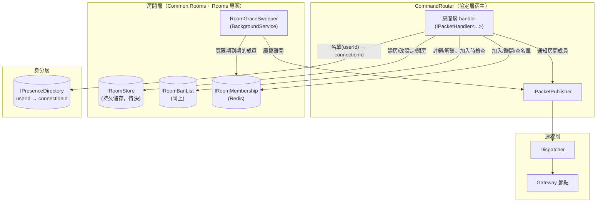
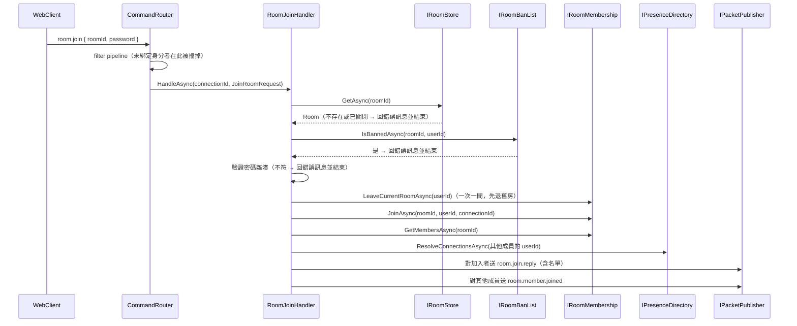
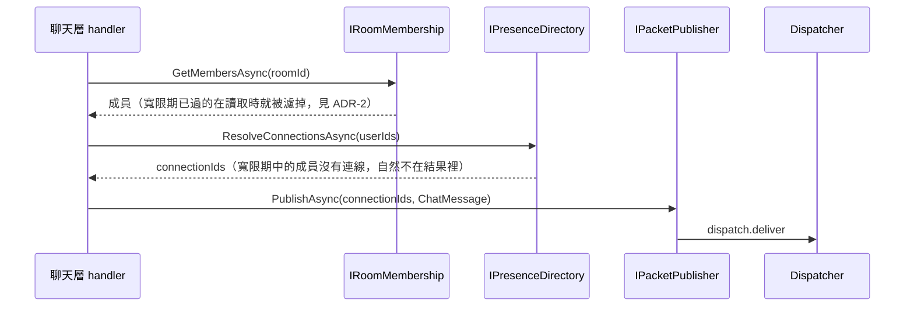
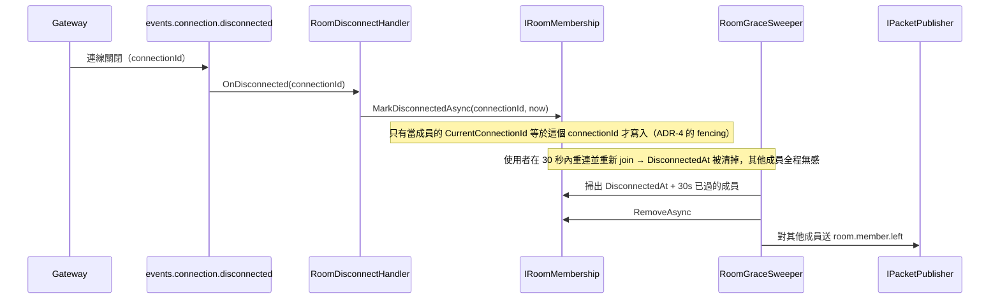
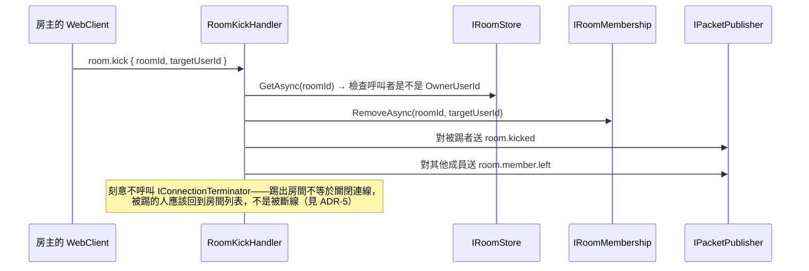

# 房間層架構設計（Room Layer）

狀態：討論中 draft，尚未實作
技術棧：延續既有的 .NET + NATS（Adaptare）+ Redis；房間本身的持久儲存待決（見第 9 節）
範圍：**房間的生命週期、成員名單、房間後台管理，以及「這個房間該通知哪些連線」**，不含訊息內容與歷史記錄
依賴：命令的解析與分派由協定層負責（[protocol-layer.md](protocol-layer.md)）；「這個使用者現在在哪條連線上」向身分層查（[identity-layer.md](identity-layer.md)）

## 1. 範圍界定

這層要解決的問題：

1. 房間的生命週期：建立（可設密碼）、修改設定、關閉／刪除。
2. 成員名單：加入（驗密碼、查封鎖）、離開、查詢名單。
3. 房間後台的四項管理能力：踢出成員、封鎖使用者、關閉房間、修改房間設定。
4. **把 `roomId` 解析成一批 `ConnectionId`**，交給協定層的出口投遞。

明確排除：訊息本身與歷史記錄（聊天層）、身分怎麼證明（身分層）、連線怎麼被持有與投遞（連線層）。

**與聊天層的邊界**：房間層回答「誰該收到」，聊天層回答「內容是什麼、要不要存」。聊天層收到一則訊息時，向房間層取得該房間的連線名單，再自己呼叫 `IPacketPublisher`。這延續了 `connection-layer.md` ADR-3 的分工——決定名單的那一層跟負責投遞的那一層是分開的。

## 2. 現有實作對照（`main` 分支）

- `ChatConnector/Models/JoinRoomCommand.cs`、`LeaveRoomCommand.cs` 及對應的 `*CommandService`：房間的加入／離開直接寫在 Connector 裡，跟連線處理揉在同一個專案。這次房間層是獨立的一層，handler 註冊到 `CommandRouter`，Connector（現在的 Gateway）完全不認識房間。
- 舊實作沒有密碼房、沒有封鎖名單、沒有後台管理，也沒有房間列表的持久儲存——這些都是本次新增。
- 舊實作的 `LeaveRoomCommand` 在 `ClientConnectHandler.OnDisconnectedAsync` 裡被直接呼叫，也就是「斷線即退房」。本次改成有寬限期（見 ADR-2），而 Gateway 已經不再認識房間，所以斷線退房不能再用這種寫法（見 ADR-3 與第 9 節的斷線事件前置需求）。

## 3. 核心概念

| 概念 | 職責 |
|---|---|
| `Room` | `RoomId`、名稱、密碼雜湊（可為空＝公開房）、`OwnerUserId`、建立時間、是否已關閉 |
| `IRoomStore`（新） | 房間本身的建立／查詢／列表／更新／關閉。**持久資料**，儲存選擇待決（見第 9 節） |
| `IRoomBanList`（新） | `roomId → {userId}` 封鎖名單。持久資料，跟 `IRoomStore` 同一個儲存 |
| `IRoomMembership`（新） | `roomId → {成員}` 與 `userId → roomId`（一次一間，所以反向是單一值）。**暫時狀態**，放 Redis |
| `RoomMember` | `UserId`、`JoinedAt`、`CurrentConnectionId`、`DisconnectedAt?`（寬限期用，見 ADR-2） |
| 寬限期 | 成員的連線斷掉後仍留在名單上 30 秒（暫定值）。實作方式見 ADR-2 |
| 房間命令 | `room.create` / `room.join` / `room.leave` / `room.list` / `room.kick` / `room.ban` / `room.close` / `room.update`，全部註冊到 `CommandRouter` |

## 4. 元件關係圖



## 5. 訊息序列

### 5.1 加入房間



### 5.2 房間內廣播（聊天層的呼叫路徑）



### 5.3 斷線 → 寬限期 → 逾期退房



### 5.4 踢出成員（後台）



## 6. 具體介面設計

### 6.1 `IRoomStore` / `IRoomBanList`（`Common.Rooms`）

```csharp
namespace Common.Rooms;

public sealed record Room(
	string RoomId,
	string Name,
	string? PasswordHash,   // null = 公開房
	string OwnerUserId,
	DateTimeOffset CreatedAt,
	bool IsClosed);

public interface IRoomStore
{
	ValueTask<Room?> GetAsync(string roomId, CancellationToken cancellationToken = default);
	ValueTask<IReadOnlyCollection<Room>> ListOpenAsync(CancellationToken cancellationToken = default);
	ValueTask CreateAsync(Room room, CancellationToken cancellationToken = default);
	ValueTask UpdateAsync(Room room, CancellationToken cancellationToken = default);
}

public interface IRoomBanList
{
	ValueTask<bool> IsBannedAsync(string roomId, string userId, CancellationToken cancellationToken = default);
	ValueTask BanAsync(string roomId, string userId, CancellationToken cancellationToken = default);
	ValueTask UnbanAsync(string roomId, string userId, CancellationToken cancellationToken = default);
}
```

「關閉房間」用 `IsClosed` 而不是真的刪除：歷史訊息屬於聊天層，房間紀錄如果直接消失，歷史訊息就會變成孤兒（要不要一併刪除是聊天層的決定，見第 9 節）。

### 6.2 `IRoomMembership`（`Common.Rooms`，Redis）

```csharp
namespace Common.Rooms;

public sealed record RoomMember(
	string UserId,
	DateTimeOffset JoinedAt,
	string CurrentConnectionId,
	DateTimeOffset? DisconnectedAt);   // 非 null = 正在寬限期中

public interface IRoomMembership
{
	// 讀取時就把寬限期已過的成員濾掉（見 ADR-2），呼叫端不需要自己算。
	ValueTask<IReadOnlyCollection<RoomMember>> GetMembersAsync(string roomId, CancellationToken cancellationToken = default);

	ValueTask<string?> GetCurrentRoomAsync(string userId, CancellationToken cancellationToken = default);

	ValueTask JoinAsync(string roomId, string userId, string connectionId, CancellationToken cancellationToken = default);

	ValueTask RemoveAsync(string roomId, string userId, CancellationToken cancellationToken = default);

	// 只有當該成員的 CurrentConnectionId 等於傳入值時才寫入 DisconnectedAt（ADR-4 的 fencing）。
	ValueTask MarkDisconnectedAsync(string connectionId, DateTimeOffset at, CancellationToken cancellationToken = default);

	// 給 sweeper 用：寬限期已過、還沒被移除的成員。
	ValueTask<IReadOnlyCollection<(string RoomId, string UserId)>> ListExpiredAsync(CancellationToken cancellationToken = default);
}
```

`JoinAsync` 同時做三件事：寫入 `Room:{roomId}:members`、寫入 `UserRoom:{userId} → roomId`、清掉可能存在的 `DisconnectedAt`。因為「一次只能在一間」，`UserRoom:{userId}` 是單一值，`JoinAsync` 直接覆寫。

### 6.3 房間層需要身分層提供的能力

fan-out 的名單是 `userId` 的集合，所以需要**批次**的正向解析：

```csharp
// 身分層 IPresenceDirectory 需要新增（原設計只有單筆 GetCurrentConnectionIdAsync）
ValueTask<IReadOnlyCollection<string>> ResolveConnectionsAsync(
	IReadOnlyCollection<string> userIds,
	CancellationToken cancellationToken = default);
```

一間房可能有很多成員，逐筆查會變成 N 次來回。這個介面的擁有者目前還在討論中（身分層的 `IPresenceDirectory` 或協定層的 `IConnectionPrincipals`），但**形狀是確定的**——批次進、批次出、查不到的直接省略。詳見第 10 節。

### 6.4 命令與訊息型別

```protobuf
// room.proto（房間層自己的 proto）
message CreateRoomRequest { string name = 1; string password = 2; }   // password 空字串 = 公開房
message JoinRoomRequest   { string room_id = 1; string password = 2; }
message LeaveRoomRequest  { string room_id = 1; }
message ListRoomsRequest  {}
message KickMemberRequest { string room_id = 1; string target_user_id = 2; }
message BanMemberRequest  { string room_id = 1; string target_user_id = 2; bool unban = 3; }
message CloseRoomRequest  { string room_id = 1; }
message UpdateRoomRequest { string room_id = 1; string name = 2; string password = 3; bool clear_password = 4; }
```

下行：

```protobuf
message RoomOperationReply {
	enum Status { OK = 0; ROOM_NOT_FOUND = 1; WRONG_PASSWORD = 2; BANNED = 3; NOT_OWNER = 4; ROOM_CLOSED = 5; }
	Status status = 1;
	string room_id = 2;
}

message RoomJoined      { string room_id = 1; repeated string member_user_ids = 2; }
message RoomMemberJoined{ string room_id = 1; string user_id = 2; }
message RoomMemberLeft  { string room_id = 1; string user_id = 2; }
message RoomKicked      { string room_id = 1; }
message RoomClosed      { string room_id = 1; }
message RoomList        { repeated RoomSummary rooms = 1; }
message RoomSummary     { string room_id = 1; string name = 2; bool has_password = 3; int32 member_count = 4; }
```

註冊（在 `CommandRouter/Program.cs`，由房間層自己的 `AddRoomPackets()` 擴充方法包起來）：

```csharp
services.AddPacketHandler<JoinRoomRequest, RoomJoinHandler>("room.join");
services.AddOutboundPacket<RoomOperationReply>("room.reply");
services.AddOutboundPacket<RoomMemberJoined>("room.member.joined");
// ...其餘同理
```

**業務錯誤一定要用下行訊息回覆**，這是協定層 ADR-8 的必然結果：協定層對「內容錯誤」的政策是記 log + 忽略、不關連線，所以密碼錯誤、被封鎖、不是房主這類業務失敗如果不明確回一則 `RoomOperationReply`，client 會什麼都收不到、看起來像卡住。

### 6.5 `RoomGraceSweeper`

```csharp
// 寬限期到期的成員需要「N 秒後被移除並廣播離開」，但目前技術棧沒有排程能力
// （core NATS 沒有延遲投遞、也沒有引入 JetStream），所以用低頻掃描補。見 ADR-2。
internal sealed class RoomGraceSweeper(
	IRoomMembership membership,
	IPacketPublisher packetPublisher,
	ILogger<RoomGraceSweeper> logger) : BackgroundService
```

掃描間隔暫定 10 秒（沿用 `ConnectionHeartbeatService` 的量級）。**必須是 idempotent 的**：`CommandRouter` 是多複本，每個複本都會跑自己的 sweeper，同一個過期成員可能被多個複本同時處理。`RemoveAsync` 要能安全地重複呼叫，廣播重複則由 client 端容忍（收到不存在成員的 `RoomMemberLeft` 就忽略）。

## 7. 架構決策記錄（ADR）

### ADR-1：成員名單以 `userId` 為鍵，不是 `connectionId`

- **Context**：成員名單可以記 `userId` 也可以記 `connectionId`。記 `connectionId` 的話 fan-out 不需要任何額外查詢（名單直接就是投遞目標），比較省。
- **Decision**：記 `userId`。
- **Consequences**：這是「斷線重連對其他成員無感」（ADR-2）逼出來的——寬限期內連線已經不存在，只有 `userId` 能代表這個成員。代價是每次 fan-out 都要多一次 `userId → connectionId` 的批次解析，而且那個索引必須存在（見第 10 節：這件事同時解決了先前懸而未決的 principal 歸屬討論缺乏依據的問題）。另一個好處是後台名單顯示的是「誰」而不是一串連線 id，而且身分層的 Supersede（同一身分換連線）對房間層完全透明。

### ADR-2：斷線後保留 30 秒寬限期，用「讀取時過濾 + 低頻掃描」實作

- **Context**：斷線重連（網路抖動、換分頁、Supersede）不該讓其他成員看到「離開又加入」。但「N 秒後做一件事」需要排程能力，而目前是 core NATS、沒有延遲投遞、也沒有引入 JetStream。
- **Decision**：成員記錄帶 `DisconnectedAt`。**讀取名單時就把寬限期已過的濾掉**（保證 fan-out 與名單查詢的正確性，不依賴任何排程）；另外跑一個低頻的 `RoomGraceSweeper` 負責真正移除與廣播 `RoomMemberLeft`。
- **Consequences**：正確性不依賴 sweeper——就算 sweeper 掛了，名單查詢與 fan-out 仍然正確，只是「離開」的廣播會遲到、Redis 裡會累積幽靈成員。sweeper 只負責「讓別人知道」與清理。代價是多一個 `BackgroundService`，而且它在多複本下會重複執行，所以移除與廣播都必須 idempotent。30 秒與 10 秒掃描間隔都是憑經驗抓的暫定值，未經負載測試（同 `connection-layer.md` 第 9 節那兩個值的處理方式）。
- **不做的事**：寬限期內送出的訊息**不補送**。使用者重連後靠聊天層的歷史記錄補齊——`product-scope.md` 已經把訊息記錄列入範疇，歷史記錄就是真相來源，即時投遞掉一則不是致命問題。這也讓 `protocol-layer.md` 第 8 節「不引入 JetStream／retry」的決定更站得住腳。

### ADR-3：斷線退房不能寫在 Gateway 裡

- **Context**：舊 `main` 分支在 `ClientConnectHandler.OnDisconnectedAsync` 裡直接呼叫 `LeaveRoomCommand`——連線層直接認識房間概念，正是這次要拆掉的耦合。
- **Decision**：房間層透過連線層的**斷線事件**得知連線消失，Gateway 不認識房間。
- **Consequences**：`connection-layer.md` 目前**沒有**這個事件（`ConnectionLifecycle.OnDisconnectedAsync` 只清自己的 registry 與 ConnectionDirectory），所以這是房間層的硬前置需求，見第 9 節。代價是斷線事件本質上不可靠（process 被 kill 時發不出來），所以寬限期的清理不能只依賴它——這正好是 ADR-2 選「讀取時過濾」而不是「收到事件才處理」的另一個理由。

### ADR-4：`MarkDisconnectedAsync` 用 `connectionId` 做 fencing

- **Context**：Supersede 會讓同一個使用者在極短時間內換連線：新連線綁定（清掉 `DisconnectedAt`）之後，**舊連線的斷線事件才抵達**，如果無條件寫入 `DisconnectedAt`，這個明明在線的使用者會被標記成離線，30 秒後被 sweeper 踢出房間。
- **Decision**：成員記錄保存 `CurrentConnectionId`，`MarkDisconnectedAsync(connectionId, ...)` 只在兩者相符時才寫入。
- **Consequences**：房間層因此要存一個 `connectionId`，但它只用於這個比對、不用於投遞（投遞一律走 `userId → connectionId` 的即時解析），所以不算把連線概念滲進成員語意。這種「事件遲到造成的錯誤覆寫」在 diff 上完全看不出來，是刻意寫進文件的。

### ADR-5：踢出房間不等於關閉連線

- **Context**：連線層已經有 `IConnectionTerminator`，踢人時順手把連線關掉是最省事的做法。
- **Decision**：`room.kick` 只把成員移出房間並送 `RoomKicked`，不動連線。
- **Consequences**：被踢的人回到房間列表、還能加入別的房間，符合一般聊天室的預期。要「連號都不准用」是封鎖（`room.ban`）或身分層的層級，不是房間層關連線。代價是被踢者理論上可以立刻再 `room.join` 同一間房——所以後台的正常用法是「踢出＋封鎖」，UI 上應該把兩者做成一個動作。

### ADR-6：房間密碼存雜湊，不存可還原的形式

- **Context**：房間密碼是成員之間共享的祕密，不是使用者憑證，所以有人會覺得可以直接存明文以便房主查看。
- **Decision**：存雜湊（加 per-room salt）。房主忘記密碼就用 `room.update` 設一組新的，不提供「查看目前密碼」。
- **Consequences**：`RoomSummary` 只揭露 `has_password` 布林值。代價是房主無法在 UI 上看到現在的密碼，只能重設——對一個 Demo 專案來說這個取捨很划算，避免了「儲存可還原的密碼」這個一旦做錯就很難補救的決定。

## 8. 明確排除於本階段

- 訊息內容、訊息歷史記錄與其查詢（聊天層）。
- 房間人數上限與相應的拒絕邏輯——`product-scope.md` 沒有規模數字，沒有依據就不先訂。
- 全站管理員／多位房間管理員：後台權限目前只認 `OwnerUserId`（見第 9 節）。
- 房間列表的分頁與搜尋：`ListOpenAsync` 先回全部，等房間數量成為問題再說。
- 私訊／1-on-1：`product-scope.md` 第 3 節已排除。
- 寬限期內訊息的補送（見 ADR-2）。

## 9. 待確認 / 後續事項

- ~~**硬前置：連線層的斷線事件**（ADR-3）。~~ **已實作**：`events.connection.disconnected`，設計見 `connection-layer.md` 第 6.7 節與 ADR-8。房間層要訂閱它並在 handler 裡呼叫 `MarkDisconnectedAsync`。注意該 ADR 明確把事件定為 best-effort——本層 ADR-2 的「讀取時過濾」正確性不依賴它，這個前提要繼續維持，不要改成「只在收到事件時才清理」。
- **房間本身的持久儲存選擇**。`IRoomStore` 與 `IRoomBanList` 是持久資料（房間關掉之後歷史訊息還要能查），不該只放 Redis。但這個決定跟聊天層的訊息記錄是**同一個決定**（同一個資料庫、同一套 migration/備份策略），建議一起做，不要為房間層單獨選一個。介面設計刻意不綁任何儲存技術，所以先實作 Redis 版本再換也可以，只是要接受一次資料遷移。
- **後台權限模型**：目前只認 `OwnerUserId`。要不要有「多位管理員」或「全站管理員」（例如你自己要能關掉任何房間）？後者會需要一個房間層之外的角色概念。
- **`ResolveConnectionsAsync` 的擁有者**（見 6.3、第 10 節）：形狀確定，歸屬待定。
- 寬限期 30 秒與 sweeper 10 秒間隔都是暫定值，未經負載測試。
- 「關閉房間」之後歷史訊息要保留多久、還能不能查——聊天層的決定，但會回頭影響 `IsClosed` 而非真刪的設計是否足夠。

## 10. 對既有文件的影響

### `identity-layer.md`

- **6.2 節 `IPresenceDirectory` 要新增批次的 `ResolveConnectionsAsync(userIds)`**。原設計只有單筆 `GetCurrentConnectionIdAsync`，那是為 Supersede（查一筆舊連線）設計的；房間 fan-out 是批次查詢，逐筆會變成 N 次來回。
- **ADR-4 的單值 Presence 剛好夠用**。「一次只能在一間房」＋「同一身分同時只有一條連線」兩個決定疊起來，`userId → connectionId` 維持單一值不需要改成集合。
- **ADR-8 的反向索引（`connectionId → userId`）與房間層無關**。房間層需要的是正向；反向是命令脈絡用的（「這則命令是誰送的」），兩者的使用者不同，不要混在一起討論。

### `protocol-layer.md`

- **先前懸而未決的 principal 歸屬討論現在有依據了**。房間層確認了兩件事：正向解析（principal → connections）**確實需要存在**，而且**必須是批次的**；至於它該由協定層的 `IConnectionPrincipals` 擁有還是身分層的 `IPresenceDirectory` 擁有，仍然是那個決定。房間層的呼叫端只會有一處，所以事後搬家成本很低。
- **值得在 ADR-8 補一句**：因為協定層對內容錯誤採取「記 log + 忽略」，業務層的失敗（密碼錯、被封鎖、權限不足）**必須**用明確的下行訊息回覆，否則 client 會收不到任何東西。這是 ADR-8 對上層的隱含要求，目前沒寫出來。

### `connection-layer.md`

- 第 9 節那條「上層目前收不到連線已斷開的通知」從「記在案」升級為**房間層的硬前置需求**（ADR-3）。

### `product-scope.md`

- 第 5 節表格：房間層狀態從「待設計」改為「設計中」。
- 第 6 節：「房間後台管理功能具體要管理什麼」已回答——踢出成員、封鎖使用者、關閉／刪除房間、修改房間設定四項，這條可以劃掉。
- 第 6 節可新增：一個使用者一次只能在一間房、斷線重連採寬限期，這兩個產品層面的決定原本沒有記在任何地方。
