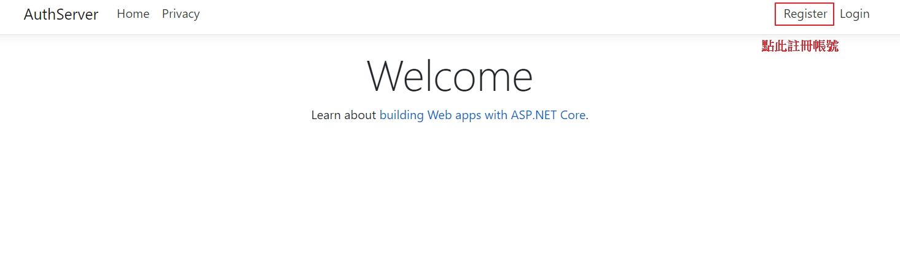
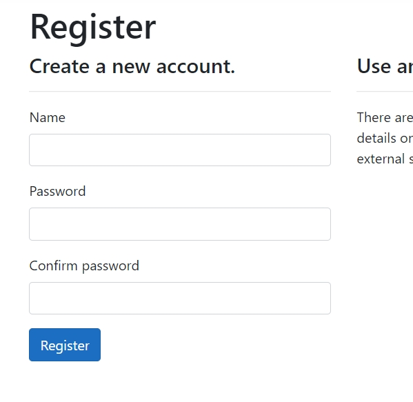
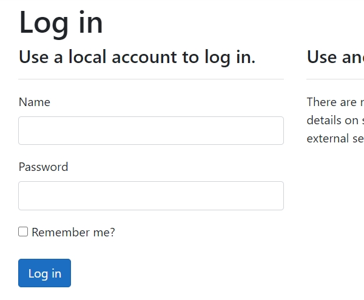
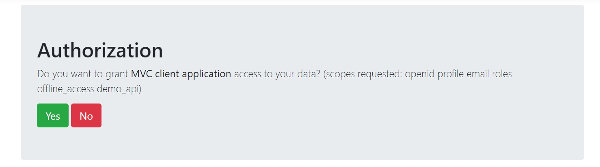
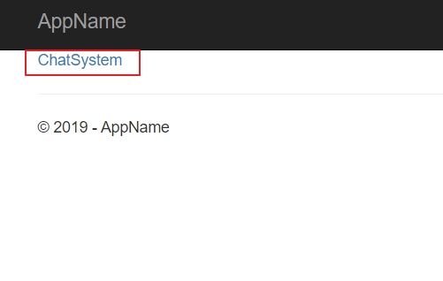
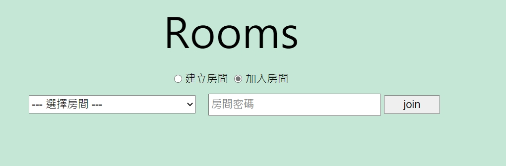
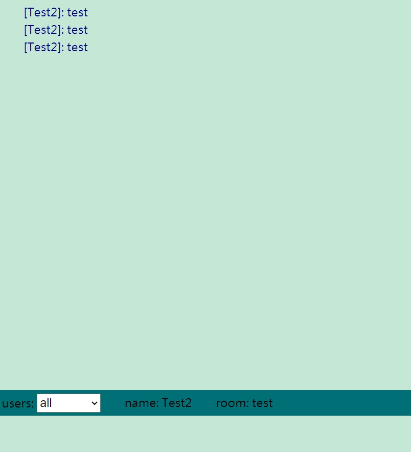

# Demo

1. 先在[https://auth.yggdrasill.dev](https://auth.yggdrasill.dev)註冊帳號

1. 填入帳號、密碼後，按下[Register]按鈕即可以完成註冊

1. 完成註冊後，打開連結[https://chat.yggdrasill.dev](https://chat.yggdrasill.dev)，一開始會看到登入畫面

1. 第一次登入會看到授權畫面，點[Yes]授權即可

1. 登入完成後，會看到首頁，點選連結進入chat

1. 進入chat後，首先會看到選擇房間的畫面，在這邊可以決定要建立一個房間，或者要進入一個已經存在的房間

1. 房間的列表上，如果有"*"代表進入這個房間需要填入密碼，另外，建立房間時如果有填寫密碼，之後進入房間就會需要密碼
1. 進入後，就可以看到chat的畫面

